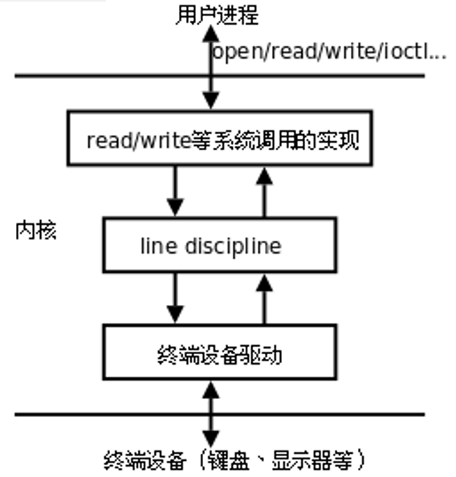
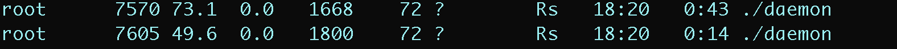

## 一.终端

### 1.基本概念

在UNIX系统中，用户通过终端登录系统后得到一个Shell进程，这个终端成为Shell进程的控制终端（Controlling Terminal），进程中，控制终端是保存在PCB中的信息，而fork会复制PCB中的信息，因此由Shell进程启动的其它进程的控制终端也是这个终端。

默认情况下（没有重定向），每个进程的标准输入、标准输出和标准错误输出都指向控制终端，进程从标准输入读也就是读用户的键盘输入，进程往标准输出或标准错误输出写也就是输出到显示器上。信号中还讲过，在控制终端输入一些特殊的控制键可以给前台进程发信号，例如Ctrl-C表示SIGINT，Ctrl-\表示SIGQUIT。

## 2.终端的启动流程

文件与I/O中讲过，每个进程都可以通过一个特殊的设备文件/dev/tty访问它的控制终端。事实上每个终端设备都对应一个不同的设备文件，/dev/tty提供了一个通用的接口，一个进程要访问它的控制终端既可以通过/dev/tty也可以通过该终端设备所对应的设备文件来访问。ttyname函数可以由文件描述符查出对应的文件名，该文件描述符必须指向一个终端设备而不能是任意文件。

简单来说，一个Linux系统启动，大致经历如下的步骤：

 **init --> fork --> exec --> getty --> 用户输入帐号 --> login --> 输入密码 --> exec --> bash**

硬件驱动程序负责读写实际的硬件设备，比如从键盘读入字符和把字符输出到显示器，**线路规程**像一个过滤器，对于某些特殊字符并不是让它直接通过，而是做特殊处理，比如在键盘上按下Ctrl - Z，对应的字符并不会被用户程序的read读到，而是被线路规程截获，解释成SIGTSTP信号发给前台进程，通常会使该进程停止。线路规程应该过滤哪些字符和做哪些特殊处理是可以配置的。

<div align = center></div>


## 二.进程组

### 1.概念与特性

进程组，也称之为作业。BSD于1980年前后向Unix中增加的一个新特性。代表一个或多个进程的集合。每个进程都属于一个进程组。在waitpid函数和kill函数的参数中都曾使用到。操作系统设计的进程组的概念，是为了简化对多个进程的管理。

当父进程，创建子进程的时候，默认子进程与父进程属于同一进程组。

+ 进程组ID = 第一个进程ID(组长进程)。
+ 组长进程标识：其进程组ID= 其进程ID 

可以使用 **kill -SIGKILL -进程组ID(负的)** 来将整个进程组内的进程全部杀死。 

组长进程可以创建一个进程组，创建该进程组中的进程，然后终止。只要进程组中有一个进程存在，进程组就存在，与组长进程是否终止无关。

进程组生存期：进程组创建到最后一个进程离开(终止或转移到另一个进程组)。

一个进程可以为自己或子进程设置进程组ID

### 2.进程组操作函数

#### getpgrp函数

```c
#include <sys/types.h>
#include <unistd.h>

pid_t getpgrp(void);                 /* POSIX.1 version */
pid_t getpgrp(pid_t pid);            /* BSD version */
//总是返回调用者的进程组ID
```

+ 获取当前进程的进程组ID


#### getpgid函数

```c
#include <sys/types.h>
#include <unistd.h>

pid_t getpgid(pid_t pid);
// 成功：0；失败：-1，设置errno
```

+ 获取指定进程的进程组ID
+ 如果pid = 0，那么该函数作用和getpgrp一样。


#### setpgid函数

```c
#include <sys/types.h>
#include <unistd.h>

int setpgid(pid_t pid, pid_t pgid);
//成功：0；失败：-1，设置errno
```

+ 改变进程默认所属的进程组。通常可用来加入一个现有的进程组或创建一个新进程组。

+ 将参1对应的进程，加入参2对应的进程组中。  注意： 
  1. 如改变子进程为新的组，应fork后，exec前。 
  2. 权级问题。非root进程只能改变自己创建的子进程，或有权限操作的进程    


## 三.会话

+ 进程组是进程的集合，会话是进程组的集合

### 1.创建会话

创建一个会话需要注意以下6点注意事项：

1. 调用进程不能是进程组组长，该进程变成新会话首进程(session header)

2. 该进程成为一个新进程组的组长进程。

3. 需有root权限(ubuntu不需要)

4. 新会话丢弃原有的控制终端，该会话没有控制终端

5. 该调用进程是组长进程，则出错返回

6. 建立新会话时，先调用fork, 父进程终止，子进程调用setsid

### 2.会话相关函数

#### getsid函数

```c
#include <sys/types.h>
#include <unistd.h>

pid_t getsid(pid_t pid);
//成功：返回调用进程的会话ID；失败：-1，设置errno
```

+ pid为0表示察看当前进程session ID
+ ps ajx命令查看系统中的进程。参数a表示不仅列当前用户的进程，也列出所有其他用户的进程，参数x表示不仅列有控制终端的进程，也列出所有无控制终端的进程，参数j表示列出与作业控制相关的信息
+ 组长进程不能成为新会话首进程，新会话首进程必定会成为组长进程。


#### setsid函数

``` c
#include <sys/types.h>
#include <unistd.h>

pid_t setsid(void);  
//成功：返回调用进程的会话ID；失败：-1，设置errno
```

+ 调用了setsid函数的进程，既是新的会长，也是新的组长。                  


## 四.守护进程

### 1.基本概念

**Daemon(精灵)进程，是Linux中的后台服务进程，通常独立于控制终端并且周期性地执行某种任务或等待处理某些发生的事件。一般采用以d结尾的名字。**

Linux后台的一些系统服务进程，没有控制终端，不能直接和用户交互。不受用户登录、注销的影响，一直在运行着，他们都是守护进程。如：预读入缓输出机制的实现；ftp服务器；nfs服务器等。

**创建守护进程，最关键的一步是调用setsid函数创建一个新的Session，并成为Session Leader。**


### 2.创建守护进程模型

1. 创建子进程，父进程退出
   + 所有工作在子进程中进行形式上脱离了控制终端
2. 在子进程中创建新会话
   + setsid()函数
   + 使子进程完全独立出来，脱离控制

3. 改变当前目录为根目录
   + chdir()函数
   +  防止占用可卸载的文件系统
   + 也可以换成其它路径

4. 重设文件权限掩码
   + umask()函数
   + 防止继承的文件创建屏蔽字拒绝某些权限
   + 增加守护进程灵活性

5. 将文件描述符0/1/2进行重定向；关闭文件描述符
   + 继承的打开文件不会用到，浪费系统资源，无法卸载

6. 开始执行守护进程核心工作
7. 守护进程退出处理程序模型              

+ **代码实现：**

  ```c
  #include <stdio.h>
  #include <stdlib.h>
  #include <fcntl.h>
  #include <sys/stat.h>
  #include <unistd.h>
  
  void mydaemond(void)
  {
      //1.创建子进程
      pid_t pid = fork();
      //父进程退出
      if (pid > 0) {
          exit(1);
      }
  
      //2.创建新会话
      pid_t sid;
      sid = setsid();
  
      //3.改变工作目录
      int ret = chdir("/home/OperatorSystem/signal/");
      if (ret == -1) {
          perror("chdir error");  // chdir error no such diractroy or file
          exit(1);
      }
  
      //4.重设文件权限掩码
      umask(0002);
  
      //close(fd[0]);  //stdin
      //5.关闭文件描述符
      close(STDIN_FILENO);
  
      //6.开始执行守护进程核心工作
      open("/dev/null", O_RDWR);
      dup2(0, STDOUT_FILENO);
      dup2(0, STDERR_FILENO);
  }
  
  int main(void)
  {
      mydaemond();
      while (1) {
      }
      return 0;
  }
  ```

<div align = center></div>


