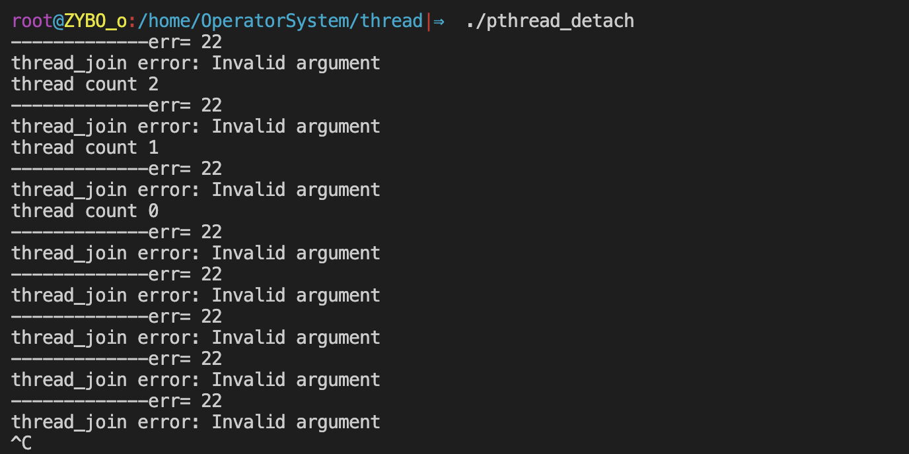

## 一.线程概念

### 1.什么是线程

在Linux中，线程是轻量级的进程，本质仍是进程。进程拥有PCB，也拥有独立的地址空间；但线程只有自己的PCB(TCB)，没有独立的地址空间。他俩区别就是是否拥有共享地址空间。

在Linux下：

+ 线程： **最小的执行单位**
+ 进程： **最小分配资源单位，可看成是只有一个线程的进程。按照进程个数来分配资源**

> 编译使用 -pthread ,因为这是第三方库

### 2.Linux内核线程实现原理

类Unix系统中，早期是没有"线程"概念的，80年代才引入，借助进程机制实现出了线程的概念。因此在这类系统中，进程和线程关系密切。

1. 轻量级进程(light-weight process)，也有PCB，创建线程使用的底层函数和进程一样，都是clone

2. 从内核里看进程和线程是一样的，都有各自不同的PCB，但是 **PCB中指向内存资源的三级页表是相同的，指向相同的页目录，即相同的物理地址**

3. **进程可以蜕变成线程**

4. 线程可看做 **寄存器** 和 **栈** 的集合，因为代码程序主要就是赋值和函数调用

> 线程ID是 **时间片分配的依据** ，也是 **进程内部区分线程的依据** 。

+ 对于进程来说，相同的地址(同一个虚拟地址)在不同的进程中，反复使用而不冲突。原因是他们虽虚拟址一样，但，页目录、页表、物理页面各不相同。相同的虚拟址，映射到不同的物理页面内存单元，最终访问不同的物理页面。

+ 但！线程不同！两个线程具有各自独立的PCB，但共享同一个页目录，也就共享同一个页表和物理页面。所以两个PCB共享一个地址空间。

实际上，无论是创建进程的fork，还是创建线程的pthread_create，底层实现都是调用同一个内核函数clone。 **如果复制对方的地址空间，那么就产出一个“进程”；如果共享对方的地址空间，就产生一个“线程”。**   因此：Linux内核是不区分进程和线程。

### 3.进程内部的线程共享资源

1. 文件描述符表

2. 每种信号的处理方式（尽量不要让信号和线程结合使用）

3. 当前工作目录（根据进程定的）

4. 用户ID和组ID

5. 内存地址空间 (.text/.data/.bss/heap/共享库) 

   > 除了栈之外都共享

**不共享的资源如下：**

1.线程id

2. 处理器现场和栈指针(内核栈)

3. 独立的栈空间(用户空间栈)

4. errno变量

5. 信号屏蔽字

6. 调度优先级

### 4.线程的优点和缺点：

**优点：** 

 1. 提高程序并发性   2. 开销小   3. 数据通信、共享数据方便

**缺点：** 

 1. 库函数，不稳定（不如系统调用）   2. 调试、编写困难、gdb不支持    3. 对信号支持不好


## 二.线程的创建与使用

### 1.线程标识

就像每个进程有一个进程ID一样，每个线程也有一个线程ID。进程 ID在整个系统中是唯一的，但线程ID不同， **线程ID只有在它所属的进程 上下文中才有意义。**

线程可以通过调用pthread_self函数获得自身的线程ID。 

```c
#include <pthread.h>
pthread_t pthread_self(void);

//返回值:调用线程的线程ID
```

进程ID 是用pid_t数据类型来表示的，是一个非负整 数。线程ID是用pthread_t数据类型来表示的，实现的时候可以用一个结构来代表pthread_t数据类型，所以可移植的操作系统实现不能把它作为整数处理。

**在Linux下为无符号整数(%lu)，其他系统中可能是结构体实现** ，因此必须使用一个函数来对两个线程ID进行比较。

```c
#include <pthread.h>

int pthread_equal(pthread_t tid1, pthread_t tid2);
//返回值:若相等，返回非0数值;否则，返回0
```


### 2.线程创建

在传统UNIX进程模型中，每个进程只有一个控制线程。从概念上 讲，这与基于线程的模型中每个进程只包含一个线程是相同的。

在 POSIX线程(pthread)的情况下，程序开始运行时，它也是以单进程中的单个控制线程启动的。 **在创建多个控制线程以前，程序的行为与传统的进程并没有什么区别。新增的线程可以通过调用pthread_create函数创建。**

```c
#include <pthread.h>
int pthread_create(pthread_t *restrict tidp, 
                   const pthread_attr_t *restrict attr, 
                   void *(*start_rtn)(void *), 
                   void *restrict arg);
//返回值:若成功，返回0;否则，返回错误编号
```

参数分析：

+ pthread_t：当前Linux中可理解为：`typedef unsigned long int pthread_t`;
+ tidp：传出参数，保存系统为我们分配好的线程ID
+ attr：通常传NULL，表示使用线程默认属性。若想使用具体属性也可以修改该参数。
+ start_rtn ：函数指针，指向线程主函数(线程体)，该函数运行结束，则线程结束。如果需要向start_rtn函数传递的参数有一个以上，那 么需要把这些参数放到一个结构中，然后把这个结构的地址作为arg参 数传入。
+ arg：线程主函数执行期间所使用的参数。

在一个线程中调用`pthread_create()`创建新的线程后，当前线程从`pthread_create()`返回继续往下执行，而新的线程所执行的代码由我们传给`pthread_create`的函数指针start_routine决定。

start_routine函数接收一个参数，是通过pthread_create的arg参数传递给它的，该参数的类型为`void *`，这个指针按什么类型解释由调用者自己定义。start_routine的返回值类型也是`void *`，这个指针的含义同样由调用者自己定义。

start_routine返回时，这个线程就退出了，其它线程可以调用pthread_join得到start_routine的返回值，类似于父进程调用wait(2)得到子进程的退出状态。

**创建线程的例子：**

```c
#include "apue.h"
#include <pthread.h>

pthread_t ntid;

void printids(const char *s) {
	pid_t		pid;
	pthread_t	tid;
	pid = getpid();
	tid = pthread_self();
	printf("%s pid %lu tid %lu (0x%lx)\n", s, (unsigned long)pid, (unsigned long)tid, (unsigned long)tid);
}

void * thr_fn(void *arg) {
	printids("new thread: ");
	return((void *)0);
}

int main(void){
	int	err;
	err = pthread_create(&ntid, NULL, thr_fn, NULL);
	if (err != 0)
		err_exit(err, "can't create thread");
	printids("main thread:");
	sleep(1);
	exit(0);
}
```

<div align = center></div>

**第四个参数arg注意点：**

```c
#include <pthread.h>
#include <stdio.h>
#include <unistd.h>
#include <stdlib.h>

void *tfn(void *arg)
{
	int i = (int)arg;
	sleep(i);	 //通过i来区别每个线程
	printf("I'm %dth thread, Thread_ID = %lu\n", i+1, pthread_self());
	return NULL;
}

int main(void)
{
	pthread_t tid;
    int i;
	for (int i = 0; i < 5; i++) {
		pthread_create(&tid, NULL, tfn, (void *)i);
		//将i转换为指针，在tfn中再强转回整形。
	}
	sleep(6);
	printf("I am main, and I am not a process, I'm a thread!\n" 
			"main_thread_ID = %lu\n", pthread_self());
	return 0;
}
```

<div align = center></div>

`pthread_create(&tid, NULL, tfn, (void *)i);`中第四个参数使用的是值传入，如果是地址传入时，会发生错误：

```c
//...
void *tfn(void *arg)
{
	int i = *((int *)arg);
	sleep(i);	 //通过i来区别每个线程
	printf("I'm %dth thread, Thread_ID = %lu\n", i+1, pthread_self());
	return NULL;  
}
//...
for (int i = 0; i < 5; i++) {
		pthread_create(&tid, NULL, tfn, (void *)&i);
		//将i转换为指针，在tfn中再强转回整形。
	}
//...
```

<div align = center></div>

因为传入的是地址，等tfn函数进行根据i的地址查找i具体值时，i已经修改为6了，所以输出的都是6.

### 3.线程终止

如果进程中的任意线程调用了 exit、_ Exit 或者_exit，那么整个进程 就会终止。与此相类似，如果默认的动作是终止进程，那么，发送到线程的信号就会终止整个进程。

#### 线程退出函数 pthread_exit

```c
#include <pthread.h>

void pthread_exit(void *rval_ptr);
```

函数参数：

+ 无类型参数retval表示线程退出状态，通常传NULL

多线程环境中，应尽量少用，或者不使用exit函数，取而代之使用pthread_exit函数，将单个线程退出。任何线程里exit导致进程退出，其他线程未工作结束，主控线程退出时不能return或exit。

另注意，pthread_exit或者return返回的指针所指向的内存单元必须是全局的或者是用malloc分配的，不能在线程函数的栈上分配，因为当其它线程得到这个返回指针时线程函数已经退出了。

**总结exit、return、pthread_exit各自退出效果：**

+ **return** ：返回到调用者那里去
+  **pthread_exit()** ：将调用该函数的线程   
+  **exit:**  将进程退出。

#### 线程回收函数 pthread_join

pthread_join用于 **阻塞等待线程退出，获取线程退出状态。**  其作用对应进程中 waitpid() 函数。

```c
#include <pthread.h>

int pthread_join(pthread_t thread, void **rval_ptr);
//返回值:若成功，返回0;否则，返回错误编号
```

函数参数：

+ **thread**：线程ID （【注意】：不是指针，非传出参数）；
+ **retval**：存储线程结束状态。传出参数

调用该函数的线程将挂起等待，直到id为thread的线程终止。thread线程以不同的方法终止，通过pthread_join得到的终止状态是不同的，总结如下：

1. 如果thread线程通过return返回，retval所指向的单元里存放的是thread线程函数的返回值。
2. 如果thread线程是自己调用pthread_exit终止的，retval所指向的单元存放的是传给pthread_exit的参数。
3. 如果thread线程被别的线程调用pthread_cancel异常终止掉，retval所指向的单元里存放的是常数PTHREAD_CANCELED。

4. 如果对thread线程的终止状态不感兴趣，可以传NULL给retval参数。

**pthread_join代码实践：**

```c
#include <stdio.h>
#include <string.h>
#include <unistd.h>
#include <stdlib.h>
#include <pthread.h>

typedef struct {
    char ch;
    int var;
    char str[64];
} exit_t;

void *thrd_func(void *arg)
{
    exit_t *retvar = (exit_t *)arg;

    retvar->ch = 'm';
    retvar->var = 200;
    strcpy(retvar->str, "thrd_func thread");
    pthread_exit((void *)retvar);
}

int main(void)
{
    pthread_t tid;
    int ret;
    exit_t *retval = malloc(sizeof(exit_t));
    retval->ch = 'a';
    retval->var = 100;
    strcpy(retval->str, "main thread");
    printf("ch = %c, var = %d, str = %s\n", retval->ch, retval->var, retval->str);


    ret = pthread_create(&tid, NULL, thrd_func, (void *)retval);
    if (ret != 0) {
        fprintf(stderr, "pthread_create error:%s\n", strerror(ret));
        exit(1);
    }
    sleep(1);
    pthread_join(tid, (void **)&retval);
    printf("ch = %c, var = %d, str = %s\n", retval->ch, retval->var, retval->str);

    free(retval);
    pthread_exit((void *)1);
}
```

<div align = center></div>

#### 线程分离函数 pthread_detach

pthread_detach 实现实现线程分离

```c
#include <pthread.h>

int pthread_detach(pthread_t tid);
//返回值:若成功，返回0;否则，返回错误编号
```

线程分离状态： **指定该状态，线程主动与主控线程断开关系。 线程结束后，其退出状态不由其他线程获取，而直接自己自动释放。** 网络、多线程服务器常用。

进程若有该机制，将不会产生僵尸进程。僵尸进程的产生主要由于进程死后，大部分资源被释放，一点残留资源仍存于系统中，导致内核认为该进程仍存在。

pthread_detach代码实现：

```c
#include <stdio.h>
#include <stdlib.h>
#include <unistd.h>
#include <string.h>
#include <pthread.h>

void *tfn(void *arg)
{
	int n = 3;
	while (n--) {
		printf("thread count %d\n", n);
		sleep(1);
	}
   pthread_exit((void *)1);
}

int main(void)
{
	pthread_t tid;
	void *tret;
	int err;
  
	pthread_create(&tid, NULL, tfn, NULL);
	pthread_detach(tid);         //让线程分离  ----自动退出,无系统残留资源
	while (1) {
		err = pthread_join(tid, &tret);
        printf("-------------err= %d\n", err);
		if (err != 0)
			fprintf(stderr, "thread_join error: %s\n", strerror(err));
		else
			fprintf(stderr, "thread exit code %d\n", (int)tret);
		sleep(1);
	}
	return 0;
}
```

<div align = center></div>

一般情况下，线程终止后，其终止状态一直保留到其它线程调用pthread_join获取它的状态为止。但是线程也可以被置为detach状态，**这样的线程一旦终止就立刻回收它占用的所有资源，而不保留终止状态。不能对一个已经处于detach状态的线程调用pthread_join，这样的调用将返回EINVAL错误。**

也就是说，如果已经对一个线程调用了pthread_detach就不能再调用pthread_join了。

#### 杀死进程函数 pthread_cancel

pthread_cancel函数可以杀死(取消)线程。其作用，对应进程中 kill() 函数。

```c
#include <pthread.h>

int pthread_cancel(pthread_t tid);
//返回值:若成功，返回0;否则，返回错误编号
```

在默认情况下，pthread_cancel 函数会使得由tid标识的线程的行为 表现为如同调用了参数为PTHREAD_ CANCELED 的pthread_exit 函数，但是，线程可以选择忽略取消或者控制如何被取消。

**线程的取消并不是实时的，而有一定的延时。需要等待线程到达某个取消点(检查点)。**

> 取消点：是线程检查是否被取消，并按请求进行动作的一个位置。通常是一些系统调用creat，open，pause，close，read，write..... 执行命令man 7 pthreads可以查看具备这些取消点的系统调用列表。也可参阅 APUE.12.7 取消选项小节。
>
> 可粗略认为一个系统调用(进入内核)即为一个取消点。如线程中没有取消点，可以通过调用pthread_testcancel函数自行设置一个取消点。

pthread_cancel函数代码实践：

```c
#include <stdio.h>
#include <unistd.h>
#include <pthread.h>
#include <stdlib.h>

void *tfn1(void *arg){
	printf("thread 1 returning\n");
	return (void *)111; 
}

void *tfn2(void *arg){
	printf("thread 2 exiting\n");
	pthread_exit((void *)222);
}

void *tfn3(void *arg){
	printf("thread 3 exiting\n");
  sleep(1);
  pthread_testcancel();	//自己添加取消点*/
  return (void *)333;
}

int main(void){
	pthread_t tid;
	void *tret = NULL;
	pthread_create(&tid, NULL, tfn1, NULL);
	pthread_join(tid, &tret);
	printf("thread 1 exit code = %d\n\n", (int)tret);

	pthread_create(&tid, NULL, tfn2, NULL);
	pthread_join(tid, &tret);
	printf("thread 2 exit code = %d\n\n", (int)tret);

	pthread_create(&tid, NULL, tfn3, NULL);
  pthread_cancel(tid);
	pthread_join(tid, &tret);
	printf("thread 3 exit code = %d\n", (int)tret);

	return 0;
}
```

<div align = center></div>

#### 终止线程方式

总结：终止某个线程而不终止整个进程，有三种方法：

1. 从线程主函数return。这种方法对主控线程不适用，从main函数return相当于调用exit。

2. 一个线程可以调用pthread_cancel终止同一进程中的另一个线程。

3. 线程可以调用pthread_exit终止自己。

### 4.控制原语对比

<div align = center></div>

