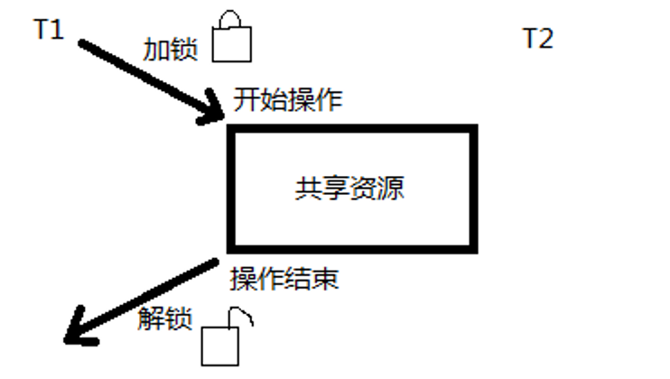
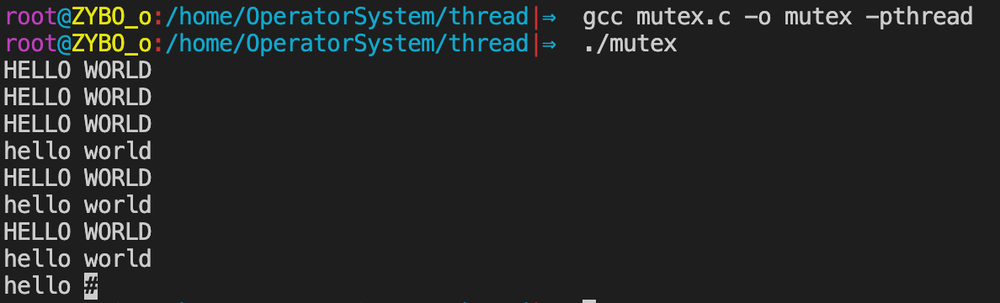
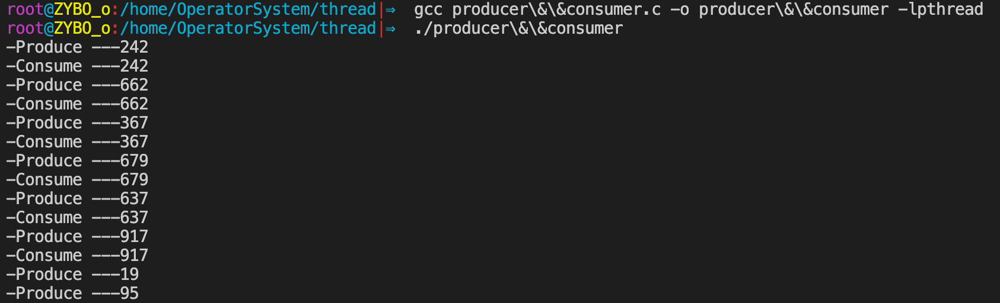

## 一.同步的概念

### 1.同步的概念

所谓同步，即同时起步，协调一致。不同的对象，对“同步”的理解方式略有不同。如：

+ 设备同步，是指在两个设备之间规定一个共同的时间参考；
+ 数据库同步，是指让两个或多个数据库内容保持一致，或者按需要部分保持一致；
+ 文件同步，是指让两个或多个文件夹里的文件保持一致。等等

而编程中、通信中所说的同步与生活中大家印象中的同步概念略有差异。“同”字应是指协同、协助、互相配合。主旨在协同步调，按预定的先后次序运行。

### 2.线程同步

同步即协同步调，按预定的先后次序运行。 **线程同步，指一个线程发出某一功能调用时，在没有得到结果之前，该调用不返回。同时其它线程为保证数据一致性，不能调用该功能。**

例子：内存中100字节，线程T1欲填入全1，线程T2欲填入全0。但如果T1执行了50个字节失去cpu，T2执行，会将T1写过的内容覆盖。当T1再次获得cpu继续从失去cpu的位置向后写入1，当执行结束，内存中的100字节，既不是全1，也不是全0。

上面例子所产生的现象叫做 **“与时间有关的错误” (time related)** 。

为了避免这种数据混乱，线程需要同步。 **而 “同步”的目的，是为了避免数据混乱，解决与时间有关的错误。实际上，不仅线程间需要同步，进程间、信号间等等都需要同步机制。**

### 3.数据混乱的原因

1. **资源共享（独享资源则不会）**   

2. **调度随机（意味着数据访问会出现竞争）**  

3. **线程间缺乏必要的同步机制。**

以上3点中，前两点不能改变，欲提高效率，传递数据，资源必须共享。只要共享资源，就一定会出现竞争。只要存在竞争关系，数据就很容易出现混乱。所以只能从第三点着手解决。使多个线程在访问共享资源的时候，出现互斥。

## 二.互斥锁

### 1.互斥量mutex

Linux中提供一把互斥锁mutex（也称之为互斥量）。每个线程在对资源操作前都尝试先加锁，成功加锁才能操作，操作结束解锁。

资源还是共享的，线程间也还是竞争的，但通过“锁”就将资源的访问变成互斥操作，而后与时间有关的错误也不会再产生了。

<div align = center></div>

但，应注意：同一时刻，只能有一个线程持有该锁。

+ 当A线程对某个全局变量加锁访问
+ B在访问前尝试加锁，拿不到锁，B阻塞。
+ C线程不去加锁，而直接访问该全局变量，依然能够访问，但会出现数据混乱。

**所以，互斥锁实质上是操作系统提供的一把“建议锁”（又称“协同锁”），建议程序中有多线程访问共享资源的时候使用该机制。但，并没有强制限定。**

因此，即使有了mutex， **如果有线程不按规则来访问数据，依然会造成数据混乱。**

### 2.互斥锁主要应用函数

```c
pthread_mutex_init
pthread_mutex_destroy
pthread_mutex_lock
pthread_mutex_trylock
pthread_mutex_unlock
//以上5个函数的返回值都是：成功返回0， 失败返回错误号。  
```

+ pthread_mutex_t 类型，其本质是一个结构体。为简化理解，应用时可忽略其实现细节，简单当成整数看待。

+ pthread_mutex_t mutex; 变量mutex只有两种取值1、0。

####pthread_mutex_init 函数

```c
#include <pthread.h>

int pthread_mutex_init(pthread_mutex_t *restrict mutex, const pthread_mutexattr_t *restrict attr);
pthread_mutex_t mutex = PTHREAD_MUTEX_INITIALIZER;
```

+ **参数：**

  + mutex : 传出参数，调用时应传 &mutex   

    >  **restrict关键字：**  **只用于限制指针，告诉编译器，所有修改该指针指向内存中内容的操作，只能通过本指针完成。不能通过除本指针以外的其他变量或指针修改**

  + attr： 互斥量属性。是一个传入参数，通常传NULL，选用默认属性(线程间共享)。 参APUE.12.4同步属性

    + 静态初始化：如果互斥锁 mutex 是静态分配的（定义在全局，或加了static关键字修饰），可以直接使用宏进行初始化。e.g.  pthead_mutex_t muetx = PTHREAD_MUTEX_INITIALIZER;
    + 动态初始化：局部变量应采用动态初始化。e.g.  pthread_mutex_init(&mutex, NULL)

#### pthread_mutex_destroy函数

```c
#include <pthread.h>

int pthread_mutex_destroy(pthread_mutex_t *mutex);
pthread_mutex_t mutex = PTHREAD_MUTEX_INITIALIZER;
```

+ 销毁一个互斥锁

#### pthread_mutex_lock函数

```c
 #include <pthread.h>

int pthread_mutex_lock(pthread_mutex_t *mutex);
```

+ 加锁。可理解为将mutex--（或-1）
+ lock尝试加锁，如果加锁不成功，线程阻塞，阻塞到持有该互斥量的其他线程解锁为止。

#### pthread_mutex_trylock函数
```c
#include <pthread.h>

int pthread_mutex_trylock(pthread_mutex_t *mutex);
```

+ 尝试加锁
+ trylock加锁失败直接返回错误号（如：EBUSY），不阻塞。

#### pthread_mutex_unlock函数

``` c
#include <pthread.h>

int pthread_mutex_unlock(pthread_mutex_t *mutex);
```

+ 解锁。可理解为将mutex ++（或+1）
+ unlock主动解锁函数，**同时将阻塞在该锁上的所有线程全部唤醒**，至于哪个线程先被唤醒，取决于优先级、调度。默认：先阻塞、先唤醒。

#### 代码实例

```c
#include <stdio.h>
#include <string.h>
#include <pthread.h>
#include <stdlib.h>
#include <unistd.h>

pthread_mutex_t mutex;      //定义锁

void *tfn(void *arg)
{
    srand(time(NULL));
    while (1) {
        pthread_mutex_lock(&mutex);
      
        printf("hello ");
        sleep(rand() % 3);	/*模拟长时间操作共享资源，导致cpu易主，产生与时间有关的错误*/
        printf("world\n");
      
        pthread_mutex_unlock(&mutex);
        sleep(rand() % 3);
    }
    return NULL;
}

int main(void)
{
    int flg = 5;
    pthread_t tid;
    srand(time(NULL));

    pthread_mutex_init(&mutex, NULL);  // mutex==1
    pthread_create(&tid, NULL, tfn, NULL);
    while (flg--) {
        pthread_mutex_lock(&mutex);

        printf("HELLO ");
        sleep(rand() % 3);
        printf("WORLD\n");
        pthread_mutex_unlock(&mutex);

        sleep(rand() % 3);
    }
    pthread_cancel(tid);
    pthread_join(tid, NULL);
    pthread_mutex_destroy(&mutex);  
    return 0;
}
```



## 三.读写锁

### 1.读写锁状态

一般读写锁具备三种状态：

1. **读模式下加锁状态 (读锁)**

2. **写模式下加锁状态 (写锁)**

3. **不加锁状态**

### 2.读写锁特性

1. 读写锁是“写模式加锁”时， 解锁前，所有对该锁加锁的线程都会被阻塞。

2. 读写锁是“读模式加锁”时， 如果线程以读模式对其加锁会成功；如果线程以写模式加锁会阻塞。

3. 读写锁是“读模式加锁”时， 既有试图以写模式加锁的线程，也有试图以读模式加锁的线程。那么读写锁会阻塞随后的读模式锁请求。优先满足写模式锁。**读锁、写锁并行阻塞，写锁优先级高**

读写锁也叫共享-独占锁。当读写锁以读模式锁住时，它是以共享模式锁住的；当它以写模式锁住时，它是以独占模式锁住的。**写独占、读共享。**

读写锁非常适合于对数据结构读的次数远大于写的情况。

### 3.读写锁主要应用函数

```c
pthread_rwlock_init
pthread_rwlock_destroy
pthread_rwlock_rdlock  
pthread_rwlock_wrlock
pthread_rwlock_tryrdlock
pthread_rwlock_trywrlock
pthread_rwlock_unlock
//以上7 个函数的返回值都是：成功返回0， 失败直接返回错误号。	
```

#### pthread_rwlock_init函数

```c
#include <pthread.h>

int pthread_rwlock_init(pthread_rwlock_t *restrict rwlock,
                        const pthread_rwlockattr_t *restrict attr);
pthread_rwlock_t rwlock = PTHREAD_RWLOCK_INITIALIZER;
```

+ 初始化一把读写锁
+ **参数：**
  + attr：attr表读写锁属性，通常使用默认属性，传NULL即可。

#### pthread_rwlock_destroy函数

```c
#include <pthread.h>

int pthread_rwlock_destroy(pthread_rwlock_t *rwlock);
```

+ 销毁一把读写锁

#### pthread_rwlock_rdlock函数  

```c
 #include <pthread.h>

int pthread_rwlock_rdlock(pthread_rwlock_t *rwlock);
```

+ 以读方式请求读写锁。（常简称为：请求读锁）

#### pthread_rwlock_wrlock函数

```c
#include <pthread.h>

int pthread_rwlock_wrlock(pthread_rwlock_t *rwlock);
```

+ 以写方式请求读写锁。（常简称为：请求写锁）

#### pthread_rwlock_tryrdlock函数

```c
#include <pthread.h>

int pthread_rwlock_tryrdlock(pthread_rwlock_t *rwlock);
```

+ 非阻塞以读方式请求读写锁（非阻塞请求读锁）

#### pthread_rwlock_trywrlock函数

```c
 #include <pthread.h>

int pthread_rwlock_trywrlock(pthread_rwlock_t *rwlock);
```

+ 非阻塞以写方式请求读写锁（非阻塞请求写锁）

#### pthread_rwlock_unlock函数

```c
#include <pthread.h>

int pthread_rwlock_wrlock(pthread_rwlock_t *rwlock);
```

+ 解锁

#### 代码实例

```c

/* 3个线程不定时 "写" 全局资源，5个线程不定时 "读" 同一全局资源 */

#include <stdio.h>
#include <unistd.h>
#include <pthread.h>

 //定义全局资源
int counter;      
//定义读写锁                   
pthread_rwlock_t rwlock;

void *th_write(void *arg)
{
    int t;
    int i = (int)arg;

    while (1) {
        t = counter;
        usleep(1000);

        pthread_rwlock_wrlock(&rwlock);
        printf("=======write %d: %lu: counter=%d ++counter=%d\n", i, pthread_self(), t, ++counter);
        pthread_rwlock_unlock(&rwlock);

        usleep(5000);
    }
    return NULL;
}

void *th_read(void *arg)
{
    int i = (int)arg;

    while (1) {
        pthread_rwlock_rdlock(&rwlock);
        printf("----------------------------read %d: %lu: %d\n", i, pthread_self(), counter);
        pthread_rwlock_unlock(&rwlock);

        usleep(900);
    }
    return NULL;
}

int main(void)
{
    int i;
    //定义8个tid
    pthread_t tid[8];
    //初始化读写锁
    pthread_rwlock_init(&rwlock, NULL);

    //3个写线程
    for (i = 0; i < 3; i++)
        pthread_create(&tid[i], NULL, th_write, (void *)i);
    //5个读线程
    for (i = 0; i < 5; i++)
        pthread_create(&tid[i+3], NULL, th_read, (void *)i);
    //8个线程回收
    for (i = 0; i < 8; i++)
        pthread_join(tid[i], NULL);
    //销毁锁
    pthread_rwlock_destroy(&rwlock);            //释放读写琐

    return 0;
}
```


## 四.条件变量

### 1.基本概念

条件变量本身不是锁！但它也可以造成线程阻塞。通常与互斥锁配合使用。给多线程提供一个会合的场所。

### 2.条件变量主要应用函数

```c
pthread_cond_init
pthread_cond_destroy
pthread_cond_wait
pthread_cond_timedwait
pthread_cond_signal
pthread_cond_broadcast
//以上6 个函数的返回值都是：成功返回0， 失败直接返回错误号。
```

#### pthread_cond_init函数

```c
#include <pthread.h>

int pthread_cond_init(pthread_cond_t *restrict cond,
                      const pthread_condattr_t *restrict attr);
pthread_cond_t cond = PTHREAD_COND_INITIALIZER;
```

+ 初始化一个条件变量
+ **参数：**
  + attr ：attr表条件变量属性，通常为默认值，传NULL即可

#### pthread_cond_destroy函数

```c
#include <pthread.h>

int pthread_cond_destroy(pthread_cond_t *cond);
```

+ 销毁一个条件变量


#### pthread_cond_wait函数

```c
#include <pthread.h>

int pthread_cond_wait(pthread_cond_t *restrict cond,
                      pthread_mutex_t *restrict mutex);
```

+ 阻塞等待一个条件变量

+ 函数作用：

  1. **阻塞等待条件变量cond（参1）满足** 

  2. **释放已掌握的互斥锁（解锁互斥量）`相当于pthread_mutex_unlock(&mutex);`** 

     >  **1.2.两步为一个原子操作。**

  3. **当被唤醒，pthread_cond_wait函数返回时，解除阻塞并重新申请获取互斥锁pthread_mutex_lock(&mutex);**

#### pthread_cond_timedwait函数

```c
#include <pthread.h>

int pthread_cond_timedwait(pthread_cond_t *restrict cond,
                           pthread_mutex_t *restrict mutex,
                           const struct timespec *restrict abstime);
struct timespec {
			time_t tv_sec;		/* seconds */ 秒
			long   tv_nsec;	/* nanosecondes*/ 纳秒
		}		
```

+ 限时等待一个条件变量
+ **参数：**
  + 形参abstime：绝对时间

#### pthread_cond_signal函数

```c
 #include <pthread.h>

int pthread_cond_signal(pthread_cond_t *cond);
```

+ 唤醒至少一个阻塞在条件变量上的线程

#### pthread_cond_broadcast函数

```c
#include <pthread.h>

int pthread_cond_broadcast(pthread_cond_t *cond);
```

+ 唤醒全部阻塞在条件变量上的线程

#### 实现生产者消费者问题

```c
/*借助条件变量模拟 生产者-消费者 问题*/
#include <stdlib.h>
#include <unistd.h>
#include <pthread.h>
#include <stdio.h>

/*链表作为公享数据,需被互斥量保护*/
struct msg {
    struct msg *next;
    int num;
};

struct msg *head;
struct msg *mp;

/* 静态初始化 一个条件变量 和 一个互斥量*/
pthread_cond_t has_product = PTHREAD_COND_INITIALIZER;
pthread_mutex_t lock = PTHREAD_MUTEX_INITIALIZER;

void *consumer(void *p)
{
    for (;;) {
        pthread_mutex_lock(&lock);
        while (head == NULL) {           //头指针为空,说明没有节点    可以为if吗
            pthread_cond_wait(&has_product, &lock);
        }
        mp = head;      
        head = mp->next;    //模拟消费掉一个产品
        pthread_mutex_unlock(&lock);

        printf("-Consume ---%d\n", mp->num);
        free(mp);
        mp = NULL;
        sleep(rand() % 5);
    }
}

void *producer(void *p)
{
    for (;;) {
        mp = malloc(sizeof(struct msg));
        mp->num = rand() % 1000 + 1;        //模拟生产一个产品
        printf("-Produce ---%d\n", mp->num);

        pthread_mutex_lock(&lock);
        mp->next = head;
        head = mp;
        pthread_mutex_unlock(&lock);

        pthread_cond_signal(&has_product);  //将等待在该条件变量上的一个线程唤醒
        sleep(rand() % 5);
    }
}

int main(int argc, char *argv[])
{
    pthread_t pid, cid;
    srand(time(NULL));

    pthread_create(&pid, NULL, producer, NULL);
    pthread_create(&cid, NULL, consumer, NULL);

    pthread_join(pid, NULL);
    pthread_join(cid, NULL);

    return 0;
}
```




### 3.条件变量的优点

相较于mutex而言，条件变量可以减少竞争。

如直接使用mutex，除了生产者、消费者之间要竞争互斥量以外，消费者之间也需要竞争互斥量，但如果汇聚（链表）中没有数据，消费者之间竞争互斥锁是无意义的。有了条件变量机制以后，只有生产者完成生产，才会引起消费者之间的竞争。提高了程序效率。

## 五.进程间互斥与同步


## 六.哲学家用餐模型分析


