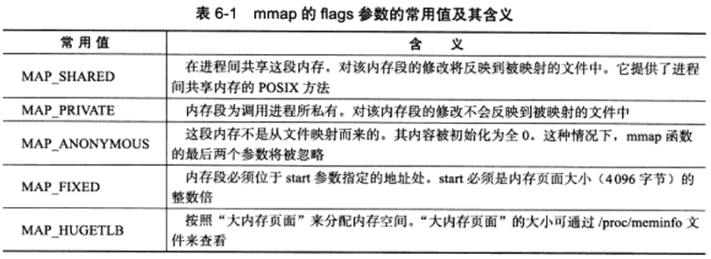
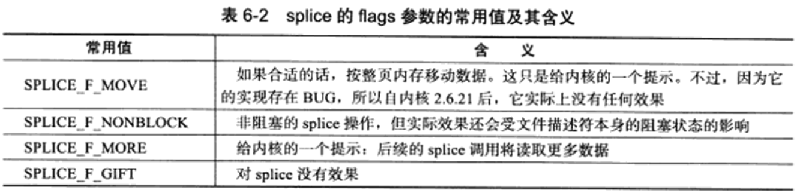
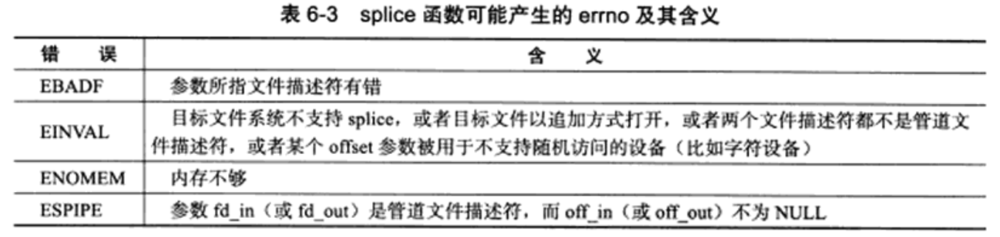
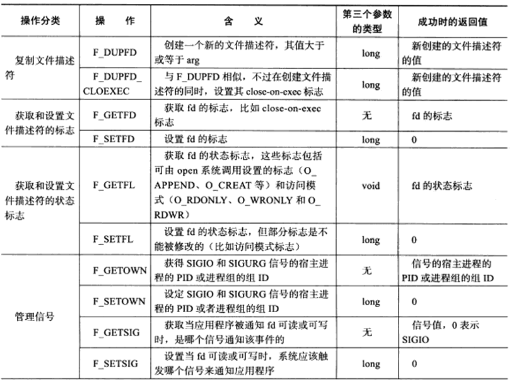

# 高级I/O函数

Linux提供了很多高级的I/O函数。它们不像Linux基础I/O函数(open,read)那么常用，但是在特定的条件会表现出优秀的性能。本章讨论几个和网络编程相关的。

+ 用于创建文件描述符的函数：pipe,dup/dup2
+ 用于读写数据的函数：readv/writev,sendfile,mmap/munmap,splice和tee函数
+ 用于控制I/O行为和属性的函数，包括fcntl函数

### 1.pipe函数

>  pipe函数可用于创建一个管道，以实现进程间通信。具体介绍见：[管道和FIFO]()

函数定义：

```c
#include<unistd.h>
init pipe(int fd[2]);
```

pipe函数的参数是一个包含两个int型整数的数组指针。

+ 成功返回0，并将一对打开的文件描述符值填入其参数指向的数组
+ 失败返回-1,并设置errno

管道内部传输的数据是字节流，这和TCP字节流的概念相同。但是二者又有细微的区别。

+ 应用层程序能往一个TCP连接中写入多少字节的数据，取决于对方的接收通告窗口的大小和本端的拥塞窗口的大小。
+ 管道本身拥有一个容量限制，它规定如果应用程序不将数据从管道读走的话，该管道最多能被写入多少字节的数据。Linux 2.6.11起，管道容量的大小默认为65536字节。可以使用fcntl函数来修改管道容量。

socket的基础API中有一个socketpair函数。能够方便地创建双向管道。定义如下：

```c
#include <sys/types.h>
#include <sys/socket.h>
int socketpair(int domain, int type, int protocol, int socket_vector[2]);
```

+ socketpair前的三个参数的含义与socket系统调用的三个参数相同，但domain只能使用UNIX本地域协议族AF_UNIX，因为仅能在本地使用这两个双向管道。
+ 最后一个参数与pipe系统调用的参数一样，但是socketpair创建的这对文件描述符即可以读也可以写。
+ 函数成功返回0；失败返回-1并设置errno。

### 2.dup函数和dup2函数

当有需求把标准输入重定向到一个文件，或者把标准输出重定向到一个网络连接。可以通过下面的用于复制文件描述符的dup和dup2函数来实现：

```c++
#include <unistd.h>

int dup(int fildes);
int dup2(int fildes, int fildes2);
```

+ dup函数创建一个新的文件描述符，该新文件描述符和原有文件描述符fildes指向相同的文件，管道或者网络连接。而且dup返回的文件描述符总是取系统当前可用的最小整数值。
+ dup2与dup类似，不过它将返回第一个不小于filedes2的整数值。
+ dup2与dup系统调用失败时返回-1，并设置errno

> dup2与dup创建的文件描述符并不继承原文件描述符的属性。

CGI服务器使用dup函数示例：

```c
int connfd = accept( sock, ( struct sockaddr* )&client, &client_addrlength );
if ( connfd < 0 )
{
  	printf( "errno is: %d\n", errno );
}
else
{
  	//先关闭标准输出文件描述符STDOUT_FILENO(1)
  	close( STDOUT_FILENO );
  	//复制socket文件描述符connfd。
  	//因为dup总是返回系统中最小的可用文件描述符，所以它的返回值是1，即上面关闭的标准输出文件描述符的值
  	dup( connfd );
  	//这样，服务器输出到标准输出的内容(abcd)就会直接发送到与客户连接对应的socket上
  	//此时，printf调用的输出将被客户端获得
  	printf( "abcd\n" );
  	close( connfd );
}
//以上就是CGI服务器的基本工作原理
```


### 3.readv 函数和 writev 函数

> + readv函数将数据从文件描述符读到分散的内存块中，即分散读
> + writev函数将多块分散的内存数据一并写入文件描述符，即集中写
> + 具体介绍见：[高级I/O]()

函数定义：

```c++
#include <sys/types.h>
#include <sys/uio.h>
#include <unistd.h>

ssize_t readv(int d, const struct iovec *iov, int iovcnt);
ssize_t writev(int d, const struct iovec *iov, int iovcnt);
```

+ fd参数是被操作的目标文件描述符

+ vector参数类型是iovec结构体数组。

  ```c
  struct iovec
  {
  		void *iov_base;
  		size_t iov_len;
  }
  ```

  - iovec结构体封装了一块内存的起始位置和长度

+ count参数是vector数组的长度，即有多少块内存数据需要从fd读出或写到fd

+ readv 和 writev 在成功时返回读出/写入fd的字节数，失败返回-1并设置errno

+ 相当于简化版的recvmsg和sendmsg函数

+ HTTP应答包含1个状态行，多个头部字段，1个空行和文档的内容。前三部分的内容可能被Web服务器放置在一个内存中，而文档的内容则通常被读入到另一块单独的内存中。我们并不需要把这两部分内容拼接到一起再发送，而是可以使用writev函数将它们同时写出：

  ```c
  	//定义两种HTTP状态码和状态信息
  	static const char* status_line[2] = { "200 OK", "500 Internal server error" };
  	...
  	struct sockaddr_in client;
      socklen_t client_addrlength = sizeof( client );
      int connfd = accept( sock, ( struct sockaddr* )&client, &client_addrlength );
      if ( connfd < 0 )
      {
          printf( "errno is: %d\n", errno );
      }
      else
      {		//用于保存HTTP应答的状态行，头部字段和一个空行的缓冲区
          char header_buf[ BUFFER_SIZE ];
          memset( header_buf, '\0', BUFFER_SIZE );
          
          char* file_buf;
          struct stat file_stat;
          bool valid = true;
          int len = 0;
          if( stat( file_name, &file_stat ) < 0 )
          {
              valid = false;
          }
          else
          {
              if( S_ISDIR( file_stat.st_mode ) )
              {
                  valid = false;
              }
              else if( file_stat.st_mode & S_IROTH )
              {
                  int fd = open( file_name, O_RDONLY );
                  file_buf = new char [ file_stat.st_size + 1 ];
                  memset( file_buf, '\0', file_stat.st_size + 1 );
                  if ( read( fd, file_buf, file_stat.st_size ) < 0 )
                  {
                      valid = false;
                  }
              }
              else
              {
                  valid = false;
              }
          }
          
          if( valid )
          {
              ret = snprintf( header_buf, BUFFER_SIZE-1, "%s %s\r\n", "HTTP/1.1", status_line[0] );
              len += ret;
              ret = snprintf( header_buf + len, BUFFER_SIZE-1-len, 
                               "Content-Length: %d\r\n", file_stat.st_size );
              len += ret;
              ret = snprintf( header_buf + len, BUFFER_SIZE-1-len, "%s", "\r\n" );
              struct iovec iv[2];
              iv[ 0 ].iov_base = header_buf;
              iv[ 0 ].iov_len = strlen( header_buf );
              iv[ 1 ].iov_base = file_buf;
              iv[ 1 ].iov_len = file_stat.st_size;
              ret = writev( connfd, iv, 2 );
          }
          else
          {
              ret = snprintf( header_buf, BUFFER_SIZE-1, "%s %s\r\n", "HTTP/1.1", status_line[1] );
              len += ret;
              ret = snprintf( header_buf + len, BUFFER_SIZE-1-len, "%s", "\r\n" );
              send( connfd, header_buf, strlen( header_buf ), 0 );
          }
          close( connfd );
          delete [] file_buf;
      }
  ```


###  4.sendfile函数

> sendfile函数在两个文件描述符之间传递数据(完全在内核中操作)，从而避免了内核缓冲区和用户缓冲区之间的数据拷贝，效率高，这被称为零拷贝。

sendfile函数的定义：

```c
#include <sys/types.h>
#include <sys/socket.h>
#include <sys/uio.h>

int
sendfile(int out_fd, int in_fd, off_t* offset, size_t count);
```

+ in_fd是待读出内容的文件描述符；out_fd是待写入内容的文件描述符
  + in_fd必须是一个支持类似mmap函数的文件描述符，必须指向真实的文件，不能是socket和管道
  + out_fd必须是一个socket
+ offset参数指定从读入文件流的哪个位置开始读，如果为空，则使用读入文件流默认的初始位置。
+ count参数指定在文件描述符in_fd和out_fd之间传输的字节数。
+ sendfil成功返回传输的字节数；失败返回-1并设置errno

> sendfile几乎是专门为了网络上传输文件而设计的。

+ 利用sendfile函数将服务器上的一个文件传送到客户端示例：

  ```c
  //将文件作为第三个参数传递给服务器程序
  const char* file_name = argv[3];
  
  int filefd = open( file_name, O_RDONLY );
  assert( filefd > 0 );
  struct stat stat_buf;
  fstat( filefd, &stat_buf );
  ...
  struct sockaddr_in client;
  socklen_t client_addrlength = sizeof( client );
  int connfd = accept( sock, ( struct sockaddr* )&client, &client_addrlength );
  if ( connfd < 0 )
  {
    	printf( "errno is: %d\n", errno );
  }
  else
  {
    	sendfile( connfd, filefd, NULL, stat_buf.st_size );
    	close( connfd );
  }
  ```

### 5.mmap函数和munmap函数

> + mmap函数用于申请一段内存空间。可以将这段内存作为进程间通信的共享内存，也可以将文件直接映射到其中。
> + unmmap函数则释放有mmap创建的这段内存空间。
> + 具体介绍见[共享内存区介绍]()

定义如下：

```c
#include <sys/mman.h>

void *
mmap(void *addr, size_t length, int prot, int flags, int fd, off_t offset);
int 
munmap(void *start, size_t length);
```

+ addr参数允许用户使用某个特定的地址作为这段内存的起始地址。如果被设置为NULL，则系统会自动分配一个地址。

+ length参数指定内存段的长度

+ prot参数用来设置内存段的访问权限。可以和下面几个值进行按位或：

  ```c
  PORT_READ		//内存段可读
  PORT_WRITE	//内存段可写
  PORT_EXEC		//内存段可执行
  PORT_NONE		//内存段不能被访问
  ```

+ flags参数控制内存段内容中容易被修改后程序的行为。可以被设置为下表中的值的按位或(MAP_SHARED和MAP_PRIVATE是互斥的，不能同时指定)。

  <div align = center><div>

+ fd参数是被映射文件对应的文件描述符，一般通过open系统调用获得。

+ offset参数设置从文件的何处开始映射。

+ mmap函数成功时返回指向目标内存区域的指针，失败返回MAP_FAILED并设置errno

+ unmmap函数成功返回0，失败返回-1并设置errno

### 6.splice函数

> splice函数用于在两个文件描述符之间移动数据，也是零拷贝操作。

函数定义：

```c
#include<fcntl.h>
ssize_t spilce(int fd_in, loff_t* off_in, int fd_out, loff_t* off_out, size_t len, unsigned int flags);
```

+ fd_in参数是待输入数据的文件描述符。

  + 如果fd_in是一个管道文件描述符，那么off_in参数必须被设置为NULL
  + 如果fd_in不是一个管道文件描述符，那么off_in表示从输入数据流的何处开始读取数据。
    + 此时，若off_in被设置为NULL，则表示从输入数据流的当前偏移位置读入
    + 如果off_in不是NULL，则它将指出具体偏移位置。

+ Fd_out/off_out参数的含义与fd_in/off_in相同，不过用于输出数据流

+ len参数指定移动数据的长度

+ flags参数则控制数据如何移动，可以设置为下表中某些值的按位或：

  <div align = center></div>

+ 使用splice函数时，fd_in和fd_out必须至少有一个是管道文件描述符。

+ splice函数调用成功时返回移动字节的数量。可能返回0，表示没有数据需要移动，这发生在管道中读取数据(fd_in是管道文件描述符)而该管道没有被写入任何数据时。失败时返回-1并设置errno。常见的errno如下表所示：

  <div align = center></div>

使用splice函数实现零拷贝的回射服务器示例：

```c
struct sockaddr_in client;
socklen_t client_addrlength = sizeof( client );
int connfd = accept( sock, ( struct sockaddr* )&client, &client_addrlength );
if ( connfd < 0 )
{
  	printf( "errno is: %d\n", errno );
}
else
{
  	int pipefd[2];
  	assert( ret != -1 );
  	//创建管道
  	ret = pipe( pipefd );
  	//将connfd上流入的客户数据定向到管道中
    ret = splice( connfd, NULL, pipefd[1], NULL, 32768, SPLICE_F_MORE | SPLICE_F_MOVE ); 
    assert( ret != -1 );
    //将管道的输出定向到connfd客户连接文件描述符
    ret = splice( pipefd[0], NULL, connfd, NULL, 32768, SPLICE_F_MORE | SPLICE_F_MOVE );
    assert( ret != -1 );
    close( connfd );
}
```

### 7.tee函数

> tee函数在两个管道文件描述符之间复制数据，也是零拷贝操作，不消耗数据，因此源文件描述符上的数据仍然可以用于后续的读操作。

tee函数定义：

```c
#include<fcntl.h>
ssize_t tee(int fd_in, int fd_out, size_t len, unsigned int flags);
```

+ 该函数参数的含义与splice相同，但是fd_in和fd_out必须都是管道文件描述符。
+ 函数成功时返回两个文件描述符之间复制的数据数量(字节数)。返回0表示没有复制任何数据。失败时返回-1并设置errno

利用tee函数与splice函数，实现Linux下tee程序的基本功能：

```c
if ( argc != 2 )
{
		printf( "usage: %s <file>\n", argv[0] );
		return 1;
}
int filefd = open( argv[1], O_CREAT | O_WRONLY | O_TRUNC, 0666 );
assert( filefd > 0 );

int pipefd_stdout[2];
int ret = pipe( pipefd_stdout );
assert( ret != -1 );

int pipefd_file[2];
ret = pipe( pipefd_file );
assert( ret != -1 );

//将标准输入内容输入管道
ret = splice( STDIN_FILENO, NULL, pipefd_stdout[1], NULL, 32768, SPLICE_F_MORE | SPLICE_F_MOVE );
assert( ret != -1 );
//将管道pipefd_stdout的输出复制到管道pipefd_file的输入端
ret = tee( pipefd_stdout[0], pipefd_file[1], 32768, SPLICE_F_NONBLOCK ); 
assert( ret != -1 );
//将管道pipefd_file的输出定向到文件描述符filefd上，从而将标准输入的内容写入文件
ret = splice( pipefd_file[0], NULL, filefd, NULL, 32768, SPLICE_F_MORE | SPLICE_F_MOVE );
assert( ret != -1 );
//将管道pipefd_stdout的输出定向到标准输出，其内容和写入文件的内容完全一致
ret = splice( pipefd_stdout[0], NULL, STDOUT_FILENO, NULL, 32768, SPLICE_F_MORE | SPLICE_F_MOVE );
assert( ret != -1 );

close( filefd );
close( pipefd_stdout[0] );
close( pipefd_stdout[1] );
close( pipefd_file[0] );
close( pipefd_file[1] );
return 0;
```

### 8.fcntl函数

> fcntl函数提供对文件描述符的各种控制操作。另一个是ioctl，但是对于控制文件描述符常用的属性和行为，fcntl是由POSIX规定的首选方法。

函数定义：

```c
 #include <fcntl.h>

int fcntl(int fd, int cmd, ...);
```

+ fd参数是被操作的文件描述符

+ cmd参数指定执行何种类型的操作。根据操作的不同，该函数可能还需要第三个可选参数arg。fcntl函数支持的常用操作及其参数如下表所示：

  <div align = center>
  </div>

+ fcntl函数成功时的返回值如上表最后一列所示。失败返回-1并设置errno

+ 在网络编程中，fcntl函数通常用来将一个文件描述符设置为非阻塞的

  ```c
  int setnonblocking(int fd) {
    	//获取文件描述符旧的状态标志
    	int old_option = ftcnl(fd, F_GETFL);
    	//设置非阻塞标志
    	int new_option = old_option | O_NONBLOCK;
    	fcntl(fd, F_SETFL, new_option);
    	 //返回文件描述符旧的状态，以便日后恢复该状态标志
    	return old_option;
  }
  ```

  

   


