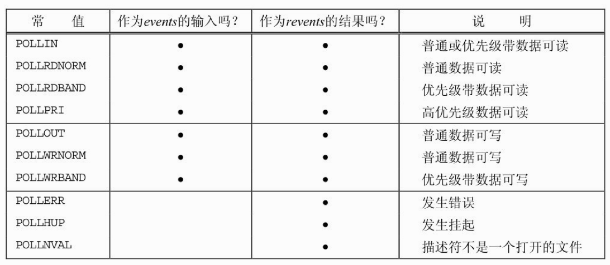
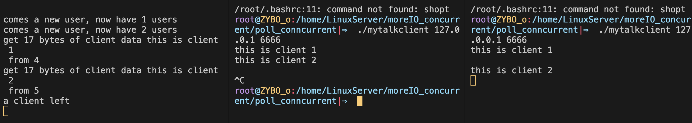

## 多路I/O复用

多路IO转接服务器也叫做多任务IO服务器。该类服务器实现的主旨思想是， **不再由应用程序自己监视客户端连接，取而代之由内核替应用程序监视文件描述符。** 这对提高程序的性能至关重要。通常，网络程序在下列情况下需要使用I/O 复用技术。

+ 客户端程序需要同时处理多个socket。比如非阻塞connect技术。
+ 客户端程序要同时处理用户输入和网络连接。
+ TCP服务器要同时监听socket和连接socket。
+ 服务器需要同时处理TCP和UDP请求
+ 服务器需要同时监听多个端口，或者处理多种服务。

需要指出的的是，I/O复用虽然能同时监听多个文件描述符，但它本身是阻塞的。 而**且当多个文件描述符同时就绪时，如果不采用额外的措施，程序就只能按照顺序依次处理其中的每一个文件描述符，这使得服务器程序看起来像是串行工作的。**  :diamond_shape_with_a_dot_inside:  如果要实现并发，只能使用多进程或者多线程等编程手段。 

Linux下实现I/O复用的系统调用主要有： 

:small_blue_diamond: select

:small_blue_diamond: ​poll

:small_blue_diamond: ​epoll


## select系统调用

select系统调用的用途是：在一段指定时间内，监听用户感兴趣的文件描述符上的可读，可写，和异常等时间。

### 1.API解析

```c
/* According to POSIX.1-2001, POSIX.1-2008 */
#include <sys/select.h>

/* According to earlier standards */
#include <sys/time.h>
#include <sys/types.h>
#include <unistd.h>

int select(int nfds, fd_set *readfds, fd_set *writefds,
           fd_set *exceptfds, struct timeval *timeout);

struct timeval {
  	long tv_sec; /* seconds */
  	long tv_usec; /* microseconds */
};

//下面的宏访问fd_set结构体中的位
void FD_ZERO(fd_set *set); 			//把文件描述符集合里所有位清0
void FD_CLR(int fd, fd_set *set); 	//把文件描述符集合里fd清0
int FD_ISSET(int fd, fd_set *set); 	//测试文件描述符集合里fd是否置1
void FD_SET(int fd, fd_set *set); 	//把文件描述符集合里fd位置1

#include <sys/select.h>

int pselect(int nfds, fd_set *readfds, fd_set *writefds,
            fd_set *exceptfds, const struct timespec *timeout,
            const sigset_t *sigmask);
```

:diamonds: **参数：**

+ nfds： 指定被监听的文件描述符的总数。它通常被设置为select 监听的所有文件描述符中的最大值加1，因为文件描述符是从0开始计数的。

+ readfds： 监控有读数据到达文件描述符集合，传入传出参数

+ writefds： 监控写数据到达文件描述符集合，传入传出参数

+ exceptfds： 监控异常发生达文件描述符集合,如带外数据到达异常，传入传出参数

+ timeout： 定时阻塞监控时间，3种情况

  1. NULL，永远等下去

  2. 设置timeval，等待固定时间

  3. 设置timeval里时间均为0，检查描述字后立即返回，轮询

:diamonds: ​**返回值：**
+ 成功： **所监听的所有 监听集合中，满足条件的总数**
+ 失败： 返回 -1 并设置errno


### 2.文件描述符就绪条件

:diamonds: **下面情况下 socket 可读**

+ socket接收缓冲区中的数据字节数大于等于套接字接收缓冲区低水位标记SO_RCVLOWAT的当前大小。 此时可以无阻塞地读该socket，对这样的套接字执行读操作不会阻塞并将返回一个大于0的值。
+ socket的读半部关闭（也就是接收了FIN的TCP连接）。对这样的套接字的读操作将不阻塞并返回0（也就是返回EOF）。
+ 监听socket上有了新的连接。对这样的套接字的accept通常不会阻塞。
+ Socket上有一个套接字错误待处理。对这样的套接字的读操作将不阻塞并返回-1（也就是返回一个错误），同时把errno设置成确切的错误条件。 这些错误可以通过getsockopt来读取和清除。

:diamonds: **下面情况下 socket 可写**

+ Socket发送缓冲区中的可用空间字节数大于等于套接字发送缓冲区低水位标记SO_SNDLOWAT的当前大小，并且或者该套接字已连接，或者该套接字不需要连接（如UDP套接字）。此时可以无阻塞地写该socket，并且写操作返回的字节数大于0。
+  socket的写半部关闭。对这样的套接字的写操作将产生SIGPIPE信号。
+ socket使用非阻塞式connect的套接字已建立连接，或者connect已经以失败告终。
+ socket上有一个套接字错误待处理。对这样的套接字的写操作将不阻塞并返回-1（也就是返回一个错误。


### 3.select的优缺点

:diamonds: **优点：**

1. select目前几乎在所有的平台上支持，其良好跨平台支持也是它的一个优点。

:diamonds: **缺点：**

1. select能监听的文件描述符个数 **受限于FD_SETSIZE** ,一般为1024，单纯改变进程打开的文件描述符个数并不能改变select监听文件个数。 `可以通过修改宏定义甚至重新编译内核的方式提升这一限制`，但是这样也会造成效率的降低。

2. 解决1024以下客户端时使用select是很合适的，但如果链接客户端过多，select采用的是轮询模型，会大大降低服务器响应效率，不应在select上投入更多精力

   > 当套接字比较多的时候，每次select()都要通过遍历FD_SETSIZE个socket来完成调度，不管哪个socket是活跃的，都遍历一遍。这会浪费很多CPU时间。
   >
   > `如果能给套接字注册某个回调函数，当他们活跃时，自动完成相关操作，那就避免了轮询`，这正是epoll与kqueue做的。

3. **文件描述符监听集合** 与 **返回后的满足监听条件的集合** 是一个集合，每次操作都需要将原有的集合进行保存。


## poll系统调用

> poll系统调用和select类似，也是在指定时间内轮询一定数量的文件描述符，以测试其中是否有就绪者。

### 1.API解析

```c
#include <poll.h>

int poll(struct pollfd *fds, nfds_t nfds, int timeout);

#define _GNU_SOURCE         /* See feature_test_macros(7) */
#include <signal.h>
#include <poll.h>

int ppoll(struct pollfd *fds, nfds_t nfds,
          const struct timespec *tmo_p, const sigset_t *sigmask);
```

:diamonds: ​**参数：**

+ fds： pollfd结构类型的数组，它指定所有我们感兴趣的文件描述符上发生的可读，可写和异常等事件。

  ```c
  struct pollfd {
      int fd; /* 文件描述符 */
  		short events; /* 监控的事件 */
  		short revents; /* 监控事件中满足条件返回的事件，由内核填充 */
  };
  ```

  + poll支持的事件类型如下表所示：

    <div align = center></div>

    :small_blue_diamond:  Linux内核2.6.17开始，GNU为poll增加了 POLLRDHUP 事件。它在socket上接收到对方关闭连接的请求之后触发。

+ nfds： 指定被监听时间集合fds的大小。

+ timeout： 毫秒级等待
  + -1：阻塞等待，#define INFTIM -1         Linux中没有定义此宏
  + = 0：立即返回，不阻塞进程
  + \> 0：等待指定毫秒数，如当前系统时间精度不够毫秒，向上取值

:diamonds: ​**返回值：**

+ 成功： **所监听的所有 监听集合中，满足条件的总数**
+ 失败： 返回 -1 并设置errno

:diamonds: ​**简单的使用案例**

```c
struct pollfd fds[100];
//初始化
fds[0].fd = listenfd;
fds[0].events = POLLIN;
fds[1].fd = fd1;
fds[1].events = POLLIN;
fds[2].fd = fd2;
fds[2].events = POLLIN;
fds[3].fd = fd3;
fds[3].events = POLLIN;
fds[4].fd = fd4;
fds[4].events = POLLIN;
//调用poll函数
poll(fds, 5, -1);
```

:diamonds: ​**修改文件描述符的上限数目**

+ 可以使用cat命令查看一个进程可以打开的socket描述符上限。

  ```bash
  cat /proc/sys/fs/file-max
  ```

+ 如有需要，可以通过修改配置文件的方式修改该上限值。

  ```bash
  sudo vi /etc/security/limits.conf
  ```

+ 在文件尾部写入以下配置,soft软限制，hard硬限制。如下图所示。

  <div align = center></div>


### 2.poll的优缺点

**优点：**

+ 可以修改文件描述符的上限数目，优于select
+ 将监听集合 和 返回集合 实现了分离，不像select那么麻烦，搜索范围更小

**缺点：**

+ 但还是需要将数组全部变量，找出已连接的文件描述符，而不是直接返回满足的文件描述符数组。

### 3.poll实现聊天室程序

:diamond_shape_with_a_dot_inside: 本节以poll为例实现一个简单的聊天室程序，以阐述如何使用I/O复用技术来同时处理网络连接和用户输入。

该聊天室程序能让所有用户同时在线群聊，它分为客户端和服务器两个部分。其中客户端程序有两个功能：

+ 从标准输入终端读入用户数据，并将用户数据发送至服务器；
+ 往标准输出终端打印服务器发送给它的数据。服务器的功能是接收客户数据，并把客户数据发送给每一个登录到该服务器上的客户端（数据发送者除外）。

#### 客户端

:one:  **创建socket，绑定IP与端口，进行连接**

```c++
const char* ip = argv[1];
int port = atoi( argv[2] );

struct sockaddr_in server_address;
bzero( &server_address, sizeof( server_address ) );
server_address.sin_family = AF_INET;
inet_pton( AF_INET, ip, &server_address.sin_addr );
server_address.sin_port = htons( port );

int sockfd = socket( PF_INET, SOCK_STREAM, 0 );
assert( sockfd >= 0 );
//进行连接
if ( connect( sockfd, ( struct sockaddr* )&server_address, sizeof( server_address ) ) < 0 )
{
  	printf( "connection failed\n" );
  	close( sockfd );
 	 return 1;
}
```

:two: **注册poll**

```c++
pollfd fds[2];
//注册标准输入标识符
fds[0].fd = 0;
fds[0].events = POLLIN;
fds[0].revents = 0;
//注册socket文件标识符
fds[1].fd = sockfd;
fds[1].events = POLLIN | POLLRDHUP;
fds[1].revents = 0;
```

:three: **注册管道**

```c++
char read_buf[BUFFER_SIZE];
int pipefd[2];
int ret = pipe( pipefd );
assert( ret != -1 );
```

:four: **处理逻辑**

```c++
while( 1 )
{
  	//调用poll系统调用
    ret = poll( fds, 2, -1 );
    if( ret < 0 ){
        printf( "poll failure\n" );
        break;
    }

  	//如果是 POLLRDHUP 事件。说明server已经关闭链接
    if( fds[1].revents & POLLRDHUP ){
        printf( "server close the connection\n" );
        break;
    }
  	//如果是 socket的读事件，则将消息从缓冲区取出并输出至终端
    else if( fds[1].revents & POLLIN ){
        memset( read_buf, '\0', BUFFER_SIZE );
        recv( fds[1].fd, read_buf, BUFFER_SIZE-1, 0 );
        printf( "%s\n", read_buf );
    }
  	//如果是标准输入的读事件——输入消息至终端，则利用splice函数，零拷贝得将消息通过管道传输至socket中
    /*splice函数，高效的零拷贝*/
    if( fds[0].revents & POLLIN )
    {   //将 标准输入的数据 定向到到管道 中
        ret = splice( 0, NULL, pipefd[1], NULL, 32768, SPLICE_F_MORE | SPLICE_F_MOVE );
        //将管道中的数据 定向到 socket 中，等待server端进行读取
        ret = splice( pipefd[0], NULL, sockfd, NULL, 32768, SPLICE_F_MORE | SPLICE_F_MOVE );
    }
}
```

#### 服务器端

:one: **创建用户的数据结构：**

```c
//客户数据
struct client_data
{
    sockaddr_in address;            //客户端socket地址
    char* write_buf;                //待写到客户端的数据的位置
    char buf[ BUFFER_SIZE ];        //从客户端读入的数据
};
```

:two:  **创建socket，绑定IP与端口，设置监听数目**

```c++
const char* ip = argv[1];
int port = atoi( argv[2] );

int ret = 0;
struct sockaddr_in address;
bzero( &address, sizeof( address ) );
address.sin_family = AF_INET;
inet_pton( AF_INET, ip, &address.sin_addr );
address.sin_port = htons( port );

int listenfd = socket( PF_INET, SOCK_STREAM, 0 );
assert( listenfd >= 0 );

ret = bind( listenfd, ( struct sockaddr* )&address, sizeof( address ) );
assert( ret != -1 );

ret = listen( listenfd, 5 );
assert( ret != -1 );
```

:three: **创建用户数组，初始化poll数组，注册listenfd事件**

```c++
//创建 FD_LIMIT 个用户元素？
client_data* users = new client_data[FD_LIMIT];
//创建 USER_LIMIT + 1 个poll事件数组
pollfd fds[USER_LIMIT + 1];
//连接数目
int user_counter = 0;
//先初始化为-1
for( int i = 1; i <= USER_LIMIT; ++i ){
  fds[i].fd = -1;
  fds[i].events = 0;
}
//数组第一个注册的是 listened 文件描述符
fds[0].fd = listenfd;
fds[0].events = POLLIN | POLLERR;
fds[0].revents = 0;
```

:four: **while循环，进行poll系统调用**

```c++
while( 1 ){   
  	//进行系统调用
    ret = poll( fds, user_counter + 1, -1 );
    if ( ret < 0 ){
        printf( "poll failure\n" );
        break;
    }
  ...
}
```

:five:  **循环遍历返回的事件数组，如果监听到的是连接事件**

```c++
//遍历结束后返回的 事件数组
for( int i = 0; i < user_counter + 1; ++i ){
    //如果是 listenfd 描述符 并且是 读事件
    if( ( fds[i].fd == listenfd ) && ( fds[i].revents & POLLIN ) ) {
      ...
      //进行连接
      int connfd = accept( listenfd,...);
     
      //如果用户数超过极限，则报错，关闭当前的 socket
      if( user_counter >= USER_LIMIT ){
        ...
        close( connfd );
        continue;
      }
      //用户数目 + 1
      user_counter++;
      //文件描述符对应的用户数组进行填写信息： 客户端socket地址
      users[connfd].address = client_address;
      //设置为非阻塞
      setnonblocking( connfd );
      //注册新用户对应的 poll 事件
      fds[user_counter].fd = connfd;
      fds[user_counter].events = POLLIN | POLLRDHUP | POLLERR;
      fds[user_counter].revents = 0;
      printf( "comes a new user, now have %d users\n", user_counter );
    }
```

:six:  **如果监听到的是 错误事件**

```c++
else if( fds[i].revents & POLLERR )
{
    //输入错误信息
    printf( "get an error from %d\n", fds[i].fd );
    char errors[ 100 ];
    memset( errors, '\0', 100 );
    socklen_t length = sizeof( errors );
    if( getsockopt( fds[i].fd, SOL_SOCKET, SO_ERROR, &errors, &length ) < 0 ){
      	printf( "get socket option failed\n" );
    }
    continue;
}
```

:seven: **如果监听到的是对方关闭链接的事件** :arrow_backward: ==注意==​

```c++
else if( fds[i].revents & POLLRDHUP )
{   
    //将最后一个 用户信息 赋给 关闭链接 的用户信息
    users[fds[i].fd] = users[fds[user_counter].fd];
    //关闭 原来对应的 socket 
    close( fds[i].fd );
    //传递新的 socket
    fds[i] = fds[user_counter];
    //循环退回一步，这样用来重新检查
    i--;
    //用户数目 - 1
    user_counter--;
    //输出退出信息
    printf( "a client left\n" );
}
```

:eight: **如果监听的是读事件**

```c++
else if( fds[i].revents & POLLIN )
{   //定义一个 socket 接受 读事件的socket
    int connfd = fds[i].fd;
    memset( users[connfd].buf, '\0', BUFFER_SIZE );
    //将文件描述符中的数据 读到 用户客户端数据处
    ret = recv( connfd, users[connfd].buf, BUFFER_SIZE-1, 0 );
    printf( "get %d bytes of client data %s from %d\n", ret, users[connfd].buf, connfd );
    //缓冲区数据被完全接收
    if( ret < 0 ){
        if( errno != EAGAIN )
        {
            close( connfd );
            //删除当前的用户
            users[fds[i].fd] = users[fds[user_counter].fd];
            fds[i] = fds[user_counter];
            i--;
            user_counter--;
        }
    }
    else if( ret == 0 )
      	printf( "code should not come to here\n" );
    else{
        //将数据发送给通知其他socket
        for( int j = 1; j <= user_counter; ++j )
        {
            if( fds[j].fd == connfd )
                continue;

            fds[j].events |= ~POLLIN;
            fds[j].events |= POLLOUT;
            //其他用户需要写的数据
            users[fds[j].fd].write_buf = users[connfd].buf;
        }
    }
 }
```

:nine:  **如果是写事件**

```c++
else if( fds[i].revents & POLLOUT )
{
    int connfd = fds[i].fd;
    //如果缓冲区为空，则继续
    if( ! users[connfd].write_buf ) 
      	continue;
    //将数据发送给对应的用户
    ret = send(...);
    //重新调整用户信息
    users[connfd].write_buf = NULL;
    fds[i].events |= ~POLLOUT;
    fds[i].events |= POLLIN;
}
```

:keycap_ten: **清楚内存，关闭socket**

```c++
delete [] users;
close( listenfd );
```

<div align = center></div>

