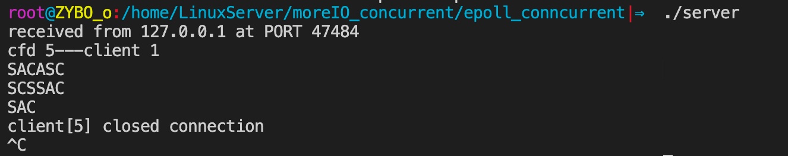
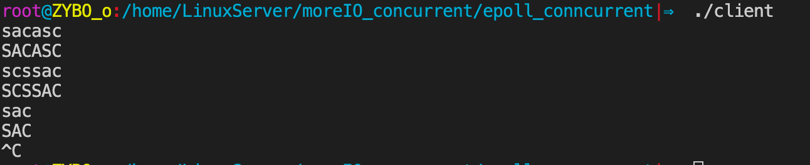

## 一.epoll基本使用

### 1.基本介绍

epoll是Linux下多路复用IO接口select/poll的增强版本，它能显著提高程序在大量并发连接中只有少量活跃的情况下的系统CPU利用率。

+ 因为它会复用文件描述符集合来传递结果而不用迫使开发者每次等待事件之前都必须重新准备要被侦听的文件描述符集合，
+ 另一点原因就是获取事件的时候，它无须遍历整个被侦听的描述符集，只要遍历那些被内核IO事件异步唤醒而加入Ready队列的描述符集合就行了。

目前epell是linux大规模并发网络程序中的热门首选模型。

epoll除了提供select/poll那种IO事件的电平触发（Level Triggered）外，还提供了边沿触发（Edge Triggered），这就使得用户空间程序有可能缓存IO状态，减少epoll_wait/epoll_pwait的调用，提高应用程序效率。


### 2.基础API

#### epoll_create 函数

```c
#include <sys/epoll.h>

int epoll_create(int size);
int epoll_create1(int flags);
//On success, these system calls return a nonnegative file descriptor.  On error, -1 is returned, and errno is set to
```

+  创建一个epoll句柄，参数size用来告诉内核监听的文件描述符的个数，跟内存大小有关。

+ **参数：**

  + size：监听数目(告诉Linux内核创建多大的epoll模型)

    > 但这只是给Linux内核的建议值，建议内核创建多大结点的红黑树

+ 返回的文件描述符，它指向红黑树中的树根


#### epoll_ctl 函数

```c
 #include <sys/epoll.h>

int epoll_ctl(int epfd, int op, int fd, struct epoll_event *event);
//When successful, epoll_ctl() returns zero.  When an error occurs, epoll_ctl() returns -1 and errno is set appropriately.

struct epoll_event {
			__uint32_t events; /* Epoll events */
			epoll_data_t data; /* User data variable */
};
/*
	**epoll_event中的 events:
	EPOLLIN ：	表示对应的文件描述符可以读（包括对端SOCKET正常关闭）
	EPOLLOUT：	表示对应的文件描述符可以写
	EPOLLPRI：	表示对应的文件描述符有紧急的数据可读（这里应该表示有带外数据到来）
	EPOLLERR：	表示对应的文件描述符发生错误
	EPOLLHUP：	表示对应的文件描述符被挂断；
	EPOLLET： 	将EPOLL设为边缘触发(Edge Triggered)模式，这是相对于水平触发(Level Triggered)而言的
	EPOLLONESHOT：只监听一次事件，当监听完这次事件之后，如果还需要继续监听这个socket的话，需要再次把这个socket加入到EPOLL队列里
*/

typedef union epoll_data {
    void *ptr;
    int fd;					//与epoll_ctl函数中的fd对应
    uint32_t u32;
    uint64_t u64;
} epoll_data_t;
```

+ 控制某个epoll监控的文件描述符上的事件：注册、修改、删除。
+ **参数：**
  + epfd ： epoll_create成功返回的文件描述符，即红黑树树根
  + op ： 在红黑树树上进心增删改：
    + EPOLL_CTL_ADD (注册新的fd到epfd)
    + EPOLL_CTL_MOD (修改已经注册的fd的监听事件)
    + EPOLL_CTL_DEL (从epfd删除一个fd)
  + fd ： 具体需要操作的文件描述符
  + event： 告诉内核需要监听的事件


#### epoll_wait

```c
 #include <sys/epoll.h>

int epoll_wait(int epfd, struct epoll_event *events,
               int maxevents, int timeout);
int epoll_pwait(int epfd, struct epoll_event *events,
                int maxevents, int timeout,
                const sigset_t *sigmask);
//返回值： 成功返回有多少文件描述符就绪，时间到时返回0，出错返回-1
```

+  等待所监控文件描述符上有事件的产生，类似于 select() 调用。

+ **参数：**

  + epfd ： epoll_create成功返回的文件描述符，即红黑树树根

  + events ： 是一个传出参数数组

    > epoll_ctl中是传入变量的地址，这个变量初始化好就行
    >
    > epoll_wait中是传入数组，传出满足事件的文件描述符，每个元素都是epoll_event结构体

  + maxevents ： 告之内核这个events有多大，这个maxevents的值不能大于创建epoll_create()时的size，

  + timeout ：是超时时间

    +  -1： 阻塞
    +  0： 立即返回，非阻塞
    + \>0： 指定毫秒


### 3.epoll实现基本socket通信

服务器端：

```c
#include "wrap.h"

#define MAXLINE 8192
#define SERV_PORT 8000
#define OPEN_MAX 5000

int main(int argc, char *argv[])
{
    int i, listenfd, connfd, sockfd;
    int  n, num = 0;
    ssize_t nready, efd, res;
    char buf[MAXLINE], str[INET_ADDRSTRLEN];
    socklen_t clilen;

    struct sockaddr_in cliaddr, servaddr;
    //tep: epoll_ctl参数  ep[] : epoll_wait参数
    struct epoll_event tep, ep[OPEN_MAX];       
   
    //创建socket
    listenfd = Socket(AF_INET, SOCK_STREAM, 0);

    //端口复用
    int opt = 1;
    setsockopt(listenfd, SOL_SOCKET, SO_REUSEADDR, &opt, sizeof(opt));      //端口复用

    //绑定Socket
    bzero(&servaddr, sizeof(servaddr));
    servaddr.sin_family = AF_INET;
    servaddr.sin_addr.s_addr = htonl(INADDR_ANY);
    servaddr.sin_port = htons(SERV_PORT);
    Bind(listenfd, (struct sockaddr *) &servaddr, sizeof(servaddr));

    //设置监听数目
    Listen(listenfd, 20);

     //创建epoll模型, efd指向红黑树根节点
    efd = epoll_create(OPEN_MAX);              
    if (efd == -1)
        perr_exit("epoll_create error");

    //指定lfd的监听时间为"读"
    tep.events = EPOLLIN; 
    //将listened文件描述符设置为数据
    tep.data.fd = listenfd; 
    //将lfd及对应的结构体设置到树上,efd可找到该树          
    res = epoll_ctl(efd, EPOLL_CTL_ADD, listenfd, &tep);    
    if (res == -1)
        perr_exit("epoll_ctl error");

    for ( ; ; ) {
        /*epoll为server阻塞监听事件, ep为struct epoll_event类型数组, OPEN_MAX为数组容量, -1表永久阻塞*/
        nready = epoll_wait(efd, ep, OPEN_MAX, -1); 
        if (nready == -1)
            perr_exit("epoll_wait error");

        for (i = 0; i < nready; i++) {
            //如果不是"读"事件, 继续循环
            if (!(ep[i].events & EPOLLIN))      
                continue;

            //判断满足事件的fd是不是lfd      
            if (ep[i].data.fd == listenfd) {          
                clilen = sizeof(cliaddr);
                //接受链接
                connfd = Accept(listenfd, (struct sockaddr *)&cliaddr, &clilen);    

                printf("received from %s at PORT %d\n", 
                        inet_ntop(AF_INET, &cliaddr.sin_addr, str, sizeof(str)), 
                        ntohs(cliaddr.sin_port));
                printf("cfd %d---client %d\n", connfd, ++num);

                //添加至红黑树进行监听
                tep.events = EPOLLIN; tep.data.fd = connfd;
                res = epoll_ctl(efd, EPOLL_CTL_ADD, connfd, &tep);
                if (res == -1)
                    perr_exit("epoll_ctl error");

            //不是lfd, 
            } else {                                
                sockfd = ep[i].data.fd;
                n = Read(sockfd, buf, MAXLINE);

                if (n == 0) {                       //读到0,说明客户端关闭链接
                    //将该文件描述符从红黑树摘除
                    res = epoll_ctl(efd, EPOLL_CTL_DEL, sockfd, NULL);  
                    if (res == -1)
                        perr_exit("epoll_ctl error");
                    //关闭与该客户端的链接
                    Close(sockfd);                  
                    printf("client[%d] closed connection\n", sockfd);

                } else if (n < 0) {                 //出错
                    perror("read n < 0 error: ");
                    res = epoll_ctl(efd, EPOLL_CTL_DEL, sockfd, NULL);
                    Close(sockfd);

                } else {                            //实际读到了字节数
                    for (i = 0; i < n; i++)
                        buf[i] = toupper(buf[i]);   //转大写,写回给客户端

                    Write(STDOUT_FILENO, buf, n);
                    Writen(sockfd, buf, n);
                }
            }
        }
    }
    Close(listenfd);
    Close(efd);

    return 0;
}
```

客户端：

```c
#include <stdio.h>
#include <string.h>
#include <unistd.h>
#include <netinet/in.h>
#include <arpa/inet.h>

#include "wrap.h"

#define MAXLINE 8192
#define SERV_PORT 8000

int main(int argc, char *argv[])
{
    struct sockaddr_in servaddr;
    char buf[MAXLINE];
    int sockfd, n;

    sockfd = Socket(AF_INET, SOCK_STREAM, 0);

    bzero(&servaddr, sizeof(servaddr));
    servaddr.sin_family = AF_INET;
    inet_pton(AF_INET, "127.0.0.1", &servaddr.sin_addr);
    servaddr.sin_port = htons(SERV_PORT);

    Connect(sockfd, (struct sockaddr *)&servaddr, sizeof(servaddr));

    while (fgets(buf, MAXLINE, stdin) != NULL) {
        Write(sockfd, buf, strlen(buf));
        n = Read(sockfd, buf, MAXLINE);
        if (n == 0) {
            printf("the other side has been closed.\n");
            break;
        }
        else
            Write(STDOUT_FILENO, buf, n);
    }
    Close(sockfd);

    return 0;
}
```

<div align = center></div>

<div align = center></div>

## 二.epoll事件模型

### 1.事件模型

**EPOLL事件有两种模型：**

+ **Edge Triggered (ET)** ： 边缘触发只有数据到来才触发，不管缓存区中是否还有数据。

+ **Level Triggered (LT)** ：水平触发只要有数据都会触发。

**思考如下步骤：**

1. 假定我们已经把一个用来从管道中读取数据的文件描述符(RFD)添加到epoll描述符。
2.  管道的另一端写入了2KB的数据

3. 调用epoll_wait，并且它会返回RFD，说明它已经准备好读取操作

4. 读取1KB的数据

5. 调用epoll_wait……

在这个过程中，有两种工作模式：

### 2.ET模式

如果我们在第1步将RFD添加到epoll描述符的时候使用了EPOLLET标志，那么 **在第5步调用epoll_wait之后将有可能会挂起，因为剩余的数据还存在于文件的输入缓冲区内，而且数据发出端还在等待一个针对已经发出数据的反馈信息。**

**只有在监视的文件句柄上发生了某个事件的时候 ET 工作模式才会汇报事件。** 因此在第5步的时候，调用者可能会放弃等待仍在存在于文件输入缓冲区内的剩余数据。

**epoll工作在ET模式的时候，必须使用非阻塞套接口，以避免由于一个文件句柄的阻塞读/阻塞写操作把处理多个文件描述符的任务饿死。** 最好以下面的方式调用ET模式的epoll接口，在后面会介绍避免可能的缺陷。

+  基于非阻塞文件句柄

+  只有当read或者write返回EAGAIN(非阻塞读，暂时无数据) 时才需要挂起、等待。但这并不是说每次read时都需要循环读，直到读到产生一个EAGAIN才认为此次事件处理完成，当read返回的读到的数据长度小于请求的数据长度时，就可以确定此时缓冲中已没有数据了，也就可以认为此事读事件已处理完成。

### 3.LT模式

与ET模式不同的是，以LT方式调用epoll接口的时候，它就相当于一个速度比较快的poll，无论后面的数据是否被使用。

LT(level triggered)：LT是缺省的工作方式，并且同时支持block和no-block socket。在这种做法中，内核告诉你一个文件描述符是否就绪了，然后你可以对这个就绪的fd进行IO操作。如果你不作任何操作，内核还是会继续通知你的，所以，这种模式编程出错误可能性要小一点。传统的select/poll都是这种模型的代表。

ET(edge-triggered)：ET是高速工作方式，只支持no-block socket。在这种模式下，当描述符从未就绪变为就绪时，内核通过epoll告诉你。然后它会假设你知道文件描述符已经就绪，并且不会再为那个文件描述符发送更多的就绪通知。 **请注意，如果一直不对这个fd作IO操作(从而导致它再次变成未就绪)，内核不会发送更多的通知(only once).**


## 三.epoll反应堆模型

### 1.epoll模型对比

+ epoll模型原来的流程

```c
epoll_create(); // 创建监听红黑树
epoll_ctl(); // 向书上添加监听fd
epoll_wait(); // 监听
有监听fd事件发送--->返回监听满足数组--->判断返回数组元素--->
lfd满足accept--->返回cfd---->read()读数据--->write()给客户端回应。
```

+ epoll反应堆模型的流程

```c
epoll_create(); // 创建监听红黑树
epoll_ctl(); // 向书上添加监听fd
epoll_wait(); // 监听
有客户端连接上来--->lfd调用acceptconn()--->将cfd挂载到红黑树上监听其读事件--->
epoll_wait()返回cfd--->cfd回调recvdata()--->将cfd摘下来，重新设置监听写事件---> 进行逻辑操作 --->
epoll_wait()返回cfd--->cfd回调senddata()--->将cfd摘下来，重新设置监听读事件--->...--->
```

> 这样修改的原因：
>
> 滑动窗口相关概念，如果客户端缓冲区被填满，被填满则无法回写，服务器端会出现阻塞。

<div align = center></div>


### 2.实例

```c
/*
 *epoll基于非阻塞I/O事件驱动
 */
#include <stdio.h>
#include <sys/socket.h>
#include <sys/epoll.h>
#include <arpa/inet.h>
#include <fcntl.h>
#include <unistd.h>
#include <errno.h>
#include <string.h>
#include <stdlib.h>
#include <time.h>

#define MAX_EVENTS  1024                                    //监听上限数
#define BUFLEN 4096                                         //缓存区大小
#define SERV_PORT   8080                                    //端口号

void recvdata(int fd, int events, void *arg);
void senddata(int fd, int events, void *arg);

/* 描述就绪文件描述符相关信息 */
struct myevent_s {
    int fd;                                                 //要监听的文件描述符
    int events;                                             //对应的监听事件
    void *arg;                                              //泛型参数
    void (*call_back)(int fd, int events, void *arg);       //回调函数
    int status;                                             //是否在监听:1->在红黑树上(监听), 0->不在(不监听)
    char buf[BUFLEN];
    int len;
    long last_active;                                       //记录每次加入红黑树 g_efd 的时间值
};

int g_efd;                                                  //全局变量, 保存epoll_create返回的文件描述符，红黑树树根
struct myevent_s g_events[MAX_EVENTS + 1];                  //自定义结构体类型数组. +1-->listen fd


/*将结构体 myevent_s 成员变量 初始化

 * 封装一个自定义事件，包括fd，这个fd的回调函数，还有一个额外的参数项
 * 注意：在封装这个事件的时候，为这个事件指明了回调函数，一般来说，一个fd只对一个特定的事件
 * 感兴趣，当这个事件发生的时候，就调用这个回调函数
 */
void eventset(struct myevent_s *ev, int fd, void (*call_back)(int, int, void *), void *arg)
{
    ev->fd = fd;
    ev->call_back = call_back;
    ev->events = 0;
    ev->arg = arg;
    ev->status = 0;
    memset(ev->buf, 0, sizeof(ev->buf));
    ev->len = 0;
    ev->last_active = time(NULL);                       //调用eventset函数的时间

    return;
}

/* 向 epoll监听的红黑树 添加一个 文件描述符 */
void eventadd(int efd, int events, struct myevent_s *ev)
{
    struct epoll_event epv = {0, {0}};
    int op;
    epv.data.ptr = ev;
    epv.events = ev->events = events;       //EPOLLIN 或 EPOLLOUT

    if (ev->status == 1) {                  //已经在红黑树 g_efd 里
        op = EPOLL_CTL_MOD;                 //修改其属性
    } else {                                //不在红黑树里
        op = EPOLL_CTL_ADD;                 //将其加入红黑树 g_efd, 并将status置1
        ev->status = 1;
    }

    if (epoll_ctl(efd, op, ev->fd, &epv) < 0)                       //实际添加/修改
        printf("event add failed [fd=%d], events[%d]\n", ev->fd, events);
    else
        printf("event add OK [fd=%d], op=%d, events[%0X]\n", ev->fd, op, events);

    return ;
}

/* 从epoll 监听的 红黑树中删除一个 文件描述符*/
void eventdel(int efd, struct myevent_s *ev)
{
    struct epoll_event epv = {0, {0}};

    if (ev->status != 1)                                        //不在红黑树上
        return ;

    epv.data.ptr = ev;
    ev->status = 0;                                             //修改状态
    epoll_ctl(efd, EPOLL_CTL_DEL, ev->fd, &epv);                //从红黑树 efd 上将 ev->fd 摘除

    return ;
}

/*  当有文件描述符就绪, epoll返回, 调用该函数 与客户端建立链接 */
void acceptconn(int lfd, int events, void *arg)
{
    struct sockaddr_in cin;
    socklen_t len = sizeof(cin);
    int cfd, i;

    if ((cfd = accept(lfd, (struct sockaddr *)&cin, &len)) == -1) {
        if (errno != EAGAIN && errno != EINTR) {
            /* 暂时不做出错处理 */
        }
        printf("%s: accept, %s\n", __func__, strerror(errno));//打印当前函数名
        return ;
    }

    do {
        for (i = 0; i < MAX_EVENTS; i++)                                //从全局数组g_events中找一个空闲元素
            if (g_events[i].status == 0)                                //类似于select中找值为-1的元素
                break;                                                  //跳出 for

        if (i == MAX_EVENTS) {                                          //已经到达上限
            printf("%s: max connect limit[%d]\n", __func__, MAX_EVENTS);
            break;                                                      //跳出do while(0) 不执行后续代码
        }

        int flag = 0;
        if ((flag = fcntl(cfd, F_SETFL, O_NONBLOCK)) < 0) {             //将cfd也设置为非阻塞
            printf("%s: fcntl nonblocking failed, %s\n", __func__, strerror(errno));
            break;
        }

        /* 给cfd设置一个 myevent_s 结构体, 回调函数 设置为 recvdata */
        eventset(&g_events[i], cfd, recvdata, &g_events[i]);            
        eventadd(g_efd, EPOLLIN, &g_events[i]);                         //将cfd添加到红黑树g_efd中,监听读事件

    } while(0);                                                         //很巧妙的替代了goto功能

    printf("new connect [%s:%d][time:%ld], pos[%d]\n", 
            inet_ntoa(cin.sin_addr), ntohs(cin.sin_port), g_events[i].last_active, i);
    return ;
}

/*读取客户端发过来的数据的函数*/
void recvdata(int fd, int events, void *arg)
{
    struct myevent_s *ev = (struct myevent_s *)arg;
    int len;

    len = recv(fd, ev->buf, sizeof(ev->buf), 0);            //读文件描述符, 数据存入myevent_s成员buf中

    eventdel(g_efd, ev);                                    //将该节点从红黑树上摘除

    if (len > 0) {

        ev->len = len;
        ev->buf[len] = '\0';                                //手动添加字符串结束标记
        printf("C[%d]:%s\n", fd, ev->buf);

        eventset(ev, fd, senddata, ev);                     //设置该 fd 对应的回调函数为 senddata
        eventadd(g_efd, EPOLLOUT, ev);                      //将fd加入红黑树g_efd中,监听其写事件

    } else if (len == 0) {
        close(ev->fd);
        /* ev-g_events 地址相减得到偏移元素位置 */
        printf("[fd=%d] pos[%ld], closed\n", fd, ev-g_events);
    } else {
        close(ev->fd);
        printf("recv[fd=%d] error[%d]:%s\n", fd, errno, strerror(errno));
    }

    return;
}

/*发送给客户端数据*/
void senddata(int fd, int events, void *arg)
{
    struct myevent_s *ev = (struct myevent_s *)arg;
    int len;

    len = send(fd, ev->buf, ev->len, 0);                    //直接将数据 回写给客户端。未作处理
    /*
    printf("fd=%d\tev->buf=%s\ttev->len=%d\n", fd, ev->buf, ev->len);
    printf("send len = %d\n", len);
    */

    if (len > 0) {

        printf("send[fd=%d], [%d]%s\n", fd, len, ev->buf);
        eventdel(g_efd, ev);                                //从红黑树g_efd中移除
        eventset(ev, fd, recvdata, ev);                     //将该fd的 回调函数改为 recvdata
        eventadd(g_efd, EPOLLIN, ev);                       //从新添加到红黑树上， 设为监听读事件

    } else {
        close(ev->fd);                                      //关闭链接
        eventdel(g_efd, ev);                                //从红黑树g_efd中移除
        printf("send[fd=%d] error %s\n", fd, strerror(errno));
    }

    return ;
}

/*创建 socket, 初始化lfd */
void initlistensocket(int efd, short port)
{
    int lfd = socket(AF_INET, SOCK_STREAM, 0);
    fcntl(lfd, F_SETFL, O_NONBLOCK);                                            //将socket设为非阻塞

    /* void eventset(struct myevent_s *ev, int fd, void (*call_back)(int, int, void *), void *arg);  */
    //回调函数传入参数，传入的是函数本身，这样就能使用结构体的其他参数
    eventset(&g_events[MAX_EVENTS], lfd, acceptconn, &g_events[MAX_EVENTS]);

    /* void eventadd(int efd, int events, struct myevent_s *ev) */
    //将lfd添加到红黑树
    eventadd(efd, EPOLLIN, &g_events[MAX_EVENTS]);

    struct sockaddr_in sin;
	memset(&sin, 0, sizeof(sin));                                               //bzero(&sin, sizeof(sin))
	sin.sin_family = AF_INET;
	sin.sin_addr.s_addr = INADDR_ANY;
	sin.sin_port = htons(port);

	bind(lfd, (struct sockaddr *)&sin, sizeof(sin));

	listen(lfd, 20);

    return ;
}

int main(int argc, char *argv[])
{
    unsigned short port = SERV_PORT;

    if (argc == 2)
        port = atoi(argv[1]);                           //使用用户指定端口.如未指定,用默认端口

    g_efd = epoll_create(MAX_EVENTS + 1);                 //创建红黑树,返回给全局 g_efd 
    if (g_efd <= 0)
        printf("create efd in %s err %s\n", __func__, strerror(errno));

    initlistensocket(g_efd, port);                      //初始化监听socket

    struct epoll_event events[MAX_EVENTS + 1];            //保存已经满足就绪事件的文件描述符数组 
	printf("server running:port[%d]\n", port);

    int checkpos = 0, i;
    while (1) {

        /* 超时验证，每次测试100个链接，不测试listenfd 当客户端60秒内没有和服务器通信，则关闭此客户端链接 */
        long now = time(NULL);                          //当前时间
        for (i = 0; i < 100; i++, checkpos++) {         //一次循环检测100个。 使用checkpos控制检测对象
            if (checkpos == MAX_EVENTS)
                checkpos = 0;
            if (g_events[checkpos].status != 1)         //不在红黑树 g_efd 上
                continue;

            long duration = now - g_events[checkpos].last_active;       //客户端不活跃的时间

            if (duration >= 60) {
                close(g_events[checkpos].fd);                           //关闭与该客户端链接
                printf("[fd=%d] timeout\n", g_events[checkpos].fd);
                eventdel(g_efd, &g_events[checkpos]);                   //将该客户端 从红黑树 g_efd移除
            }
        }

        /*监听红黑树g_efd, 将满足的事件的文件描述符加至events数组中, 1秒没有事件满足, 返回 0*/
        int nfd = epoll_wait(g_efd, events, MAX_EVENTS+1, 1000);
        if (nfd < 0) {
            printf("epoll_wait error, exit\n");
            break;
        }

        for (i = 0; i < nfd; i++) {
            /*使用自定义结构体myevent_s类型指针, 接收 联合体data的void *ptr成员*/
            struct myevent_s *ev = (struct myevent_s *)events[i].data.ptr;  

            if ((events[i].events & EPOLLIN) && (ev->events & EPOLLIN)) {           //读就绪事件
                ev->call_back(ev->fd, events[i].events, ev->arg);                   //调用读事件满足后需要进行的回调函数
            }
            if ((events[i].events & EPOLLOUT) && (ev->events & EPOLLOUT)) {         //写就绪事件
                ev->call_back(ev->fd, events[i].events, ev->arg);                   //调用写事件满足后需要进行的回调函数
            }
        }
    }

    /* 退出前释放所有资源 */
    return 0;
}
```


