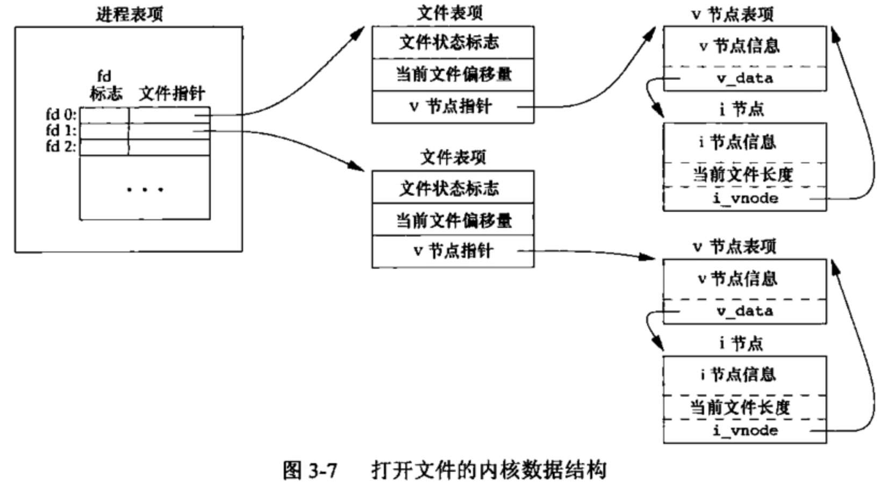
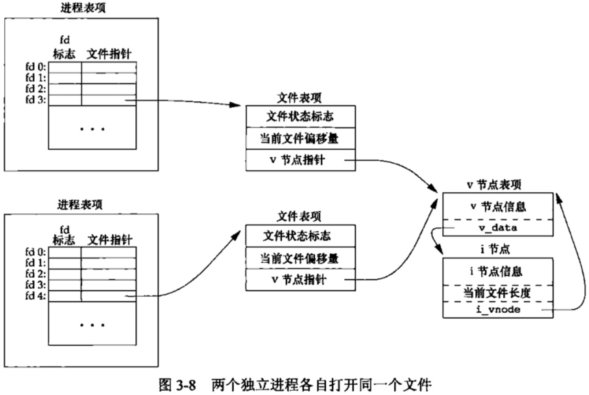
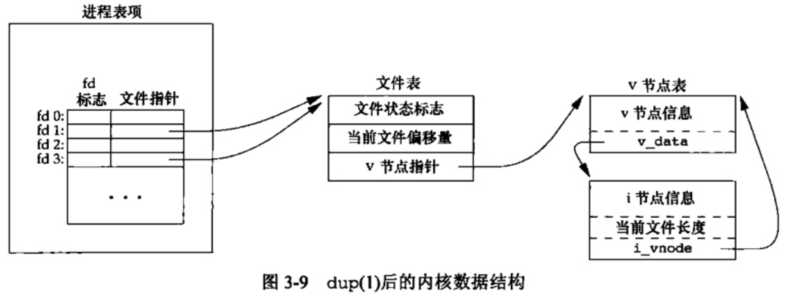
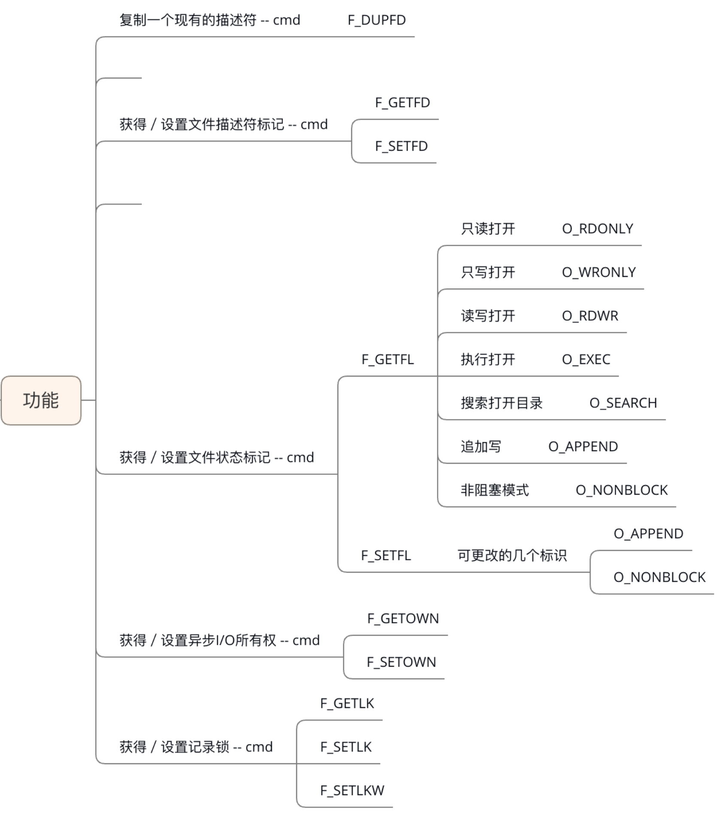

# 文件I/O

UNX系统中的大多数文件只需用到5个函数:open、read、 write、 lseek以及close。

本章描述的函数经常被称为不带缓冲的I/O( unbuffered I/O,与将在第5章中说明的标准I/O函数相对照)。术语不带缓冲指的是每个read和 write都调用内核中的一个系统调用。

只要涉及在多个进程间共享资源,原子操作的概念就变得非常重要。我们将通过文件IO和open函数的参数来讨论此概念。

## 一.文件描述符

对于内核而言,**所有打开的文件都通过文件描述符引用**。文件描述符是一个非负整数。当打开一个现有文件或创建一个新文件时,内核向进程返回一个文件描述符。

按照惯例,UNIX系统shell把**文件描述符0与进程的标准输入关联,文件描述符1与标准输出关联,文件描述符2与标准错误关联**。这是各种shel以及很多应用程序使用的惯例.

在符合POSIX.1的应用程序中，幻数0，1，2虽然已被标准化，但还是应该换成常量STDIN_FILENO，STDOUT_FILENO和STDERR_FILENO来提高可读性。这些常量定义在有文件<unistd.h>中。

## 二.函数open和openat

调用open或openat函数用于打开或者创建一个文件。

```c
#include <fcntl.h> 
int open(const char *path, int oflag, ... /* mode_t mode */ ); 
int openat(int fd, const char *path, int oflag, ... /* mode_t mode */ ); 
//Both return: file descriptor if OK, −1 on error
```

我们将最后一个参数写为…,ISO C用这种方法表明余下的参数的数量及其类型是可变的。对于open函数而言,仅当创建新文件时才使用最后这个参数。

+ path参数是要打开或创建文件的名字。
+ oflag参数可用来说明此函数的多个选项。用一个或者多个常量“或”运算构成oflag参数
  + oflags参数表示打开文件所采用的操作，我们需要注意的是：必须指定以下五个常量的一种，且只允许指定一个
    + **O_RDONLY：**只读模式
    + **O_WRONLY：**只写模式
    + **O_RDWR：**可读可写
    + **OEXEC：** 只执行打开
    + **O_SEARCH：** 只搜索打开(应用于目录)
  + 以下的常量是选用的，这些选项是用来和上面的必选项进行按位或起来作为oflags参数。
    + **O_APPEND：** 表示追加，如果原来文件里面有内容，则这次写入会写在文件的最末尾。 
    + **O_CREAT ：**表示如果指定文件不存在，则创建这个文件 
    + **O_EXCL：** 表示如果同时制定了O_CREAT，而文件已存在，则出错，同时返回 -1，并且修改 errno 的值。 
    + **O_TRUNC：** 表示截断，如果文件存在，并且以只写、读写方式打开，则将其长度截断为0。 
    + **O_NOCTTY：** 如果路径名指向终端设备，不要把这个设备用作控制终端。 
    + **O_NONBLOCK：** 如果路径名指向 FIFO/块文件/字符文件，则把文件的打开和后继 I/O设置为非阻塞模式（nonblocking mode） 
  + 以下三个常量同样是选用的，它们用于同步输入输出
    + **O_DSYNC：** 等待物理 I/O 结束后再 write。在不影响读取新写入的数据的前提下，不等待文件属性更新。 
    + **O_RSYNC：** read 等待所有写入同一区域的写操作完成后再进行 
    + **O_SYNC：** 等待物理 I/O 结束后再 write，包括更新文件属性的 I/O


### 1.open函数与fopen函数区别
从来源来分，这两者很好区分：

+ open函数是Unix下系统调用函数，操作成功返回的是文件描述符，操作失败返回的是-1,

+ fopen是ANSIC标准中C语言库函数，所以在不同的系统中调用不同的内核的API，返回的是一个指向文件结构的指针。

+ 同时open函数没有缓冲，fopen函数有缓冲，open函数一般和write配合使用，fopen函数一般和fwrite配合使用。

### 2.open函数与openat函数比较

#### 相同点

当传给函数的路径名是绝对路径时，二者无区别.（openat()自动忽略第一个参数fd）

#### 不同点

当传给函数的是相对路径时，如果openat()函数的第一个参数fd是常量AT_FDCWD时，则其后的第二个参数路径名是以当前工作目录为基址的；否则以fd指定的目录文件描述符为基址。

目录文件描述符的取得通常分为两步，先用opendir()函数获得对应的DIR结构的目录指针，再使用`int dirfd(DIR*)`函数将其转换成目录描述符，此时就可以作为openat()函数的第一个参数使用了。

#### 实例

1. 打开采用绝对路径表示的文件/home/leon/test.c,如果文件不存在就创建它。

```c
fd = open("/home/leon/test.c", O_RDWR | O_CREAT, 0640);
fd = openat(anything, "/home/leon/test.c", O_RDWR | O_CREAT, 0640);
```

2. 打开采用相对路径表示的文件

a.打开当前目录文件下的test.c

```c
fd = open("./test.c", O_RDWR | O_CREAT, 0640);
fd = openat( AT_FDCWD, O_RDWR | O_CREAT, 0640);
```

b.打开用户chalion家目录中的test.c文件,且此时你在自己的家目录

```c
DIR* dir_chalion = opendir(/home/chalion);
fd_chalion = dirfd(dir_chalion);
fd = openat(fd_chalion, "test.c" ,O_RDWR | O_CREAT, 0640);
```

## 三.函数create

可以调用create函数创建一个文件：

```c
#include <fcntl.h> 

int creat(const char *path, mode_t mode); 
//Returns: file descriptor opened for write-only if OK, −1 on error
```

此函数等效于`open(path, O_WRONLY | O_CREAT | O_TRUNC, mode);`

creat的一个不足之处是它以只写方式打开所创建的文件。

## 四.函数close

调用close函数关闭一个打开的文件：

```c
#include <unistd.h> 

int close(int fd);
//Returns: 0 if OK, −1 on error
```

关闭一个文件时还会释放该进程加在该文件上的所有记录锁。

当一个进程终止时,内核自动关闭它所有的打开文件。很多程序都利用了这一功能而不显式地用close关闭打开文件。

## 五.函数lseek

每个打开文件都有一个与其相关联的“**当前文件偏移量**”( current file offset)。它通常是一个非负整数,用以度量从文件开始处计算的字节数。通常，读、写操作都是从当前文件偏移量开始，并使偏移量增加读写的字节数。在系统默认情况下，当打开一个文件时，除非指定O_APPEND项，否则当前偏移量被设置为0。

调用lseek显式地为一个打开文件设置偏移量：

```c
#include <unistd.h>

off_t lseek(int fd, off_t offset, int whence);
//Returns: new file offset if OK, −1 on error
```

对参数offet的解释与参数 whence的值有关。

- 若 whence是 SEEK_SET,则将该文件的偏移量设置为距文件开始处 offset个字节。
- 若 whence是 SEEK_CUR,则将该文件的偏移量设置为其当前值加 offset, offset可为正或负。
- 若 whence是 SEEK_END,则将该文件的偏移量设置为文件长度加 offset, offset可正可负。

若lseek成功执行，则返回新的文件偏移量，为此可以用下面方式确定打开文件的偏移量：

```c
off_t currpos;
currpos = lseek(fd, 0, SEEK_CUR);
```

lseek仅将当前的文件偏移量记录在内核中,它并不引起任何IO操作。然后,该偏移量用于下一个读或写操作。

文件偏移量可以大于文件的当前长度,在这种情况下,对该文件的下一次写将加长该文件,并在文件中构成一个空洞,这一点是允许的。位于文件中但没有写过的字节都被读为0

**文件中的空洞并不要求在磁盘上占用存储区**。具体处理方式与文件系统的实现有关,当定位到超出文件尾端之后写时,对于新写的数据需要分配磁盘块,但是对于原文件尾端和新开始写位置之间的部分则不需要分配磁盘块。

创建一个具有空洞的文件：

```c
#include "apue.h"
#include <fcntl.h>

char	buf1[] = "abcdefghij";
char	buf2[] = "ABCDEFGHIJ";

int
main(void)
{
	int		fd;

	// 创建文件
	if ((fd = creat("file.hole", FILE_MODE)) < 0)
		err_sys("creat error");

	// 写入a-j，此时文件偏移量为10
	if (write(fd, buf1, 10) != 10)
		err_sys("buf1 write error");
	/* offset now = 10 */

	// 改变文件偏移量到16384
	if (lseek(fd, 16384, SEEK_SET) == -1)
		err_sys("lseek error");
	/* offset now = 16384 */

	// 在新的文件偏移量下写入A-J
	if (write(fd, buf2, 10) != 10)
		err_sys("buf2 write error");
	/* offset now = 16394 */

	exit(0);
}
```

因为lseek使用的偏移量是用off_t类型表示的,所以允许具体实现根据各自特定的平台自行选择大小合适的数据类型。

## 六.函数read

调用read函数从打开文件中读数据

```c
#include <unistd.h> 

ssize_t read(int fd, void *buf, size_t nbytes); 
//Returns: number of bytes read, 0 if end of file, −1 on error
```

如read成功,则返回读到的字节数。如已到达文件的尾端,则返回0。

有多种情况可使实际读到的字节数少于要求读的字节数

- 读普通文件时,在读到要求字节数之前已到达了文件尾端。
- 当从终端设备读时,通常一次最多读一行。
- 当从网络读时,网络中的缓冲机制可能造成返回值小于所要求读的字节数
- 当从管道或FIFO读时,如若管道包含的字节少于所需的数量,那么read将只返回实际可用的字节数
- 当从某些面向记录的设备(如磁带)读时,一次最多返回一个记录。
- 当一信号造成中断,而已经读了部分数据量时。

## 七.函数write

调用write函数想打开文件写数据

```c
#include <unistd.h> 

ssize_t write(int fd, const void *buf, size_t nbytes); 
//Returns: number of bytes written if OK, −1 on error
```

其返回值通常与参数 nbytes的值相同,否则表示出错。 write出错的一个常见原因是磁盘已写满,或者超过了一个给定进程的文件长度限制

## 八.I/O的效率

BUFFSIZE 一般选取与磁盘块相同大小的字节数，大多数情况下4096

大多数文件系统为改善性能都采用某种预读( read ahead)技术。当检测到正进行顺序读取时,系统就试图读入比应用所 要求的更多数据,并假想应用很快就会读这些数据。

## 九.文件共享

UNIX系统支持在不同进程间共享打开文件。在介绍dup函数之前,先要说明这种共享。为此先介绍内核用于所有I/O的数据结构。

内核使用3种数据结构表示打开文件,它们之间的关系决定了在文件共享方面一个进程对另个进程可能产生的影响。

1. **每个进程在进程表中都有一个记录项,记录项中包含一张打开文件描述符表**，可将其视为一个矢量，每个描述符占用一项。与每个文件描述符相关联的是：
   + 文件描述符标志。
   + 指向一个文件表项的指针。
2. **内核为所有打开文件维持一张文件表**。每个文件表项包含：
   + 文件状态标志(读、写、添写、同步和非阻塞等)
   + 当前文件偏移量
   + 指向该文件v节点表项的指针
3. 每个打开文件(或设备)都有一个v节点( v-node)结构。v节点包含了文件类型和对此文件进行各种操作函数的指针。对于大多数文件,v节点还包含了该文件的i节点(i-node,索引节点)。这些信息是在打开文件时从磁盘上读入内存的，所以，文件的所有相关信息都是随时可用的。

<div align = center></div>

> 创建v节点结构的目的是对在一个计算机系统上的多文件系统类型提供支持。把与文件系统无关的i节点部分称为v节点。Linux没有将相关数据结构分为i节点和ⅴ节点,而是采用了一个与文件系统相关的i节点和个与文件系统无关的i节点。

如果两个独立进程打开同一个文件，则有下图的关系：

<div align = center></div>

文件描述符标志和文件状态标志在作用范围方面的区别，前者只用于一个进程的一个描述符，而后者则应用于指向该给定文件表项的任何进程中的所有描述符。

---

## 十.原子操作

原子操作指的是由多步组成的一个操作。如果该操作原子地执行，则要么执行完所有步骤，要么一步也不执行，不能只执行所有步骤的一个子集。

### 1.追加到一个文件

多个进程同时使用这种方法将数据追加写到同一文件,则会产生问题

问题出在逻辑操作“先定位到文件尾端,然后写”，它使用了两个分开的函数调用。解决问题的方法是使这两个操作对于其他进程而言成为一个原子操作。

### 2.函数pread和pwrite

```c
#include <unistd.h> 

ssize_t pread(int fd, void *buf, size_t nbytes, off_t offset); 
//Returns: number of bytes read, 0 if end of file, −1 on error

ssize_t pwrite(int fd, const void *buf, size_t nbytes, off_t offset); 
//Returns: number of bytes written if OK, −1 on error
```

调用 pread相当于调用lseek后调用read，但是 pread又与这种顺序调用有下列重要区别：

+  调用 pread时,无法中断其定位和读操作。
+ 不更新当前文件偏移量。

调用pwrite相当于调用lseek后调用 write,但也与它们有类似的区别。

---

## 十一.dup和dup2

下面两个用来复制一个文件描述符

```c
#include <unistd.h>

int dup(int fd);
int dup2(int fd, int fd2);
//Both return: new file descriptor if OK, −1 on error
```

由dup返回的新文件描述符一定是当前可用文件描述符中的最小数值。

对于dup2，可以用fd2参数指定新描述符的值。如果fd2已经打开，则先将其关闭。如若fd等于fd2，则dup2返回fd2，而不关闭它。否则,fd2的 FD_CLOEXEO文件描述符标志就被清除，这样fd2在进程调用exec时是打开状态。

这些函数返回的新文件描述符与参数fd共享一个文件表项，如下图所示：

<div align = center></div>

在此图中，假定进程启动时执行了：

```c
newfd = dup(1);
```

当此函数开始执行时，假定一下个可用的描述符是3。因为两个描述符指向同一个文件表项，所以它们共享同一个文件状态标志(读，写，追加等)以及同一当前文件偏移量。

## 十二.函数sync、 fsync和 fdatasync

传统的UNⅨ系统实现在内核中设有缓冲区高速缓存或页高速缓存,大多数磁盘I/O都通过缓冲区进行。当我们向文件写入数据时，内核通常先将数据复制到缓冲区中，然后排入队列,晚些时候再写入磁盘。这种方式被称为**延迟写**( delayed write)

通常，当内核需要重用缓冲区来存放其他磁盘块数据时,它会把所有延迟写数据块写入磁盘为了保证磁盘上实际文件系统与缓冲区中内容的一致性，UNIX系统提供了sync、 fsync和Edatasync三个函数。

```c
#include <unistd.h> 

int fsync(int fd); 
int fdatasync(int fd);
//Returns: 0 if OK, −1 on error
void sync(void);
```

sync只是将所有修改过的块缓冲区排入写队列，然后就返回，它并不等待实际写磁盘操作结束。

fsync函数只对由文件描述符/指定的一个文件起作用，并且等待写磁盘操作结束才返回fsync可用于数据库这样的应用程序，这种应用程序需要确保修改过的块立即写到磁盘上。

fdatasync函数类似于 sync，但它只影响文件的数据部分。而除数据外，fsync还会同步更新文件的属性。

## 十三.函数fcntl 

fcntl函数可以改变已经打开文件的属性。

```c
#include <fcntl.h> 

int fcntl(int fd, int cmd, ... /* int arg */ ); 
//Returns: depends on cmd if OK (see following), −1 on error
```

fcnt1函数有以下5种功能

1. 复制一个已有的描述符(cmd= F_DUPFD或 F_DUPFD_CLOEXEC)。
2. 获取/设置文件描述符标志(cmd= E_GETED或 F_SETED)。
3. 获取/设置文件状态标志(cmd= F_GETEL或 F_SETEL)
4. 获取/设置异步IO所有权(cmd= F_GETOWN或F_SETOWN)。
5. 获取/设置记录锁(cmd= F_GETLK、 F_SETLK或 F_SETLKW)

<div align = center></div>

在修改文件描述符标志或文件状态标志时必须谨慎，先要获得现在的标志值，然后按照期望修改它，最后设置新标志值。不能只是执行 F_SETED或 E_SETEL命令,这样会关闭以前设置的标志位。

```c
#include <stdio.h>
#include <stdlib.h>
#include <fcntl.h>
#include <unistd.h>
#include <string.h>
int main(void)
{
    int fd;
    int flag;
    // 测试字符串
    char *p = "我们是一个有中国特色的社会主义国家！！！！！！";
    char *q = "呵呵, 社会主义好哇。。。。。。";
    // 只写的方式打开文件
    fd = open("test.txt", O_WRONLY);
    if(fd == -1)
    {
        perror("open");
        exit(1);
    }
    // 输入新的内容，该部分会覆盖原来旧的内容
    if(write(fd, p, strlen(p)) == -1)
    {
        perror("write");
        exit(1);
    }
    // 使用 F_GETFL 命令得到文件状态标志
    flag = fcntl(fd, F_GETFL, 0);
    if(flag == -1)
    {
        perror("fcntl");
        exit(1);
    }
    // 将文件状态标志添加 ”追加写“ 选项
    flag |= O_APPEND;
    // 将文件状态修改为追加写
    if(fcntl(fd, F_SETFL, flag) == -1)
    {
        perror("fcntl -- append write");
        exit(1);
    }
    // 再次输入新内容，该内容会追加到旧内容的后面
    if(write(fd, q, strlen(q)) == -1)
    {
        perror("write again");
        exit(1);
    }
    // 关闭文件
    close(fd);
    return 0;
}
```
