# 一.进程环境

> 本章主要的学习内容：
>
> + main函数是如何被调用的
>
> + 命令行参数是如何传递给新程序的
>
> + 典型的存储空间布局是什么样式
>
> + 如何分配另外的存储空间
>
> + 进程如何使用环境变量
>
> + 进程的不同终止方式
> + longjmp和setjmp函数以及它们与栈的交换方式

## 一.main函数

C程序总是从main函数开始执行，main函数的原型是：

```c
int main(int argc, char *argv);
```

>  其中，argc是命令行参数的数目，argv是指向参数的各个指针所构成的数组

**当内核执行C程序时(使用一个exec函数),在调用main前先调用一个特殊的启动例程**。  

**可执行程序文件将此启动例程指定为程序的起始地址—这是由连接编辑器设置的,而连接编辑器则由C编译器调用。** 启动例程从内核取得命令行参数和环境变量值,然后为按上述方式调用main函数做好安排。

## 二.进程终止

有8种方法使得进程终止(termination)，其中5种为正常终止：

1. 从main返回
2. 调用exit
3. 调用 _exit 或  _Exit
4. 最后一个线程从其启动例程返回
5. 从最后一个线程调用 pthread_exit

异常终止有3种方式,它们是:

1. 调用 abort
2. 接到一个信号
3. 最后一个线程对取消请求做出响应

### 1.退出函数

3个函数用于正常终止一个程序: _ exit和 _Exit立即进入内核, exit则先执行一些清理处理,然后返回内核。

```c
#include <stdlib.h> 
void exit(int status); 
void _Exit(int status);
 
#include <unistd.h> 
void _exit(int status);
```

> `exit`函数总是执行一个标准I/O库的清理关闭操作:对于所有打开流调用fclose函数。这造成输出缓冲中的所有数据都被冲洗(写到文件上)
>
> 3个退出函数都带一个整型参数,称为终止状态(或退出状态, exit status)。大多数UNIX系统 shell都提供检查进程终止状态的方法。

### 2.atexit函数

按照ISO C的规定,一个进程可以登记多至32个函数,这些函数将由exit自动调用。我们称这些函数为终止处理程序( exit handler),并调用 atexit函数来登记这些函数。

```c
#include <stdlib.h>
int atexit(void (*func)(void));
// Returns: 0 if OK, nonzero on error
```

>  其中, `atexit`的参数是一个函数地址,当调用此函数时无需向它传递任何参数,也不期望它返回一个值。exit调用这些函数的顺序与它们登记时候的顺序相反。同一函数如若登记多次也会被调用多次。

exit首先调用各终止程序，然后关闭（通过fclose）所有打开的流

<div align = center>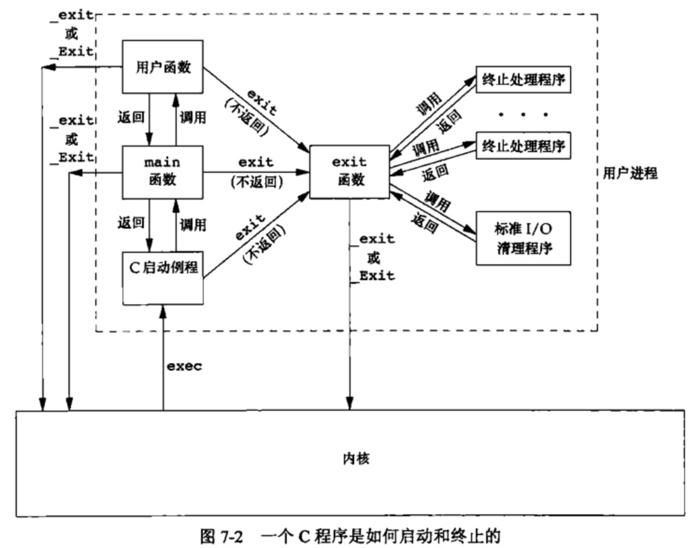</div>

注意,**内核使程序执行的唯一方法是调用一个exec函数。进程自愿终止的唯一方法是显式或隐式地(通过调用exit)调用exit或Exit**。进程也可非自愿地由一个信号使其终止。

> atexit函数有点像析构函数的意思

```c
#include "apue.h"

static void	my_exit1(void);
static void	my_exit2(void);

int
main(void)
{
	if (atexit(my_exit2) != 0)
		err_sys("can't register my_exit2");

	if (atexit(my_exit1) != 0)
		err_sys("can't register my_exit1");
	if (atexit(my_exit1) != 0)
		err_sys("can't register my_exit1");
	if (atexit(my_exit1) != 0)
		err_sys("can't register my_exit1");

	printf("main is done\n");
	return(0);
}

static void
my_exit1(void)
{
	printf("first exit handler\n");
}

static void
my_exit2(void)
{
	printf("second exit handler\n");
}
```

<div align = center></div>

## 三.命令行参数

当执行一个程序时,调用exec的进程可将命令行参数传递给该新程序。

ISO C和POSIX.1都要求argv[argc]是一个空指针。这就使我们可以将参数处理循环改写为

```c
for(i = 0; argv[i] != NULL; i++)
```

## 四.环境表

每个程序都接收到一张环境表。与参数表一样,**环境表也是一个字符指针数组**,其中每个指针包含一个以null结束的C字符串的地址。全局变量 environ则包含了该指针数组的地址

<div align = center>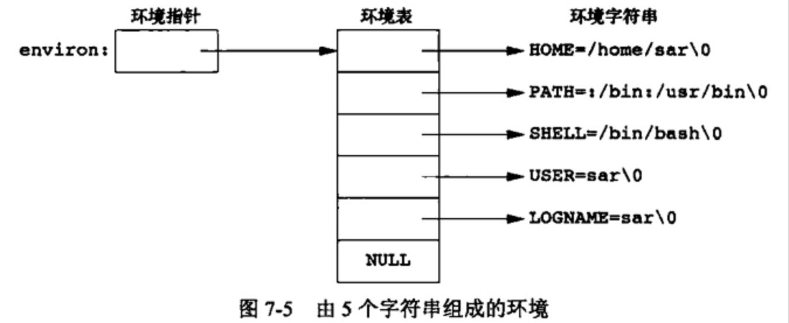</div>

## 五.C程序的存储空间布局

C程序一直由以下几个部分组成：

<div align = center></div>

+  **正文段。** 这是由CPU执行的机器指令部分。通常正文段是可共享的，但通常也只能制度，防止程序由于意外而修改其指令。
+  **初始化数据段。** 通常将此段称为数据段,它包含了程序中需明确地赋初值的变量。
+  **未初始化数据段。** 通常将此段称为bss段 (名称来源于早期汇编程序一个操作符,意思是“由符号开始的块”( block started by symbol))。在程序开始执行之前， **内核将此段中的数据初始化为0或空指针** 。
+  **栈。** 自动变量以及每次函数调用时所需保存的信息都存放在此段中。
+  **堆。** 通常在堆中进行动态存储分配。

> +  a.out 中还有其他类型的段，如符号表的段，包含调试信息的段以及包含动态共享库链接表的段等。这些部分并不装载到进程执行的程序映像中。
>
> +  未初始化数据段的内容并不存放在磁盘程序文件中。其原因是,内核在程序开始运行前将它们都设置为0。需要存放在磁盘程序文件中的段只有正文段和初始化数据段

## 六.共享库

+ 共享库使得**可执行文件中不再需要包含公用的库函数** ，而只需在所有进程都可引用的存储区中保存这种库例程的一个副本。
+ 程序第一次执行或者第一次调用某个库函数时,**用动态链接方法将程序与共享库函数相链接**。这减少了每个可执行文件的长度,但增加了一些运行时间开销。这种时间开销发生在该程序第一次被执行时,或者每个共享库函数第一次被调用时。
+ 共享库的另一个优点是**可以用库函数的新版本代替老版本而无需对使用该库的程序重新连接编辑**(假定参数的数目和类型都没有发生改变)

## 七.存储空间分配

ISO C说明了3个用于存储空间动态分配的函数

1. malloc,分配 **指定字节数的存储区** 。此存储区中的初始值不确定。
2. calloc,为 **指定数量 指定长度** 的对象分配存储空间。**该空间中的每一位(bit)都初始化为0**
3. realloc, **增加或减少以前分配区的长度** 。当增加长度时,可能需将以前分配区的内容移到另一个足够大的区域,以便在尾端提供增加的存储区,而新增区域内的初始值则不确定。

```c
#include <stdlib.h>

// All three return: non-null pointer if OK, NULL on error
void *malloc(size_t size);
void *calloc(size_t nobj, size_t size);
void *realloc(void *ptr, size_t newsize);
//这3个分配函数所返回的指针一定是适当对齐的,使其可用于任何数据对象。

void free(void *ptr);
//free函数释放ptr所指向的存储空间。被释放的空间通常被送入可用存储区池。以后可在调用上述3个分配函数时再分配。
```

## 八.环境变量

环境字符串的形式是 `name=value`

UNIX内核并不查看这些字符串,它们的解释完全取决于各个应用程序。

可以使用getenv函数获得环境变量的值：

```c
#include <stdlib.h> 

//此函数返回一个指针,它指向`name=value`字符串中的 value。
char *getenv(const char *name); 
// Returns: pointer to value associated with name, NULL if not found
```

设置环境变量的三个函数:

```c
#include <stdlib.h> 

//putenv取形式为name=value的字符串,将其放到环境表中。如果name已经存在,则先删除其原来的定义。
int putenv(char *str);
// Returns: 0 if OK, nonzero on error

//setenv将name设置为value。
int setenv(const char *name, const char *value, int rewrite); 
//unsetenv删除name的定义
int unsetenv(const char *name); 
// Both return: 0 if OK, −1 on error
```

> setenv必须分配存储空间，以便依据其参数创建name = value字符串。
>
> putenv可用自由地传递给它的参数字符串放到环境中。

这些函数在修改环境表时是如何进行操作的呢？ 

+ 环境表(指向实际`name=value`字符串的指针数组) 和 环境字符串 **通常存放在进程存储空间的顶部(栈之上)。**
+ 删除一个字符串很简单——只要先在环境表中找到该指针,然后将所有后续指针都向环境表首部顺次移动一个位置。
+ 但是增加一个字符串或修改一个现有的字符串就困难得多。
  + 环境表和环境字符串通常占用的是进程地址空间的顶部，所以它不能再向高地址方向(向上)扩展：同时也不能移动在它之下的各栈帧，所以它也不能向低地址方向(向下)扩展。两者组合使得该空间的长度不能再增加。

## 九.函数setjmp和longjmp

在C中,goto语句是不能跨越函数的,而执行这种类型跳转功能的是函数 setjmp和1ongjmp两个函数对于处理发生在很深层嵌套函数调用中的出错情况是非常有用的

setjmp和1ongjmp函数可以看成一个非局部goto函数。非局部指的是这不是由普通的C语言goto语句在一个函数内实施的跳转,而是在栈上跳过若于调用帧,返回到当前函数调用路径上的某一个函数中。

```c
#include <setjmp.h> int setjmp(jmp_buf env); // Returns: 0 if called directly, nonzero if returning from a call to longjmpvoid longjmp(jmp_buf env, int val);
```

## 十.函数getrlimit和setrlimit

每个进程都有一组资源限制,其中一些可以用getrlimit和 setrlimit函数查询和更改。

```c
#include <sys/resource.h>int getrlimit(int resource, struct rlimit *rlptr);int setrlimit(int resource, const struct rlimit *rlptr);// Both return: 0 if OK, −1 on error
```

对于这两个函数的每一次调用都指定一个资源以及一个指向下列结构的指针。

```c
struct rlimit {  	rlim_t rlim_cur;//软限制  	rlim_t rlim_max;//硬限制}
```

在更改资源限制时，必须遵循下面三条原则：

+ 任何一个进程都可将一个软限制值更改为小于或等于其硬限制值。
+ 任何一个进程都可降低其硬限制值，但它必须大于或等于其软限制值。这种降低对于普通用户是不可逆的。
+ 只有超级用户进程可以提高硬限制值。


# 二.进程控制

> 本章学习的内容：
>
> + 创建进程，执行程序和进程终止
> + 说明进程属性的各种ID——实际，有效和保存的用户ID和组ID
> + 进程如何受到进程控制原语的影响
> + 介绍解释器文件和system函数
> + 讲述大多数UNIX系统所提供的进程会计机制

## 一.进程标识

每个进程都有一个非负整型表示的唯一进程ID。因为进程ID标识符总是唯一的,常将其用作其他标识符的一部分以保证其唯一性。虽然是唯一的,但是**进程ID是可复用的**。当一个进程终止后,其进程ID就成为复用的候选者。

>  大多数UNIX系统实现延迟复用算法,使得赋予新建进程的DD不同于最近终止进程所使用的ID。 **这防止了将新进程误认为是使用同一ID的某个已终止的先前进程。**

系统中有一些专用进程,但具体细节随实现而不同。

+ **ID为0的进程通常是调度进程，常常被称为交换进程(swapper) **。该进程是内核的一部分， **它并不执行任何磁盘上的程序,因此也被称为系统进程。**

+ **进程ID为1通常是init进程，在自举过程结束时由内核调用。** 该进程的程序文件在UNIX的早期版本中是/etc/init,在较新版本中是/sbin/init。 **此进程负责在自举内核后启动一个UNIX系统。** init通常读取与系统有关的初始化文件(/etc/rc*文件或/etc/inittab文件,以及在/etc/init.d中的文件),并将系统引导到一个状态(如多用户)。init进程决不会终止。 **它是一个普通的用户进程(与交换进程不同,它不是内核中的系统进程)，但是它以超级用户特权运行。**

每个UNIX系统实现都有它自己的一套提供操作系统服务的内核进程。例如，在某些UNIX的虚拟存储器实现中，进程ID2是页守护进程( page daemon),此进程负责支持虚拟存储器系统的分页操作。

返回进程标识符的函数如下：

```c
#include <unistd.h> 

pid_t getpid(void);
// Returns: process ID of calling process

pid_t getppid(void);
// Returns: parent process ID of calling process

uid_t getuid(void);
// Returns: real user ID of calling process实际用户

uid_t geteuid(void);
// Returns: effective user ID of calling process有效用户

gid_t getgid(void);
// Returns: real group ID of calling process实际组ID

gid_t getegid(void);
// Returns: effective group ID of calling process有效组ID
```

## 二.函数fork

一个现有进程调用fork函数创建一个新的进程

```c
#include <unistd.h> 

pid_t fork(void);
// Returns: 0 in child, process ID of child in parent, −1 on error
```

由fork创建的新进程被称为子进程(child process) 。fork函数被调用一次,但返回两次。两次返回的区别是：

+ 子进程的返回值是0
+ 父进程的返回值则是新建子进程的进程ID。

将子进程ID返回给父进程的理由是：因为一个进程的子进程可以有多个,**并且没有一个函数使一个进程可以获得其所有子进程的进程ID**。

fork使子进程得到返回值0的理由是：

+ 一个进程只会有一个父进程，所以子进程总是可以调用 getppid 以获得其父进程的进程ID(进程ID 0 总是由内核交换进程使用，所以一个子进程的进程ID不可能为0)。

子进程和父进程继续执行fork调用之后的指令。子进程是父进程的副本。

由于在fork之后经常跟随着exec，所以现在的很多实现并不执行一个父进程数据段栈和堆的完全副本。作为替代，使用了**写时复制**( copy-on-write,COW)技术。这些区域由父进程和子进程共享，而且内核将它们的访问权限改变为只读。 **如果父进程和子进程中的任一个试图修改这些区域，则内核只为修改区域的那块内存制作一个副本，通常是虚拟存储系统中的一“页”。**

一般来说,在fork之后是父进程先执行还是子进程先执行是不确定的，这取决于内核所使用的调度算法。如果要求父进程和子进程之间相互同步,则要求某种形式的进程间通信。

```c
#include "apue.h"

int		globvar = 6;		/* external variable in initialized data */
char	buf[] = "a write to stdout\n";

int
main(void)
{
	int		var;		/* automatic variable on the stack */
	pid_t	pid;

	var = 88;
	if (write(STDOUT_FILENO, buf, sizeof(buf)-1) != sizeof(buf)-1)
		err_sys("write error");
	printf("before fork\n");	/* we don't flush stdout */

	printf("sizeof(buf) = %d\n",sizeof(buf));
	printf("strlen(buf) = %d\n",strlen(buf));

	if ((pid = fork()) < 0) {
		err_sys("fork error");
	} else if (pid == 0) {		/* child */
		globvar++;				/* modify variables */
		var++;
	} else {
		sleep(2);				/* parent */
	}

	printf("pid = %ld, glob = %d, var = %d\n", (long)getpid(), globvar,
	  var);
	exit(0);
}

```

<div align = center>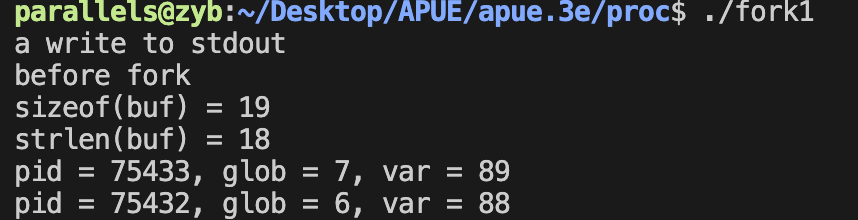</div>

### 1.sizeof与strlen区别：

+ strlen计算 **不包含终止null字节的字符串长度 ，**而sizeof则计算 **包括终止null字节的缓冲区长度**

+ **使用strlen需进行一次函数调用；** 对于sizeof而言，因为缓冲区已用已知字符串进行初始化,其长度是固定的,所以 **sizeof是在编译时计算缓冲区长度。**

### 2.文件共享

fork的一个特性是父进程的所有打开文件描述符都被复制到子进程中。我们说“复制”是因为对每个文件描述符来说,就好像执行了dup函数。**父进程和子进程每个相同的打开描述符共享一个文件表项**，因此他们共享的是一个文件偏移量。

若一个进程具有三个不同的打开文件，它们是标准输入，标准输出和标准错误。在从fork返回时，有了下图所示的结构：

<div align = center>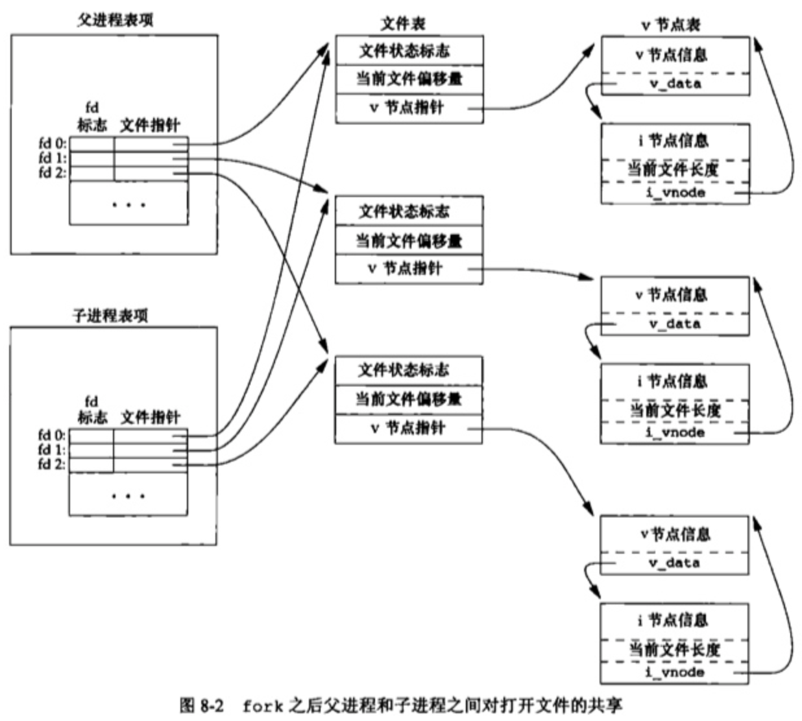</div>

父进程和子进程共享一个文件偏移量。

如果父进程和子进程写同一描述符指向的文件，但又没有任何形式的同步(如使父进程等待子进程)，那么它们的输出就会相互混合(假定所用的描述符是在fork之前打开的)。在fork之后处理文件描述符有以下两种情况：

1. 父进程等待子进程完成
2. 父进程和子进程各自执行不同的程序段。这种情况，fork之后，父进程和子进程各自关闭它们不需要使用的文件描述符，这样就不会干涉对方使用的文件描述符。网络服务进程经常使用这类方法。

除了打开文件之外,**子进程继承父进程的属性**有：

- 实际用户ID、实际组ID、有效用户ID、有效组ID
- 附属组ID
- 进程组ID
- 会话ID
- 控制终端
- 设置用户ID标志和设置组ID标志
- 当前工作目录
- 根目录
- 文件模式创建屏蔽字
- 信号屏蔽和安排
- 对任一打开文件描述符的执行时关闭( close-on-exec)标志
- 环境
- 连接的共享存储段
- 存储映像
- 资源限制

父进程和子进程的区别如下：

- fork的返回值不同
- 进程ID不同
- 这两个进程的父进程ID不同:子进程的父进程ID是创建它的进程的ID,而父进程的父进程ID则不变。
- 进程的 tms_utime、 tms_stime、 tms_cutime和tms_ultime的值设置为0
- 子进程不继承父进程设置的文件锁
- 子进程的未处理闹钟被清除
- 子进程的未处理信号集设置为空集

**使fork失败的原因主要有以下几个：**

1. 系统中已经有了太多的进程
2. 该实际用户ID的进程总数超过了系统限制

**fork有如下两种用法：**

1. 一个父进程希望复制自己,使父进程和子进程同时执行不同的代码段。

   > 网络服务进程中常见——父进程等待客户端的服务进程。当这种进程到达时，父进程调用fork，使子进程处理此请求。父进程继续等待下一个服务请求。

2. 一个进程要执行一个不同的程序

   > 这在shell中常见。这种情况下，子进程从fork返回后立即调用exec。

## 三.函数vfork

vfork函数的调用序列和返回值与fork相同,但两者的语义不同。

vfork函数用于创建一个新进程，而该新进程的目的是exec一个新程序。但是它并不将父进程的地址空间完全复制到子进程中，因为子进程会立即调用exec(或exit)，于是也就**不会引用该地址空间**。

不过在子进程调用exec或exit之前，它在父进程的空间中运行。这种优化工作方式在某些UNIX系统的实现中提高了效率，但如果子进程修改数据(除了用于存放 vfork返回值的变量)、进行函数调用、或者没有调用exec或exit就返回都可能会带来未知的结果。(就像上一节中提及的,实现采用写时复制技术以提高fork之后跟随exec操作的效率,但是不复制比部分复制还是要快一些)

vfork和fork之间的另一个区别是: **vfork保证子进程先运行，在它调用exec或exit之后父进程才可能被调度运行，当子进程调用这两个函数中的任意一个时，父进程会恢复运行**。

```c
int		globvar = 6;		/* external variable in initialized data */

int main(void)
{
	int		var;		/* automatic variable on the stack */
	pid_t	pid;
	var = 88;
	printf("before vfork\n");	/* we don't flush stdio */
	if ((pid = vfork()) < 0) {
		err_sys("vfork error");
	} else if (pid == 0) {		/* child */
		globvar++;				/* modify parent's variables */
		var++;
		printf("child pid = %ld\n", (long)getpid());
    //调用了_exit而不是exit，因为_exit不执行标准I/O缓冲区的冲洗操作，如果调用exit，则输出是不确定的，因为它依赖于标准I/O库的实现，有可能发现输出没有变化。
		_exit(0);				/* child terminates */
	}
	/* parent continues here */
	printf("parent pid = %ld, glob = %d, var = %d\n", (long)getpid(), globvar,
	  var);
	exit(0);
}
```

<div align = center>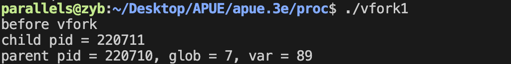</div>

> 如果子进程在调用exec或exit之前需要依赖父进程的进一步动作，会导致死锁。

## 四.函数exit

进程有5种正常终止和3种异常终止的方式，5种正常终止的方式如下：

1. 从main函数执行return函数

   > 等效于调用exit。

2. 调用exit函数

   > 操作包括调用各终止处理程序，然后关闭所有标准I/O流。

3. 调用 _ exit或 _Exit

   > 为进程提供一种无需运行终止处理程序或信号处理程序而终止的方法。

4. 最后一个线程从其启动例程中执行return语句

5. 从最后一个线程调用 pthread_exit 函数

   > 与4一样，进程的终止状态总是0

3种异常终止方式：

1. 调用 abort 

   > 产生SIGABRT信号，下一种异常终止的特例

2. 接到一个信号、

   > 信号可由进程自身，其他进程或内核产生

3. 最后一个线程对 取消(cancellation) 请求做出响应

   > 一个线程要求取消另一个线程，若干时间后，目标线程终止

不管进程如何终止,最后都会执行内核中的同一段代码。这段代码为相应进程**关闭所有打开描述符,释放它所使用的存储器等**。

对上述任意一种终止情形,我们都希望终止进程能够通知其父进程它是如何终止的。

+ 对于3个终止函数(exit、 _ exit和 _Exit),实现这一点的方法是，将其退出状态( exit status)作为参数传送给函数。

+ 在异常终止情况,内核(不是进程本身)**产生一个指示其异常终止原因的终止状态**( termination status)。在任意一种情况下，该终止进程的父进程都能用wait或waitpid函数(将在下一节说明)取得其终止状态。

上面说明了子进程将其终止状态返回给其父进程，但是如果父进程在子进程之前终止，又将如何呢?

+ 其回答是:**对于父进程已经终止的所有进程,它们的父进程都改变为init进程**。我们称这些进程自身变成**孤儿进程**，被init进程收养。其操作过程大致是:在一个进程终止时,内核逐个检查所有活动进程,以判断它是否是正要终止进程的子进程,如果是,则该进程的父进程ID就更改为1(init进程的ID)。这种处理方法保证了每个进程有一个父进程。

如果子进程在父进程之前终止，那么父进程又如何能在做相应检查时得到子进程的终止状态呢?

+ 如果子进程完全消失了，父进程在最终准备好检查子进程是否终止时是无法获取它的终止状态的。内核为每个终止子进程保存了一定量的信息,所以当终止进程的父进程调用wait或 waitpid时,可以得到这些信息。

在UNIX术语中,一个已经终止、但是其父进程尚未对其进行善后处理(获取终止子进程的有关信息、释放它仍占用的资源)的进程被称为**僵死进程**(zombie)。ps(l)命令将僵死进程的状态打印为Z。如果编写一个长期运行的程序，它fork了很多子进程，那么除非父进程等待取得子进程的终止状态，不然这些子进程终止后就会变成僵死进程。

最后一个要考虑的问题是：一个由init进程收养的进程终止时会发生什么？它会不会变成一个僵死进程？

+ 对此问题的回答是“否”，因为init被编写成无论何时只要有一个子进程终止，init就会调用一个wait函数取得其终止状态。这样也就防止了在系统中塞满僵死进程。

## 五.函数wait和waitpid

当一个进程正常或异常终止时,内核就向其父进程发送 SIGCHLD信号。因为子进程终止是个异步事件(这可以在父进程运行的任何时候发生)，所以这种信号也是内核向父进程发的异步通知。

> + 异步是 程序执行过程中需要启动另一个操作，自己还要继续执行。
> + 同步是程序执行过程中需要等待满足某一条件后才能继续执行，否则需要等待。

父进程可以选择忽略该信号,或者提供一个该信号发生时即被调用执行的函数(信号处理程序)。对于这种信号的系统默认动作是忽略它。

现在我们要知道的是调用wait和waitpid时进程都发生什么：

- **如果其所有子进程都还在运行,则阻塞。**
- **如果一个子进程已终止,正等待父进程获取其终止状态,则取得该子进程的终止状态立即返回**
- **如果它没有任何子进程,则立即出错返回。**

如果进程由于接收到 SIGCHLD信号而调用wait,我们期望wait会立即返回。但是如果在随机时间点调用wait,则进程可能会阻塞。

```c
#include <sys/wait.h> 

pid_t wait(int *statloc); 
pid_t waitpid(pid_t pid, int *statloc, int options); 
// Both return: process ID if OK, 0 (see later), or −1 on error
```

两个函数的区别如下：

- 在一个子进程终止前,wait使其调用者阻塞,而 waitpid有一选项,可使调用者不阻塞
- waitpid并不等待在其调用之后的第一个终止子进程,它有若干个选项,可以控制它所等待的进程

> 若子进程已经终止，并且是一个僵死进程，则wait立即返回并取得该子进程的状态；否则wait使其调用者阻塞，知道一个子进程终止。

这两个函数的参数statloc是一个整型指针。 **如果statloc不是一个空指针，则终止进程的终止状态就存放在它所指向的单元内。 如果不关心终止状态，则可将该参数指定为空指针。**

对于waitpid函数中pid参数的作用解释如下。

- pid == -1 等待任一子进程。此种情况下, waitpid与wait等效
- pid > 0 等待进程ID与pid相等的子进程
- pid == 0 等待组ID等于调用进程组ID的任一子进程。
- pid < -1 等待组ID等于pid绝对值的任一子进程

waitpid函数返回终止子进程的进程ID,并将该子进程的终止状态存放在由saoc指向的存储单元中。

options参数可以使我们能够进一步控制waitpid函数的操作：

<div align = center>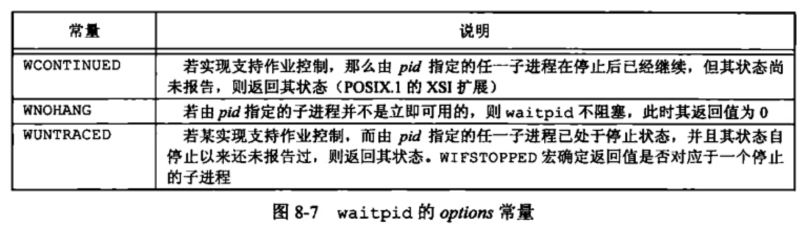</div>

> waitpid函数提供了wait函数没有提供的的三个功能：
>
> + waitpid可等待一个特定的进程，而wait则返回任一终止子进程的状态。
> + waitpid提供了一个wait的非阻塞版本。
> + waitpid通过WUNTRACED和WCONTINUED选项支持支持作业控制。

## 六.函数waitid

另一个取得进程终止状态的函数waited,此函数类似于 waitpid,但提供了更多的灵活性。

```c
#include <sys/wait.h> 

int waitid(idtype_t idtype, id_t id, siginfo_t *infop, int options); 
// Returns: 0 if OK, −1 on error
```

与 waitpid相似, waitid允许一个进程指定要等待的子进程。但它使用两个单独的参数表示要等待的子进程所属的类型,而不是将此与进程ID或进程组ID组合成一个参数。

idtype参数：

<div align = center>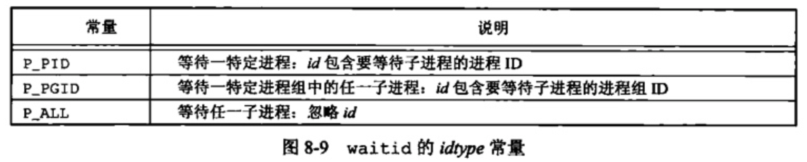</div>

options参数：

<div align = center>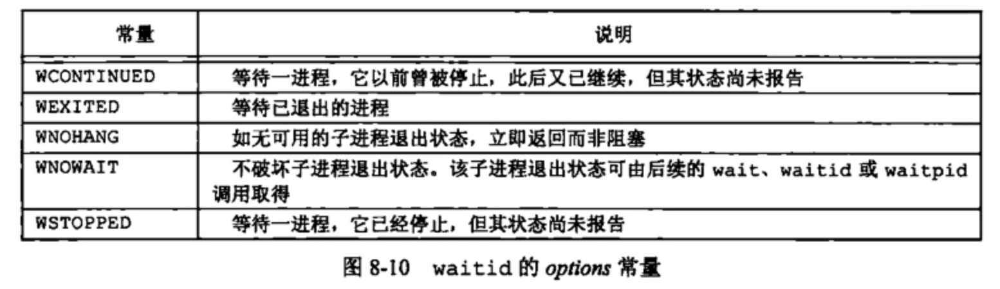</div>

infop参数是指向siginfo结构的指针。包含了造成子进程状态改变有关信号的详细信息。

## 七.函数wait3和wait4

wait3和wait4提供的功能比上面的函数多一个，该参数允许内核返回由终止进程及其所有子进程使用的资源概况。

```c
#include <sys/types.h>
#include <sys/wait.h> 
#include <sys/time.h> 
#include <sys/resource.h>

pid_t wait3(int *statloc, int options, struct rusage *rusage);

pid_t wait4(pid_t pid, int *statloc, int options, struct rusage *rusage);
// Both return: process ID if OK, 0, or −1 on error
```

资源统计信息包括用户CPU时间总量、系统CPU时间总量、缺页次数、接收到信号的次数等。

## 八.竞争条件

当多个进程都企图对共享数据进行某种处理,而最后的结果又取决于进程运行的顺序时,我们认为发生了竞争条件(race condition)。如果在fork之后的某种逻辑显式或隐式地依赖于在fork之后是父进程先运行还是子进程先运行,那么fork函数就会是竞争条件活跃的滋生地

如果一个进程希望等待一个子进程终止,则它必须调用wait函数中的一个。如果一个进程要等待其父进程终止,则可使用下列形式的循环

```c
while(getppid() != 1)
    sleep(1);
```

这种形式的循环称为轮询( polling),它的问题是浪费了CPU时间,因为调用者每隔1s都被唤醒,然后进行条件测试

为了避免竞争条件和轮询,在多个进程之间需要有某种形式的信号发送和接收的方法。在UNIX中可以使用信号机制。各种形式的进程间通信(IPC)也可使用。

```c
static void charatatime(char *str){	char	*ptr;	int		c;	setbuf(stdout, NULL);			/* set unbuffered */	for (ptr = str; (c = *ptr++) != 0; )		putc(c, stdout);}int main(void){	pid_t	pid;	TELL_WAIT();	if ((pid = fork()) < 0) {		err_sys("fork error");	} else if (pid == 0) {		WAIT_PARENT();		/* parent goes first */		charatatime("output from child\n");	} else {		charatatime("output from parent\n");		TELL_CHILD(pid);	}	exit(0);}
```

> 类似于加锁

## 九.函数exec

用fork函数创建新的子进程后,子进程往往要调用一种exec函数以执行另个程序。当进程调用一种exec函数时,该进程执行的程序完全替换为新程序,而新程序则从其main函数开始执行。因为调用exec并不创建新进程,所以前后的进程ID并未改变。**exec只是用磁盘上的一个新程序替换了当前进程的正文段、数据段、堆段和栈段**。

有7中不同的exec函数可以使用：

```c
#include <unistd.h> int execl(const char *pathname, const char *arg0, ... /* (char *)0 */ ); int execv(const char *pathname, char *const argv[]); int execle(const char *pathname, const char *arg0, .../* (char *)0, char *const envp[] */ ); int execve(const char *pathname, char *const argv[], char *const envp[]); int execlp(const char *filename, const char *arg0, ... /* (char *)0 */ ); int execvp(const char *filename, char *const argv[]); int fexecve(int fd, char *const argv[], char *const envp[]); // All seven return: −1 on error, no return on success
```

这些函数之间的第一个区别是前4个函数取路径名作为参数，后两个函数则取文件名作为参数，最后一个取文件描述符作为参数。

第二个区别与参数表的传递有关(l表示列表list，v表示矢量vector)。函数execl、execlp和 execle要求将新程序的每个命令行参数都说明为一个单独的参数。这种参数表以空指针结尾。对于另外4个函数( execv、 execvp、execve和 fexecve)，则应先构造一个指向各参数的指针数组，然后将该数组地址作为这4个函数的参数。

最后一个区别与向新程序传递环境表相关。以e结尾的3个函数(execle、 execve和 fexecve)可以传递一个指向环境字符串指针数组的指针。其他4个函数则使用调用进程中的 environ变量为新程序复制现有的环境。

<div align = center>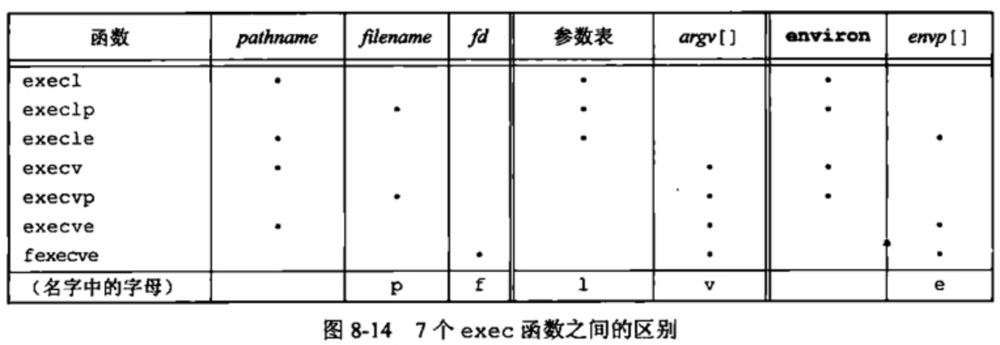</div>

> + 字母p表示函数取filename作为参数，而且用PATH环境变量寻找可执行文件
> + 字母l表示该函数取一个参数表，与v互斥，v表示函数取一个argv[]矢量
> + 字母e表示该函数取envp[]数组，而不使用当前环境

前面曾提及,在执行exec后,进程ID没有改变。但新程序从调用进程继承了的下列属性:

- 进程ID和父进程ID
- 实际用户ID和实际组ID
- 附属组ID
- 进程组ID
- 会话ID
- 控制终端
- 闹钟尚余留的时间
- 当前工作目录
- 根目录
- 文件模式创建屏蔽字
- 文件锁
- 进程信号屏蔽
- 未处理信号
- 资源限制
- nice值
- tms_utime、tms_stime、tms_cutime以及tms_ctime值

在很多UNIX实现中,这7个函数中只有`execve`是内核的系统调用。另外6个只是库函数它们最终都要调用该系统调用。

<div align = center>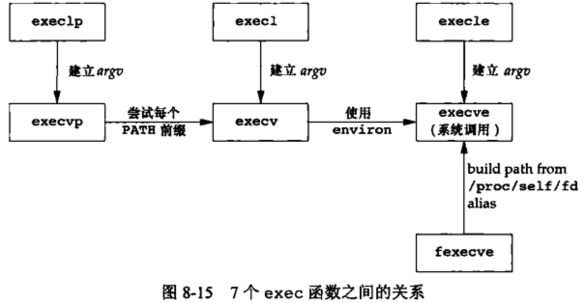</div>


## 十.更改用户ID和更改组ID

在UNIX系统中，特权(如能改变当前日期的表示法)以及访问控制(如能否读、写一个特定文件)，是基于用户ID和组ID的。当程序需要增加特权，或需要访问当前并不允许访问的资源时，我们需要更换自己的用户ID或组ID，使得新ID具有合适的特权或访问权限。与此类似当程序需要降低其特权或阻止对某些资源的访问时，也需要更换用户ID或组ID，新ID不具有相应特权或访问这些资源的能力。

在设计应用时，我们总是试图使用**最小特权( least privilege)模型**。依照此模型我们的程序应当只具有为完成给定任务所需的最小特权。这降低了由恶意用户试图哄骗我们的程序以未预料的方式使用特权造成的安全性风险。

设置用户ID和组ID的函数如下：

```c
#include <unistd.h> int setuid(uid_t uid); int setgid(gid_t gid);// Both return: 0 if OK, −1 on error
```

使用时注意如下：

- 若进程具有超级用户特权,则 setuid 函数将实际用户ID、有效用户ID以及保存的设置用户ID设置为uid
- 若进程没有超级用户特权,但是uid等于实际用户ID或保存的设置用户ID,则 setid 只将有效用户ID设置为uid。不更改实际用户ID和保存的设置用户ID
- 如果上面两个条件都不满足,则 errno设置为 EPERM,并返回-1

关于内核所维护的3个ID，需要注意的事项如下：

- 只有超级用户才可以更改实际用户ID，通常，实际用户ID是在用户登录时，由login(l)程序设置的，而且决不会改变它。
- 仅当对程序文件设置了设置用户ID位时，exec函数才设置有效用户ID
- 保存的设置用户ID是由exec复制有效用户ID而得到的

<div align = center>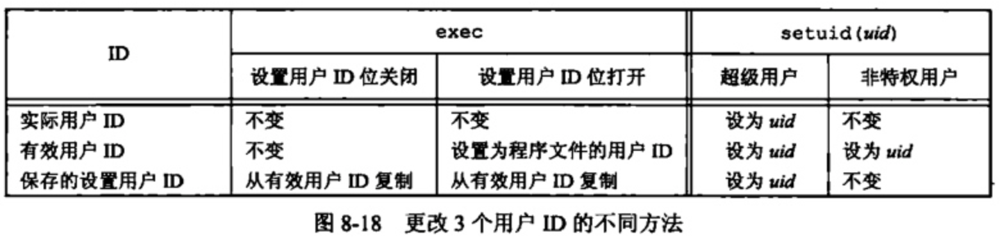</div>

1. **函数setreuid和setregid**

其功能是交换实际用户ID和有效用户ID的值。

```c
#include <unistd.h> int setreuid(uid_t ruid, uid_t euid); int setregid(gid_t rgid, gid_t egid);// Both return: 0 if OK, −1 on error
```

2. **函数seteuid和setegid**

它们类似于 setuid和 setgid,但只更改有效用户ID和有效组ID

```c
#include <unistd.h> int seteuid(uid_t uid); int setegid(gid_t gid);// Both return: 0 if OK, −1 on error
```

各个函数之间的区别

<div align = center>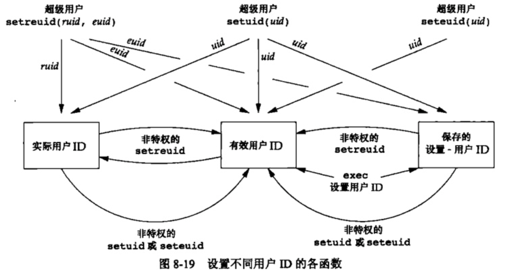</div>

## 十一.解释器文件

所有现今的UNIX系统都支持解释器文件(interpreter file)。这种文件是文本文件,其起始行的形式是：

```bash
#! pathname [optional-argument]
```

最常见的如下：

```bash
#! /bin/sh
```

对这种文件的识别是由内核作为exec系统调用处理的一部分来完成的。内核使调用exec函数的进程**实际执行的并不是该解释器文件,而是在该解释器文件第一行中 pathname所指定的文件**。一定要将解释器文件(文本文件,它以#!开头)和解释器(由该解释器文件第一行中的 pathname指定)区分开来

当内核exec解释器(/home/sar/bin/echoarg)时,argv[0]是该解释器的 pathname,argv[1]是解释器文件中的可选参数

## 十二.函数system

ISO C定义了system函数,但是其操作对系统的依赖性很强

```c
#include <stdlib.h> int system(const char *cmdstring);// Returns: (see below)
```

如果 cmdstring 是一个空指针，则仅当命令处理程序可用时,，system返回非0值，这一特征可以确定在一个给定的操作系统上是否支持 system函数。在UNIX中, system总是可用的。

因为 system在其实现中调用了fork、exec和 waitpid,因此有3种返回值

1. fork失败或者 waitpid 返回除 EINTR之外的出错，则 system返回-1，并且设置errno以指示错误类型。
2. 如果 exec失败(表示不能执行shel1)，则其返回值如同 shell 执行了exit(127) 一样
3. 否则所有3个函数(fork、exec和 waitpid)都成功，那么 system的返回值是 shell 的终止状态，其格式已在 waitpid中说明。

使用 system而不是直接使用fork和exec的优点是: system进行了所需的各种出错处理以及各种信号处理

## 十三.进程会计

大多数UNIX系统提供了一个选项以进行进程会计( process accounting)处理。启用该选项后,每当进程结束时内核就写一个会计记录。典型的会计记录包含总量较小的二进制数据,一般包括**命令名、所使用的CPU时间总量、用户ID和组ID、启动时间**等。

一个至今没有说明的函数(acct)启用和禁用进程会计。唯一使用这一函数的是`accton(8)`命令(这是在几种平台上都类似的少数几条命令中的一条)。超级用户执行一个带路径名参数的accton命令启用会计处理。会计记录写到指定的文件中

会计记录结构定义在头文件<sys/acct.h>中，每个系统都有不同，但是基本样式如下：

<div align = center>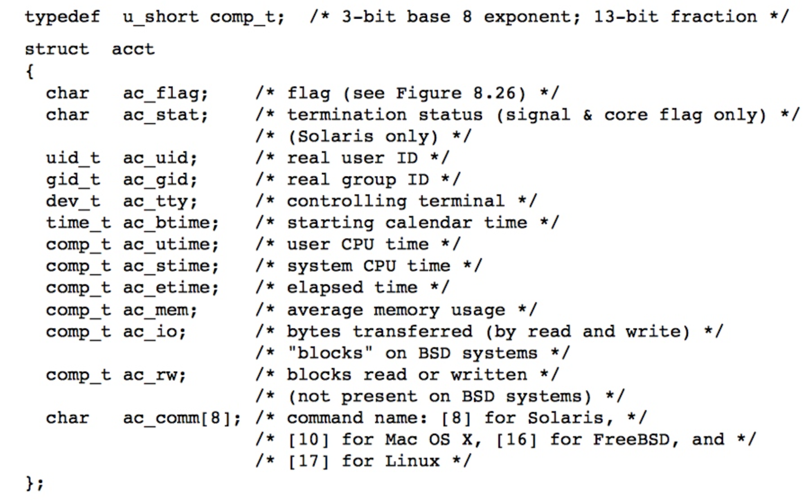</div>

会计记录所需的各个数据(各CPU时间、传输的字符数等)都由内核保存在进程表中,并在个新进程被创建时初始化(如fork之后在子进程中)。进程终止时写一个会计记录。

这产生两个后果:

+ 第一,我们不能获取永远不终止的进程的会计记录。像init这样的进程在系统生命周期中直在运行,并不产生会计记录。这也同样适合于内核守护进程,它们通常不会终止
+ 第二,在会计文件中记录的顺序对应于进程终止的顺序,而不是它们启动的顺序。

## 十四. 用户标识

任一进程都可以得到其实际用户ID和有效用户ID及组ID。但是,我们有时希望找到运行该程序用户的登录名。

系统通常记录用户登录时使用的名字(见68节),用get1ogin函数可以获取此登录名。

```c
#include <unistd.h> char *getlogin(void); // Returns: pointer to string giving login name if OK, NULL on error
```

如果调用此函数的进程没有连接到用户登录时所用的终端，则函数会失败。通常称这些进程为守护进程(daemon)

## 十五. 进程调度

UNIX系统历史上对进程提供的只是基于调度优先级的粗粒度的控制。调度策略和调度优先级是由内核确定的。**进程可以通过调整nice值选择以更低优先级运行**(通过调整nice值降低它对CPU的占有，因此该进程是“友好的”)。只有特权进程允许提高调度权限。

Single UNIX Specification中nice值的范围在0~(2 * NZERO)-1之间，有些实现支持0~2*NERO。nice值越小，优先级越高。虽然这看起来有点倒退，但实际上是有道理的：你越友好,你的调度优先级就越低。 NERO是系统默认的nice值。

进程可以通过nice函数获取或更改它的nice值。使用这个函数,进程只能影响自己的nce值,不能影响任何其他进程的nice值

```c
#include <unistd.h> int nice(int incr);// Returns: new nice value − NZERO if OK, −1 on error
```

getpriority函数可以像nice函数那样用于获取进程的nice值,但是 getpriority还可以获取一组相关进程的nice值。

```c
#include <sys/resource.h> int getpriority(int which, id_t who); // Returns: nice value between −NZERO and NZERO−1 if OK, −1 on error
```

setpriority函数可用于为进程、进程组和属于特定用户ID的所有进程设置优先级

```c
#include <sys/resource.h> int setpriority(int which, id_t who, int value); // Returns: 0 if OK, −1 on error
```

## 十六. 进程时间

我们可以度量的3个时间:墙上时钟时间、用户CPU时间和系统CPU时间。任一进程都可调用 times函数获得它自己以及已终止子进程的土述值。

```c
#include <sys/times.h>clock_t times(struct tms *buf );// Returns: elapsed wall clock time in clock ticks if OK, −1 on error
```


