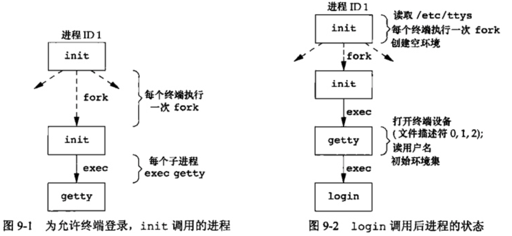
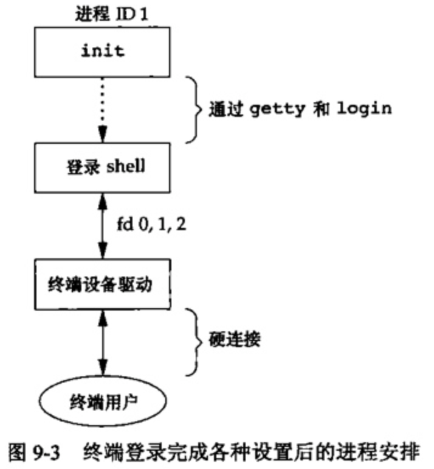
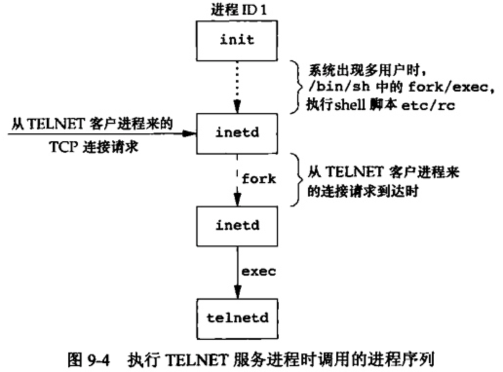
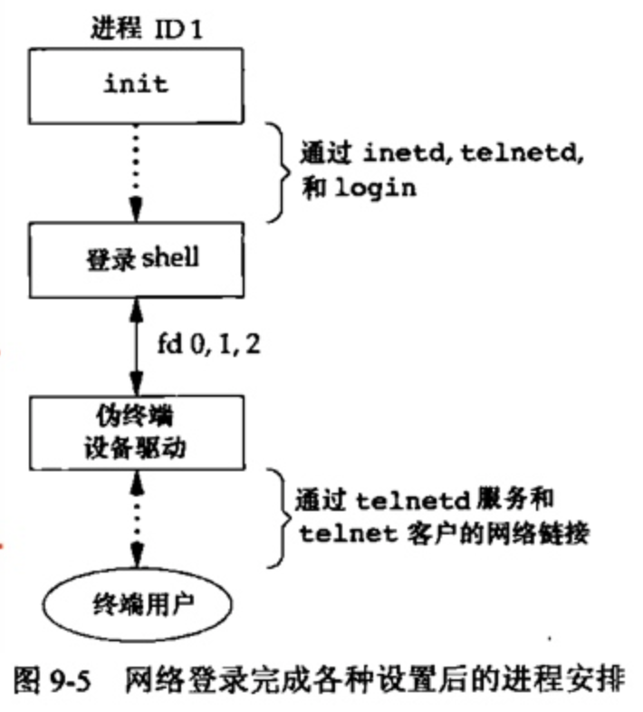
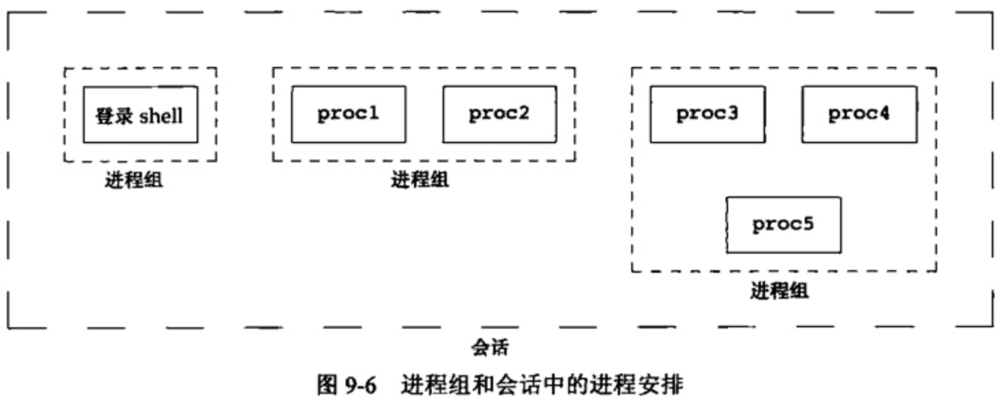
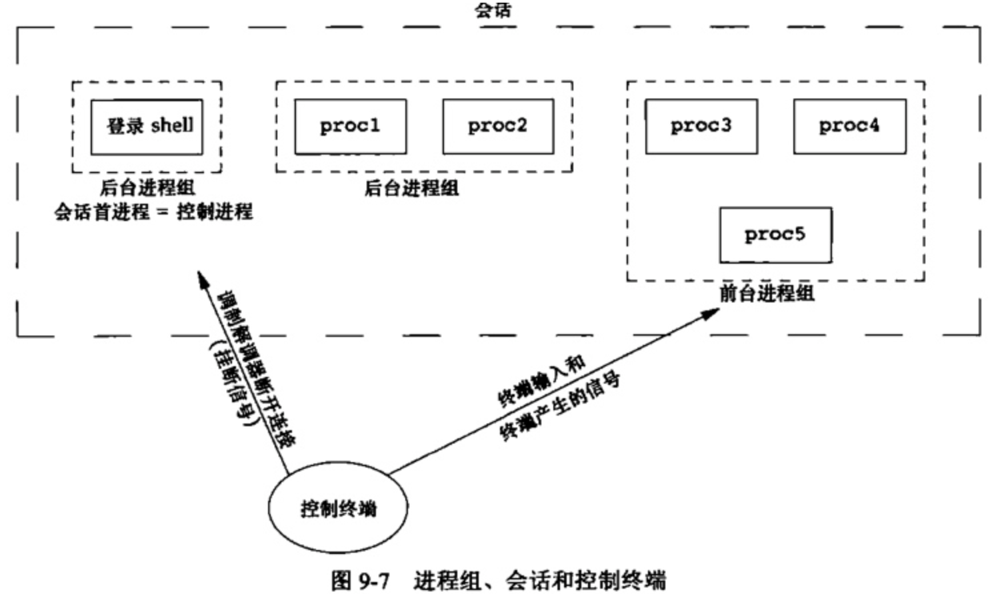
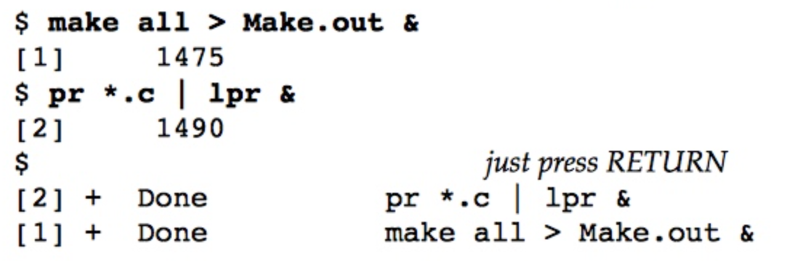
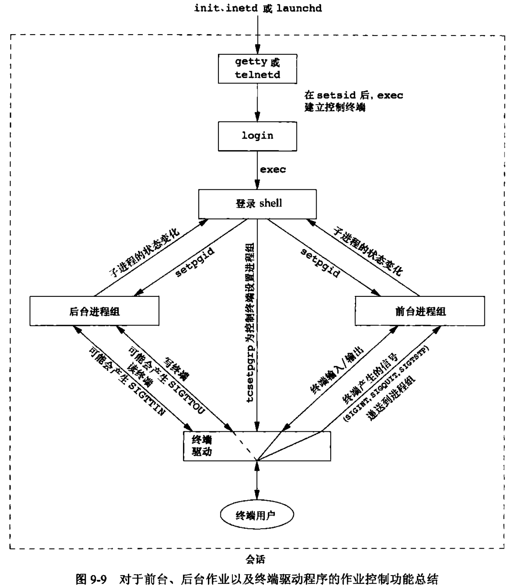
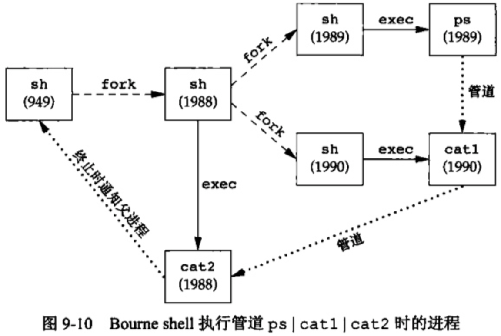

## 一.终端登录

我们现在描述的过程用于经由终端登录至UNIX系统。该过程几乎与所使用的终端类型无关,所使用的终端可以是基于字符的终端、仿真基于字符终端的图形终端,或者运行窗口系统的图形终端。

### 1.BSD终端登录

系统管理者创建通常名为/etc/ttys的文件,其中,每个终端设备都有一行,每一行说明设备名和传到 getty程序的参数。

<div align = center></div>

login能处理多项工作。因为它得到了用户名，所以能调用`getpwnam`取得相应用户的口令文件登录项。然后调用`getpass`以显示提示“ Password:”，接着读用户键入的口令(自然,禁止回显用户键入的口令)。它调用 `crypt`将用户键入的口令加密，并与该用户在阴影口令文件中登录项的`pw_passwd`字段相比较。如果用户几次键入的口令都无效，则`1ogin`以参数1调用`exit`表示登录过程失败。父进程(init)了解到子进程的终止情况后，将再次调用`fork`,其后又执行了`getty`，对此终端重复上述过程。

如果用户正确登录，login就将完成如下工作：

1. 将当前工作目录更改为该用户的起始目录(chdir)。
2. 调用chown更改该终端的所有权，使登录用户成为它的所有者。将对该终端设备的访问权限改变成“用户读和写”。
3. 调用setgid及initgroups设置进程的组ID
4. 用login得到的所有信息初始化环境：起始目录(HOME)、shell(SHEL)用户名(USER和 LOGNAME)以及一个系统默认路径(PATH)。
5. login进程更改为登录用户的用户ID( setuid)并调用该用户的登录 shell

至此，登录用户的登录shell开始运行。其父进程ID是init进程，所以当此登录shell终止时，init会得到通知(接收SIGCHLD信号)，它会对该终端重复全部上述过程。登录shell的文件描述符0,1,2设置为终端设备。如下图所示：

<div align = center></div>

## 二.网络登录

通过串行终端登录至系统和经由网络登录至系统两者之间的主要(物理上的)区别是:

+ 网络登录时,在终端和计算机之间的连接不再是点到点的。在网络登录情况下，login仅仅是一种可用的服务,这与其他网络服务(如FIP或SMIP)的性质相同
+ 终端登录中，init知道哪些终端设备可用来进行登录，并为每个设备生成一个getty进程。但是，对网络登录情况则有所不同，所有登录都经由内核的网络接口驱动程序，并且实现不知道将会有多少这样的登录。

为使同一个软件既能处理终端登录，又能处理网络登录，系统使用了一种称为伪终端(pseudo terminal)的软件驱动程序，它仿真串行终端的运行行为，并将终端操作映射为网络操作，反之亦然。

### 1.BSD网络登录

作为系统启动的一部分，init调用一个shell，使其执行shell脚本/etc/rc。由此shell脚本启动一个守护进程 inetd。一旦此shell脚本终止, inetd的父进程就变成init。 inetd等待TCP/IP连接请求到达主机，而当一个连接请求到达时，它执行一次fork，然后生成的子进程exec适当的程序。

<div align = center></div>

然后telnetd进程打开一个伪终端设备，并用fork分成两个进程。父进程处理通过网络连接的通信，子进程则执行login程序。父进程和子进程通过伪终端相连接。在调用exec之前，子进程使其文件描述符0,1,2与伪终端相连。如果登录正确，login就执行那些初始化步骤。然后login调用exec将其自身替换为登录用户的登录shell。

<div align = center></div>

当通过终端或网络登录时,我们得到一个登录shell,其标准输入、标准输出和标准错误要么连接到一个终端设备,要么连接到一个伪终端设备上。

## 三.进程组

进程组是一个或多个进程的集合。通常,它们是在同一作业中结合起来的，**同一进程组中的各进程接收来自同一终端的各种信号**。每个进程组有一个唯一的进程组ID。进程组ID类似于进程ID——它是一个正整数,并可存放在pid_t数据类型中。函数 getpgrp返回调用进程的进程组ID。

```c
#include <unistd.h> 

pid_t getpgrp(void);
// Returns: process group ID of calling process
```

getpgid函数返回指定进程所在的进程组ID：

```c
#include <unistd.h> 

pid_t getpgid(pid_t pid);
// Returns: process group ID if OK, −1 on error
```

每个进程组有一个组长进程。组长进程的进程组ID等于其进程ID。

进程组组长可以创建一个进程组、创建该组中的进程，然后终止。**只要在某个进程组中有个进程存在，则该进程组就存在，这与其组长进程是否终止无关**。从进程组创建开始到其中最后一个进程离开为止的时间区间称为进程组的生命期。某个进程组中的最后一个进程可以终止，也可以转移到另一个进程组

进程调用setpgid可以加入一个现有的进程组或者创建一个新进程组

```c
#include <unistd.h> 

int setpgid(pid_t pid, pid_t pgid);
// Returns: 0 if OK, −1 on error
```

一个进程只能为它自己或它的子进程设置进程组ID。在它的子进程调用了exec后，它就不再更改该子进程的进程组ID。

## 四.会话

会话( session)是一个或多个进程组的集合

<div align = center></div>

如果调用此函数的进程不是一个进程组的组长,则此函数创建个新会话。具体会发生以下3件事。

1. 进程变成新会话的会话首进程( session leader,会话首进程是创建该会话的进程)。此时,该进程是新会话中的唯一进程
2. 该进程成为一个新进程组的组长进程。新进程组ID是该调用进程的进程ID。
3. 该进程没有控制终端(下一节讨论控制终端)。如果在调用 setid之前该进程有一个控制终端,那么这种联系也被切断。

如果该调用进程已经是一个进程组的组长,则此函数返回出错。为了保证不处于这种情况，通常先调用fork，然后使其父进程终止，而子进程则继续。因为子进程继承了父进程的进程组ID，而其进程ID则是新分配的，两者不可能相等，这就保证了子进程不是一个进程组的组长

会话首进程是具有唯一进程ID的单个进程，所以**可以将会话首进程的进程ID视为会话ID**

`getsid`函数返回会话首进程的进程组ID

```c
#include <unistd.h> 

pid_t getsid(pid_t pid); 
// Returns: session leader’s process group ID if OK, −1 on error
```

如若pid是0，getsid返回调用进程的会话首进程的进程组ID。出于安全方面的考虑些实现有如下限制：如若pid并不属于调用者所在的会话，那么调用进程就不能得到该会话首进程的进程组ID

### 五.控制终端

会话和进程组还有一些其他特性

- 一个会话可以有一个控制终端(controlling terminal)。这通常是终端设备(在终端登录情况下)或伪终端设备(在网络登录情况下)。
- 建立与控制终端连接的会话首进程被称为控制进程(controlling process)
- 一个会话中的几个进程组可被分成一个前台进程组(foreground process group)以及一个或多个后台进程组(background process group)
- 如果一个会话有一个控制终端，则它有一个前台进程组,其他进程组为后台进程组
- 无论何时键入终端的中断键(常常是Delete或Ctrl+C)，都会将中断信号发送至前台进程组的所有进程。
- 无论何时键入终端的退出键(常常是Ctrl+)，都会将退出信号发送至前台进程组的所有进程。
- 如果终端接口检测到调制解调器(或网络)已经断开连接，则将挂断信号发送至控制进程〔会话首进程)

<div align = center></div>

有时不管标准输入、标准输出是否重定向,程序都要与控制终端交互作用。保证程序能与控制终端对话的方法是open文件/dev/tty。在内核中,此特殊文件是控制终端的同义语。自然地,如果程序没有控制终端,则对于此设备的open将失败。

## 六.函数tcgetpgrp、tcsetpgrp和tcgetsid

需要有一种方法来通知内核哪一个进程组是前台进程组，这样，终端设备驱动程序就能知道将终端输入和终端产生的信号发送到何处

```c
#include <unistd.h> 

pid_t tcgetpgrp(int fd); 
// Returns: process group ID of foreground process group if OK, −1 on error 

int tcsetpgrp(int fd, pid_t pgrpid); 
// Returns: 0 if OK, −1 on error
```

函数tcgetpgrp返回前台进程组ID，它与在fd上打开的终端相关联

如果进程有一个控制终端，则该进程可以调用 tcsetpgrp将前台进程组ID设置为pergid值应当是在同一会话中的一个进程组的ID。fd必须引用该会话的控制终端。

给出控制TTY的文件描述符，通过 tcgetsid函数，应用程序就能获得会话首进程的进程组ID

```c
#include <termios.h> 

pid_t tcgetsid(int fd); 
// Returns: session leader’s process group ID if OK, −1 on error
```

## 七.作业控制

作业控制允许**在一个终端上启动多个作业(进程组)**，它控制哪一个作业可以访问该终端以及哪些作业在后台运行。作业控制要求以下3种形式的支持。

1. 支持作业控制的 shell
2. 内核中的终端驱动程序必须支持作业控制。
3. 内核必须提供对某些作业控制信号的支持。

从 shell使用作业控制功能的角度观察，用户可以在前台或后台启动一个作业。一个作业只是几个进程的集合,通常是一个进程管道。

当启动一个后台作业时，shell赋予其一个作业标识符，并打印一个或者多个进程ID，如下图所示：

<div align = center></div>

我们可以键入一个影响前台作业的特殊字符—挂起键(通常采用Ctrl+z)，与终端驱动程序进行交互作用。键入此字符使终端驱动程序将信号SIGTSTP发送至前台进程组中的所有进程，后台进程组作业则不受影响。实际上有3个特殊字符可使终端驱动程序产生信号，并将它们发送至前台进程组，他们是：

- 中断字符(一般采用Delete或Ctrl+C)产生 SIGINT
- 退出字符(一般采用Ctrl+)产生 SIGQUIT
- 挂起字符(一般采用Ctrl+Z)产生 SIGTSTE。

<div align = center></div>

是否需要作业控制是一个有争议的问题。作业控制是在窗口终端广泛得到应用之前设计和实现的。很多人认为设计得好的窗口系统已经免除了对作业控制的需要。某些人抱怨作业控制的实现要求得到内核、终端驱动程序、 shell以及某些应用程序的支持,是吃力不讨好的事情。

## 八.shell执行程序

<div align = center></div>

## 九.孤儿进程组

我们曾提及，一个其父进程己终止的进程称为孤儿进程( orphan process)，这种进程由init进程“收养”。现在我们要说明整个进程组也可成为“孤儿”，以及POSIX.1如何处理它。

POSIX.1将孤儿进程组( orphaned process group)定义为：该组中每个成员的父进程要么是该组的一个成员，要么不是该组所属会话的成员。对孤儿进程组的另一种描述可以是：一个进程组不是孤儿进程组的条件是——该组中有一个进程，其父进程在属于同一会话的另一个组中。如果进程组不是孤儿进程组那么在属于同一会话的另一个组中的父进程就有机会重新启动该组中停止的进程。在这里,进程组中每一个进程的父进程(例如,进程6100的父进程是进程1)都属于另一个会话。所以此进程组是孤儿进程组

父进程终止后，进程组包含一个停止的进程，进程组成为孤儿进程组，POSIX.1要求向新孤儿进程组中处于停止状态的每一个进程发送挂断信号( SIGHUP),接着又向其发送继续信号( SIGCONT)。

在处理了挂断信号后，子进程继续。对挂断信号的系统默认动作是终止该进程，为此必须提供一个信号处理程序以捕捉该信号。
