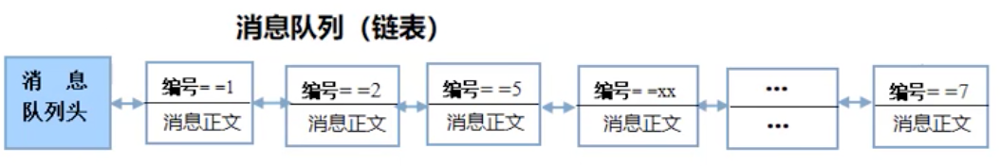
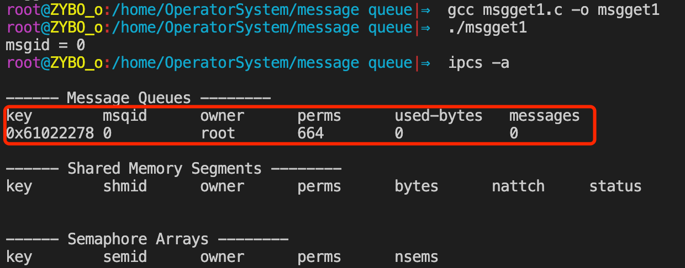

# 一.Posix IPC


# 二.System V IPC

### 1.有关System V IPC

上一章节的无名管道和有名管道都是UNIX早期提供的比较原始的一种进程间通信(IPC)方式，早到UNIX系统设计之初就有了。

后来UNIX系统升级到第五版本的时候，又提供了三种全新的IPC通信方式，分别是：

+ 消息队列
+ 信号量
+ 共享内存

System V就是系统第五版本的意思，后来Linux也继承了UNIX的这三种通信方式。

### 2.System V IPC的特点

#### 管道(原始IPC)

管道的本质就是一段缓存，不过Linux OS内核就是以文件的形式来管理的，所以我们操作管道时，不管是无名管道，还是有名管道，我们都是使用文件描述符以文件的形式进行操作的。

在操作管道时，除了pipe和mkfifo这两个函数之外，其他的向read，write，open都是文件IO函数，所以会比较简单。

#### System V IPC

System V IPC与管道不同，它完全使用了不同的实现机制，与文件没有任何的关系，也就是说内核不再以文件的形式来管理System V IPC，所以不再使用文件的方式来操作。

对于System V IPC，OS内核提供了全新的API，对于这些API来说，只需要理解即可。

#### 使用System V IPC时，不存在血缘进程一说

在任何进程之间通信时，都可以使用System V IPC来通信。

### 3.System V IPC标识符

System V IPC不再以文件的形式存在，因此不再有文件描述符这个东西存在，但是它有类似的"标识符"。可以将它理解为文件描述符的替代者，但是它专门是给System V IPC使用的，所以不能使用文件IO函数来操作"标识符"，只能使用System V IPC的特有的API才能操作。


### 4.System V IPC的缺点

进程结束时，System V IPC不会自动删除，删除方法如下：

+ 重启OS
+ 进程结束时，调用API来进行删除
+ 使用ipcrm命令来进行删除

删除共享内存：

+ `ipcrm -M key`。按照key值来进行删除
+ `ipcrm -m msgid`。按照标识符进行删除

删除消息队列：

+ `ipcrm -Q key` 按照key值来进行删除
+ `ipcrm -q msgid ` 按照标识符进行删除

删除信号量：

+ `ipcrm -S key` 按照key值来进行删除
+ `ipcrm -s msgid ` 按照标识符进行删除

# 三.消息队列

## (一).消息队列的原理

### 1.消息队列的本质

消息队列的本质就是由内核创建的用于存放信息的链表，由于是用来存放消息的，所以就把这个链表称为了消息队列。

通信的进程通过共享操作同一个消息队列，就能实现进程间通信。

### 2.消息存放在消息队列中的方式

消息队列这个双向链表有很多结点，链表上的每一个节点就是一个消息。

<div align = center></div>

从上图可以看出，每个消息由两个部分组成，分别是消息编号(消息类型)和消息正文。

+ 消息编号：用于识别消息
+ 消息正文：真正的信息内容

### 3.收发数据的过程

#### 发送消息

+ 进程先封装一个消息包

  + 这个消息包其实下面类型的一个结构体变量，封包时将消息编号和消息正文写到结构体的成员中：

    ```c
    struct msgbuf {
      	long mtype; 				//消息编号，必须 > 0
      	char mtext[msgsz];	//消息内容
    }
    ```

+ 调用相应的API发送消息

  + 调用API时通过"消息队列的标识符"找到对应的消息，然后将消息包发送到消息队列，消息包会被作为一个链表结点插入链表。

#### 接收消息

调用API接收消息时，必须传递两个重要的信息：

+ 消息队列表示符
+ 要接收的消息的编号

有了这两个信息，API就可以找到对应的消息队列，然后从消息队列中取出要找编号的消息，这样就能接收到别人所发送的消息了。

#### 优势

使用消息队列可以十分容易的实现网状交叉通信，这对于管道来说是特别困难的。


## (二).消息队列的使用

### 1.使用步骤

+ 使用msgget函数创建新的消息队列，或者获取已存在的某个消息队列，并返回唯一标识消息队列的标识符(msqID)，后续收发消息就是使用这个标识符来实现。
+ 收发消息：
  + 发送消息：使用msgsnd函数，利用消息队列标识符发送某编号的消息
  + 接收消息：使用msgrcv函数，利用消息队列标识符接收某编号的消息
+ 使用msgctl函数，在消息队列上进行各种控制操作

对于使用消息队列来通信的多个进程来说，只需要一个进程来创建消息队列即可，对于其它要参与通信的进程来说，直接使用这个创建好的消息队列即可。

为保证消息队列的创建，最好是让每一个进程都包含创建消息队列的代码，谁先运行就由谁创建，后运行的进程如果发现它想用的那个消息队列已经创建好了，则直接使用，当众多进程共享操作同一个消息队列时，即可实现进程间通信。

### 2.msgget函数

#### 函数介绍

```c
#include<sys/types.h>
#include<sys/ipc.h>
#include<sys/msg.h>

int msgget(key_t key, int msgflg); 
```

+ 功能： **利用key值创建，或者获取一个消息队列。**

  + 如果key没有对应任何消息队列，则创建一个新的消息队列。
  + 如果key已经对应某个消息队列，则说明消息队列已存在，则获取这个消息队列来使用。

  > key值也能唯一标识消息队列。

+ 返回值： 

  + 成功： 返回消息队列标识符(消息队列的ID)。对于每个建好的消息队列，ID是固定的。
  + 失败：返回-1 并设置 errno.

+ 参数：

  + key值： **为消息队列生成唯一的消息队列ID。**

    + key值有三种指定形式：

      +  **指定为 `IPC_PRIVATE` 宏。** 这样每次调用msgget函数时都会创建一个新的消息队列。如果需要每次创建新的，则可以使用这个指定形式。不过一般来说只要有一个消息队列来进行通信就够了。

      +  **可以自己指定一个整数。** 但容易重复，当需要创建新的消息队列时，如果重复则只会使用别人之前创建好的。

      + **使用 ftok 函数来生成 key。**

        ```c
        #include<sys/types.h>
        #include<sys/ipc.h>
        
        key_t ftok(const char* pathname, int proj_id);
        ```

        + ftok 通过指定 **存在的路径名** 和 **一个整型数** ，就可以计算并返回一个唯一对应的key值，只要路径名和整数变，则对应的key值就不变。
        + ftok 只使用整型数的低八位，因此往往指定一个ASCII码值。

  + msgflg值： 指定创建时的原始权限，如0664

    + 创建一个新的消息队列时，除了原始权限，还需要指定`IPC_CREAT`选项。

+ `msgid = msgget(key, 0664|IPC_CREAT);`

  >  如果key值没有对应任何消息队列，就会创建一个新的消息队列，此时就会用到msgflg参数。
  >
  > 如果key已经对应了已存在的消息队列，就会直接返回这个存在的消息队列的ID(标识符)，此时不会用到msgflg参数。

+ **多个进程如何共享同一个消息队列的？**

  1. **创建消息队列的进程**

     + 如果创建者使用`'./file', 'a'` 生成一个key 值，然后调用msgget 创建了一个消息队列，比如：

       ```c
       key_t key = ftok('./file', 'a');
       msgid = msgget(key, 0664|IPC_CREAT);
       ```

     + 当创建者得到msgid后，即可操作消息队列。

  2. **其他共享操作消息队列的进程**

     + 共享的方式很简单，只要取得别人创建好的消息队列的ID，即可共享操作同一个消息队列，实现进程间通信。

     + 获取创建好的消息队列ID，有两种方式：

       + 创建者把ID保存在某文件中，共享文件读出ID即可，不需要用到msgget函数。

       + 调用msgget函数获取已在消息队列中的ID：

         + 使用 ftok 函数，利用相同的 **存在的路径名** 和 **一个整型数** ，生成相同的key值。
         + 调用msgget函数，利用 key 找到别人创建好的消息队列，返回ID。

         ```c
         key_t key = ftok('./file', 'a');
         msgid = msgget(key, 0664|IPC_CREAT);
         ```

         这样就拿到消息队列的ID了，之后可进行共享操作。

+ 如何验证消息队列是否被创建成功？
  + 使用ipcs命令查看即可，可跟接的选项有：
    + -a 或者 什么都不跟 ： 消息队列，共享内存，信号量的信息会被显示出来
    + -m ：只显示共享内存的信息
    + -q ： 只显示消息队列的信息
    + -s ： 只显示信号量的信息

#### 代码实践

```c
#include <stdio.h>
#include <stdlib.h>
#include<unistd.h>
#include<sys/stat.h>
#include<sys/types.h>
#include<sys/ipc.h>
#include<fcntl.h>
#include<sys/msg.h>

#define MSG_FILE "./msgfile"

//创建msgid
int create_or_get_msgque() {
    int msgid = -1;
    key_t key = -1;
    int fd = 0;
    //创建一个消息队列专用文件，ftok会用到这个文件的路径名s
    fd = open(MSG_FILE, O_RDWR|O_CREAT, 0664);
    if(fd < 0) {
        perror("open error");
        exit(1);
    }
    //利用存在的文件路径和8位整型数，计算出key 
    key = ftok(MSG_FILE, 'a');
    if(key == -1) {
        perror("ftok error");
        exit(1);
    }
    //利用 key 创建，或者获取消息队列
    msgid = msgget(key, 0664|IPC_CREAT);
    if(msgid == -1) {
        perror("msgget error");
        exit(1);
    }
    return msgid;
}

int main() {
    int msgid = create_or_get_msgque();
    printf("msgid = %d\n", msgid);
    return 0;
}
```

<div align = center></div>

> 运行之后发现创建了一个消息队列


### 3.msgsnd函数

#### 函数介绍

```c
#include <sys/types.h>
#include <sys/ipc.h>
#include <sys/msg.h>

int msgsnd(int msqid, const void *msgp, size_t msgsz, int msgflg);
```

+ 功能：**发送消息到消息队列上**

+ 返回值： 

  + 成功： 返回0
  + 失败： 返回-1， errno被设置

+ 参数：

  + msqid：消息队列标识符

  + msgp： 存放消息的缓存的地址，类型为 `struct msgbuf` 类型，这个缓存就是一个消息包(存放消息的结构体变量)。

    ```c
    struct msgbuf {
    		long mtype;					//放消息编号,必须 < 0
      	char mtext[msgsz];	//消息内容
    };	
    ```

  + msgsz： 消息正文的大小

  + msgflg： 标志位

    + 0：阻塞发送消息。如果没有发送成功，函数会一直阻塞等待直到成功
    + IPC_NOWAIT：非阻塞发送消息，不管成功与否，函数都将返回

### 4.msgrcv函数

```c
#include <sys/types.h>
#include <sys/ipc.h>
#include <sys/msg.h>

ssize_t msgrcv(int msqid, void *msgp, size_t msgsz, long msgtyp, int msgflg);
```

+ 功能： 接收消息，从消息队列中取出特定编号的消息

+ 返回值：

  + 成功： 返回消息正文的字节数
  + 失败： 返回-1， errno被设置

+ 参数：

  + msqid ：消息队列的标识符

  + msgp： 缓存地址，缓存用于存放接收的消息

    + 类型还是msgbuf类型

    ```c
    struct msgbuf {
    		long mtype;					//放消息编号,必须 < 0
      	char mtext[msgsz];	//消息内容
    };	
    ```

  + msgsz：消息正文的大小

  + msgtyp：需要接收的消息的编号

  + msgflg：标志位

    + 0：阻塞发送消息。如果没有发送成功，函数会一直阻塞等待直到成功
    + IPC_NOWAIT：非阻塞发送消息，不管成功与否，函数都将返回


#### 代码实践

```c
#include <stdio.h>
#include <stdlib.h>
#include<unistd.h>
#include<sys/stat.h>
#include<sys/types.h>
#include<sys/ipc.h>
#include<fcntl.h>
#include<sys/msg.h>
#include<strings.h>

#define MSG_FILE "./msgfile"
#define MSG_SIZE 1024
//定义结构体
struct msgbuf {
		long mtype;					//放消息编号,必须 < 0
  	char mtext[MSG_SIZE];	//消息内容
};	
//创建msgid
int create_or_get_msgque() {
    int msgid = -1;
    key_t key = -1;
    int fd = 0;
    //创建一个消息队列专用文件，ftok会用到这个文件的路径名s
    fd = open(MSG_FILE, O_RDWR|O_CREAT, 0664);
    if(fd < 0) {
        perror("open error");
        exit(1);
    }
    //利用存在的文件路径和8位整型数，计算出key 
    key = ftok(MSG_FILE, 'a');
    if(key == -1) {
        perror("ftok error");
        exit(1);
    }
    //利用 key 创建，或者获取消息队列
    msgid = msgget(key, 0664|IPC_CREAT);
    if(msgid == -1) {
        perror("msgget error");
        exit(1);
    }
    return msgid;
}
int main(int argc, char** argv) {
    long recv_message = 0;
    //printf("msgid = %d\n", msgid);
    if(argc != 2) {
        printf("please input msgtype");
        exit(1);
    }
    recv_message = atol(argv[1]);

    int msgid = create_or_get_msgque();

    int ret = fork();
    if(ret < 0) {
        perror("fork error");
        exit(1);
    } 
    if(ret > 0) {//父进程发送消息
        //定义结构体
        struct msgbuf msgbuf = {0};
        while(1) {
            bzero(&msgbuf,sizeof(msgbuf));
            //封装消息包
            //输入消息的正文
            printf("input msgtext:\n");
            scanf("%s",msgbuf.mtext);
            //输入消息的编号
            printf("input msgtype:\n");
            scanf("%ld",&msgbuf.mtype);
            //发送消息
            msgsnd(msgid, &msgbuf, MSG_SIZE, 0);
        }
    } else if(ret == 0 ) {//子进程接收消息
        //定义存储消息的结构体
        struct msgbuf msgbuf = {0};
        int ret;
        while(1) {
            bzero(&msgbuf,sizeof(msgbuf));
            ret = msgrcv(msgid, &msgbuf, MSG_SIZE, recv_message,0);
            if(ret > 0) {
                printf("%s\n",msgbuf.mtext);
            }
        }
    }
    return 0;
}
```


### 5.msgctl函数

#### 函数介绍

```c
#include <sys/types.h>
#include <sys/ipc.h>
#include <sys/msg.h>

int msgctl(int msqid, int cmd, struct msqid_ds *buf);
```

+ 功能： 根据cmd指定的要求，去控制消息队列。主要有：
  + 获取消息队列的属性
  + 修改消息队列的属性
  + 删除消息队列
  + 等待
+ 参数：
  + msqid：消息队列标识符
  + cmd：控制选项
    + IPC_STAT：将msqid消息队列的属性读到第三个参数所指定的缓存中
    + IPC_SET：使用第三个参数中的新设置去修改消息队列的属性
      + 定义一个`struct msqid_ds *buf`
      + 将新的属性信息设置到Buf中
      + cmd指定为IPC_SET后，msgctl函数就会使用buf中的新属性去修改消息队列原有的属性
    + IPC_RMID：删除消息队列
      + 删除消息队列时，不需要第三个参数，直接设置为NULL


