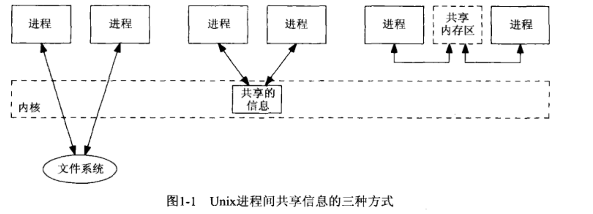
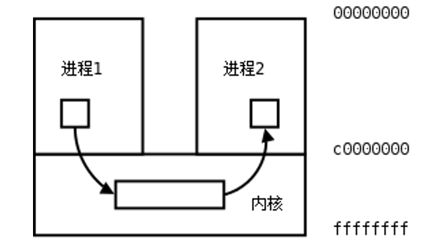
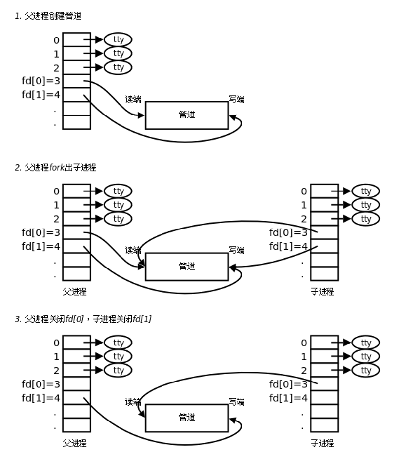
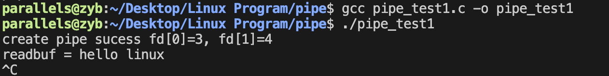

## 一.IPC概述

IPC是interprocess communication进程间通信的简称。传统上该术语描述的是运行在某个操作系统之上的不同进程间的各种消息传递的方式。

### 1.进程，线程与信息共享

按照传统的Unix编程模型，我们在一个系统上运行多个进程，每个进程都有各自的地址空间。Unix进程间的信息共享可以有多种方式。下图对此作了总结。

<div align="center"></div>

+ 左边的两个进程共享存留于文件系统中某个文件上的某些信息。 **为访问这些信息，每个进程都得穿越内核（例如read、write、lseek等）** 。当一个文件有待更新时，某种形式的同步是必要的，这样既可保护多个写入者，防止相互串扰，也可保护一个或多个读出者，防止写入者的干扰。
+ 中间的两个进程共享驻留于内核中的某些信息。**管道** 是这种共享类型的一个例子， **System V消息队列和System V信号量** 也是。 现在访问共享信息的每次操作涉及对内核的一次系统调用。
+ 右边的两个进程有一个双方都能访问的共享内存区。 **每个进程一旦设置好该共享内存区，就能根本不涉及内核而访问其中的数据。共享该内存区的进程需要某种形式的同步。**

### 2.IPC基本介绍

Linux环境下，进程地址空间相互独立，每个进程各自有不同的用户地址空间。任何一个进程的全局变量在另一个进程中都看不到，所以进程和进程之间不能相互访问，要交换数据必须通过内核，在内核中开辟一块缓冲区，进程1把数据从用户空间拷到内核缓冲区，进程2再从内核缓冲区把数据读走，内核提供的这种机制称为进程间通信（IPC，InterProcess Communication）。

<div align="center"></div>

在进程间完成数据传递需要借助操作系统提供特殊的方法，如：文件、管道、信号、共享内存、消息队列、套接字、命名管道等。随着计算机的蓬勃发展，一些方法由于自身设计缺陷被淘汰或者弃用。现今常用的进程间通信方式有：

+ 管道 (使用最简单)
+ 信号 (开销最小)
+ 共享映射区 (无血缘关系)
+ 本地套接字 (最稳定)


## 二.管道

### 1.管道的概念

+ 管道是一种最基本的IPC机制， **作用于有血缘关系的进程之间，完成数据传递。** 调用pipe系统函数即可创建一个管道。有如下特质：
  + 其本质是一个伪文件(实为内核缓冲区) 
  + 由两个文件描述符引用，一个表示读端，一个表示写端。
  + 规定数据从管道的写端流入管道，从读端流出。
+ 管道的原理: 
  + **管道实为内核使用环形队列机制，借助内核缓冲区(4k)实现。**
+ 管道的局限性：
  +  **数据自己读不能自己写。**
  +  **数据一旦被读走，便不在管道中存在，不可反复读取。**
  +  **由于管道采用半双工通信方式。因此，数据只能在一个方向上流动。**
  +  **只能在有公共祖先的进程间使用管道。**

### 2.pipe函数

+ 功能：创建管道

+ 形式：

  + `int pipe(int pipefd[2]);`      
  + 成功：0；失败：-1，设置errno

+ 函数调用成功返回r/w两个文件描述符，过程中已经进行了open，无需再进行open操作，但需手动close。

+ 规定：fd[0] → r； fd[1] → w，就像0对应标准输入，1对应标准输出一样。向管道文件读写数据其实是在读写内核缓冲区。

+ 管道创建成功以后，创建该管道的进程（父进程）同时掌握着管道的读端和写端。父子进程间通信的实现方式如下图所示：

  <div align="center"> </div>

  + 父进程调用pipe函数创建管道，得到两个文件描述符fd[0]、fd[1]指向管道的读端和写端。
  + 父进程调用fork创建子进程，那么子进程也有两个文件描述符指向同一管道。
  + 父进程关闭管道读端，子进程关闭管道写端。父进程可以向管道中写入数据，子进程将管道中的数据读出。由于管道是利用环形队列实现的，数据从写端流入管道，从读端流出，这样就实现了进程间通信。

### 3.管道的读写行为

+ **读管道：**

  + 管道中有数据，read返回实际读到的字节数。

  + 管道中无数据：

    + 管道写端被全部关闭，read返回0 (好像读到文件结尾)
    + 写端没有全部被关闭，read阻塞等待(不久的将来可能有数据递达，此时会让出cpu)

  + 例子：

    ```c
    #include<unistd.h>
    #include<stdio.h>
    #include<stdlib.h>
    
    int main() {
    
        int fd[2];
        int ret;
        char writebuf[] = "hello linux";
        char readbuf[128] = {0};
    
        ret = pipe(fd);
        if(ret < 0) {
            perror("pip error");
            exit(1);
        }
        printf("create pipe sucess fd[0]=%d, fd[1]=%d\n",fd[0],fd[1]);
    		//write into pipe
        write(fd[1],writebuf,sizeof(writebuf));
    
        //read from pipe
        read(fd[0], readbuf, 128);
        printf("readbuf = %s\n", readbuf);
    
        read(fd[0], readbuf, 128);
        printf("second readbuf");
    
        return 0;
    }
    ```

    <div align="center"> </div>

    > 第二次进行读操作时出现阻塞。
    >
    > 特点：
    >
    > + 管道中读完会删除内容。
    > + 管道中无内容时进行读，会出现阻塞现象。

+ **写管道：**

  + 管道读端全部被关闭， 进程异常终止(也可使用捕捉SIGPIPE信号，使进程不终止)
  + 管道读端没有全部关闭：
    + 管道已满，write阻塞。
    + 管道未满，write将数据写入，并返回实际写入的字节数。

+ **读写管道实现父子进程间的先后运行：**

  ```c
  #include"stdio.h"
  #include"sys/types.h"
  #include"stdlib.h"
  #include"unctrl.h"
  #include"unctrl.h"
  int main() {
      int fd[2];
      //进程间的锁
      char process_inter = 0;
      //创建管程
      int ret = pipe(fd);
      if(ret < 0){
          perror("pipe error");
          exit(1);
      }
      printf("create pip successfully\n");
      //创建子进程
      pid_t pid = fork();
      //子进程运行
      if (pid == 0)
      {
          read(fd[0], &process_inter, 1);
          //等待父进程修改管程信息为1
          while(process_inter == 0);
          for (int i = 0; i < 5; i++)
          {
              printf("this is child process, id = %d\n", i);
              sleep(1);
          }
      }
      //父进程运行
      else if(pid > 0) 
      {
          for (int i = 0; i < 5; i++)
          {
              printf("this is parent process, id = %d\n", i);
              sleep(1);
          }
          process_inter = 1;
          //修改process_inter
          write(fd[1], &process_inter, 1);
      }
      while (1);
      return 0;
  }
  ```

### 4.管道的优劣

#### 优点：

+ **简单，相比信号，套接字实现进程间通信，简单很多。**

#### 缺点：

+ **只能单向通信，双向通信需建立两个管道。**
+ **只能用于父子、兄弟进程(有共同祖先)间通信。该问题后来使用fifo有名管道解决。**


## 三.FIFO

+ FIFO(first in, first out)常被称为命名管道，以区分管道(pipe)。管道(pipe)只能用于“有血缘关系”的进程间。不同于管道的是， **每个FIFO有一个路径名与之关联，从而允许无亲缘关系的进程访问同一个FIFO。**

+ FIFO是Linux基础文件类型中的一种。但，FIFO文件在磁盘上没有数据块，仅仅用来标识内核中一个单向的数据流(半双工)。各进程可以通过这个数据流进行read/write，实际上是在读写内核通道，这样就实现了进程间通信。

+ 创建方式：

  + 命令：mkfifo 管道名

    ```c
    #include<sys/types.h>
    #include<sys/stat.h>
    
    int mkfifo(const char *pathname,  mode_t mode);
    ```

  + **参数：**

    + pathname：一个普通的UNIX路径名，是该FIFO的名字
    + mode：指定文件权限位，类似于open的第二个参数

  + 返回值：

    + 成功：0
    + 失败：-1

+ mkfifo函数已隐含指定 `O_CREAT | O_EXCL` 。也就是说，它要么创建一个新的FIFO，要么返回一个EEXIST错误（如果所指定名字的FIFO已经存在）。如果不希望创建一个新的FIFO，那就改为调用open而不是mkfifo。要打开一个已存在的FIFO或创建一个新的FIFO，应先调用mkfifo，再检查它是否返回EEXIST错误，若返回该错误则改为调用open。

+ 一旦使用mkfifo创建了一个FIFO，就可以使用open打开它，常见的文件I/O函数都可用于FIFO。如：close、read、write、unlink等。

  > 只有生成FIFO之后，使用open打开时才会在内核中出现管道。

+ 创建有名管道：

  ```c
  #include"stdlib.h"
  #include"unistd.h"
  #include"stdio.h"
  
  int main() {
      int ret = mkfifo("./myfifo",0777);
      if(ret < 0) {
          perror("mkfifo error");
          exit(1);
      }
    
      printf("create myfifo successfully\n");
      return 0;
  }
  ```

+ 利用有名管道进行无血缘关系进程之间的通信：

  ```c
  //first.c
  #include"stdlib.h"
  #include"sys/types.h"
  #include"stdio.h"
  #include"fcntl.h"
  #include"unistd.h"
  int main() {
      char process_inter = 0;
  
      int fd = open("./myfifo",O_WRONLY);
  
      if(fd < 0) {
          perror("mkfifo error");
          exit(1);
      }
  
      printf("open myfifo successfully\n");
  
      for (int i = 0; i < 5; i++)
      {
          printf("this is first process id = %d\n", i);
          sleep(1);
      }
      process_inter = 1;
      sleep(5);
      write(fd,&process_inter,1);
      while (1);  
      return 0;
  }
  //=======================================================
  //second.c
  #include"stdlib.h"
  #include"sys/types.h"
  #include"stdio.h"
  #include"fcntl.h"
  #include"unistd.h"
  
  int main() {
      char process_inter = 0;
  
      int fd = open("./myfifo",O_RDONLY);
  
      if(fd < 0) {
          perror("mkfifo error");
          exit(1);
      }
      printf("open myfifo successfully\n");
  
     read(fd, &process_inter, 1);
     while (process_inter == 0);
  
      for (int i = 0; i < 5; i++)
      {
          printf("this is second process id = %d\n", i);
          sleep(1);
      }
      process_inter = 1;
      while (1);  
      return 0;
  }
  ```

