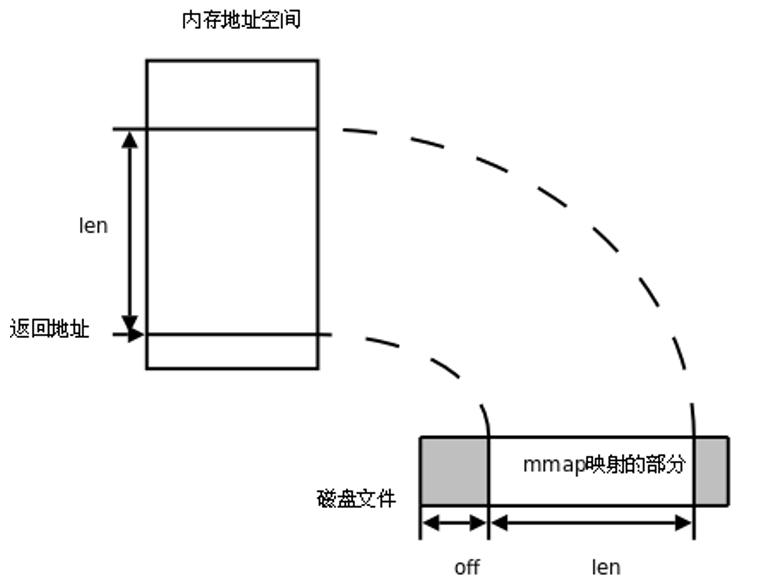

## 一.文件映射存储

### 1.存储映射IO

存储映射I/O (Memory-mapped I/O)  **使一个磁盘文件与存储空间中的一个缓冲区相映射。于是当从缓冲区中取数据，就相当于读文件中的相应字节** 。于此类似，将数据存入缓冲区，则相应的字节就自动写入文件。这样，就可在不适用read和write函数的情况下，使用地址（指针）完成I/O操作。

**使用这种方法，首先应通知内核，将一个指定文件映射到存储区域中。这个映射工作可以通过mmap函数来实现。**

<div align=  center></div>

### 2.mmap函数

+ `void* mmap(void *adrr, size_t length, int prot, int flags, int fd, off_t offset); `

+ **返回值：**
  + 成功：返回创建的映射区首地址；
  + **失败：MAP_FAILED宏**

+ **参数：**  
  + addr:    	**建立映射区的首地址** ，由Linux内核指定。使用时，直接传递NULL
  + length：  **欲创建映射区的大小**
  + prot：      **映射区权限** ：PROT_READ、PROT_WRITE、PROT_READ|PROT_WRITE
  + flags：     **标志位参数** (常用于设定更新物理区域、设置共享、创建匿名映射区)
    + MAP_SHARED:  会将映射区所做的操作反映到物理设备（磁盘）上。
    + MAP_PRIVATE:  映射区所做的修改不会反映到物理设备。
  + fd：          **用来建立映射区的文件描述符**(文件在执行这个操作之前需要open)
  + offset：   **映射文件的偏移(4k的整数倍)**
    + 映射区是由MMU完成映射的，而MMU的单位就是4K

### 3.munmap函数

+ 同malloc函数申请内存空间类似的，mmap建立的映射区在使用结束后也应调用类似free的函数来释放。
+ `int munmap(void *addr, size_t length); `
+ **返回值：**成功：0； 失败：-1

### 4.mmap进行文件映射例子

```c
#include <stdio.h>
#include <sys/stat.h>
#include <unistd.h>
#include <stdlib.h>
#include <fcntl.h>
#include <string.h>
#include <sys/mman.h>

int main()
{
	int len, ret;
	char *p = NULL;

	//打开文件，并给予权限
	int fd = open("mytest.txt",O_CREAT|O_RDWR, 0644);
	if(fd < 0) {
		perror("open error");
		exit(1);
	}

	//使用ftruncate函数设置文件大小
	len = ftruncate(fd, 4);
	if(len == -1) {
		perror("ftruncate error");
		exit(-1);
	}

	//创建MMAP，指针p来接受首地址
	p = mmap(NULL, 4, PROT_READ|PROT_WRITE, MAP_SHARED, fd, 0);
	if(p == MAP_FAILED) {
		perror("mmap error");
		exit(-1);
	}
	//利用首地址指针p进行操作，向共享内存中写入数据
	strcpy(p, "mmap\n");

	//结束mmap操作
	ret = munmap(p, 4);
  if(ret == -1) {
    perror("munmap error");
		exit(-1);
  }
	//关闭文件
	close(fd);	
  return 0;
}
```

### 5.mmap注意事项

+ 可以open的时候O_CREAT一个新文件来创建映射区吗?

  > 可以，但是大小不能为0，必须要有实际的大小

+ 如果mem++，munmmp可否成功？

  > 不能成功，首地址发生了改变

+ 如果open时O_RDONLY, mmap时PROT参数指定PROT_READ|PROT_WRITE会怎样？

  > 不能，会出现权限不足的错误
  >
  > 但是如果flags参数修改为MAP_PRIVATE，还是能够成功的
  >
  > +  创建映射区的过程中，隐含着一次对映射文件的读操作。
  >
  > +  **当MAP_SHARED时，要求：映射区的权限应 <=文件打开的权限(出于对映射区的保护)。而MAP_PRIVATE则无所谓，因为mmap中的权限是对内存的限制。**

+ 如果文件偏移量为1000会怎样？

  > 文件偏移量必须为4K的整数倍

+ 文件描述符先关闭，对mmap映射有没有影响？

  > **映射区的释放与文件关闭无关。只要映射建立成功，文件可以立即关闭。**
  >
  > 因为文件描述符是用来操作文件的句柄，文件映射之后，是用指针的方式来进行操作文件，与文件描述符无关了，此时操作的方式发生了本质的变化

### 6.mmap父子进程通信

父子等有血缘关系的进程之间也可以通过mmap建立的映射区来完成数据通信。但相应的要在创建映射区的时候指定对应的标志位参数flags：

+ MAP_PRIVATE: (私有映射) 父子进程各自独占映射区；

+ MAP_SHARED: (共享映射) 父子进程共享映射区；

+ 例子：

  ```c
  #include <stdio.h>
  #include <stdlib.h>
  #include <unistd.h>
  #include <fcntl.h>
  #include <sys/mman.h>
  #include <sys/wait.h>
  
  int var = 100;
  
  int main(void)
  {
      int *p;
      pid_t pid;
  
      int fd;
      fd = open("temp", O_RDWR|O_CREAT|O_TRUNC, 0644);
      if(fd < 0){
          perror("open error");
          exit(1);
      }
    	//删除临时文件目录项,使之具备被释放条件.
    	//当所有使用该文件的进程结束之后，文件自动删除
      unlink("temp");				
      ftruncate(fd, 4);
  
      p = (int *)mmap(NULL, 4, PROT_READ|PROT_WRITE, MAP_SHARED, fd, 0);
      //p = (int *)mmap(NULL, 4, PROT_READ|PROT_WRITE, MAP_PRIVATE, fd, 0);
      //注意:不是p == NULL
    	if(p == MAP_FAILED){		
          perror("mmap error");
          exit(1);
      }
    	//映射区建立完毕,即可关闭文件
      close(fd);					
  		//创建子进程
      pid = fork();				
      if(pid == 0){
          *p = 2000;
          var = 1000;
          printf("child, *p = %d, var = %d\n", *p, var);
      } else {
          sleep(1);
          printf("parent, *p = %d, var = %d\n", *p, var);
          wait(NULL);
  
          int ret = munmap(p, 4);				//释放映射区
          if (ret == -1) {
              perror("munmap error");
              exit(1);
          }
      }
      return 0;
  }
  ```

  

### 7.匿名映射

+ 使用映射区来完成文件读写操作十分方便，父子进程间通信也较容易。 **但缺陷是，每次创建映射区一定要依赖一个文件才能实现。通常为了建立映射区要open一个temp文件，创建好了再unlink、close掉，比较麻烦。** 

+ <font color = red> **可以直接使用匿名映射来代替。其实Linux系统给我们提供了创建匿名映射区的方法，无需依赖一个文件即可创建映射区。同样需要借助标志位参数flags来指定。** </font>

+ 使用 **MAP_ANONYMOUS**  (或MAP_ANON)， 如: 

  `int *p = mmap(NULL, 4, PROT_READ|PROT_WRITE, MAP_SHARED|MAP_ANONYMOUS, -1, 0); `

  > + 不需要文件，所以文件描述符设置为 -1

  ```c
  #include <stdio.h>
  #include <stdlib.h>
  #include <unistd.h>
  #include <fcntl.h>
  #include <sys/mman.h>
  #include <sys/wait.h>
  
  int var = 100;
  
  int main(void)
  {
      int *p;
      pid_t pid;
  
      p = (int *)mmap(NULL, 4, PROT_READ|PROT_WRITE, MAP_SHARED|MAP_ANON, -1, 0);
      //注意:不是p == NULL
    	if(p == MAP_FAILED){		
          perror("mmap error");
          exit(1);
      }
   		//创建子进程
      pid = fork();				
      if(pid == 0){
          *p = 2000;
          var = 1000;
          printf("child, *p = %d, var = %d\n", *p, var);
      } else {
          sleep(1);
          printf("parent, *p = %d, var = %d\n", *p, var);
          wait(NULL);
  				//释放映射区
          int ret = munmap(p, 4);				
          if (ret == -1) {
              perror("munmap error");
              exit(1);
          }
      }
      return 0;
  }
  ```

+  **需注意的是，MAP_ANONYMOUS和MAP_ANON这两个宏是Linux操作系统特有的宏。** 

+ 在类Unix系统中如无该宏定义，可使用如下两步来完成匿名映射区的建立。

  + fd = open("/dev/zero", O_RDWR);
  + p = mmap(NULL, size, PROT_READ|PROT_WRITE, MMAP_SHARED, fd, 0);

  ```c
  #include <stdio.h>
  #include <stdlib.h>
  #include <unistd.h>
  #include <fcntl.h>
  #include <sys/mman.h>
  #include <sys/wait.h>
  
  int var = 100;
  
  int main(void)
  {
      int *p;
      pid_t pid;
  
      int fd;
      fd = open("/dev/zero", O_RDWR);
      if(fd < 0){
          perror("open error");
          exit(1);
      }
     
      p = mmap(NULL, 4, PROT_READ|PROT_WRITE, MMAP_SHARED, fd, 0);
      if(p == MAP_FAILED){		//注意:不是p == NULL
          perror("mmap error");
          exit(1);
      }
    	//映射区建立完毕,即可关闭文件
      close(fd);					
  		//创建子进程
      pid = fork();				
      if(pid == 0){
          *p = 2000;
          var = 1000;
          printf("child, *p = %d, var = %d\n", *p, var);
      } else {
          sleep(1);
          printf("parent, *p = %d, var = %d\n", *p, var);
          wait(NULL);
  				
        	//释放映射区
          int ret = munmap(p, 4);				
          if (ret == -1) {
              perror("munmap error");
              exit(1);
          }
      }
      return 0;
  }
  ```

### 8.mmap无血缘关系进程间通信

实质上mmap是内核借助文件帮我们创建了一个映射区，多个进程之间利用该映射区完成数据传递。由于内核空间多进程共享，因此无血缘关系的进程间也可以使用mmap来完成通信。只要设置相应的标志位参数flags即可。若想实现共享，当然应该使用MAP_SHARED了。

```c
//写
#include <stdio.h>
#include <sys/stat.h>
#include <sys/types.h>
#include <fcntl.h>
#include <unistd.h>
#include <stdlib.h>
#include <sys/mman.h>
#include <string.h>

struct STU {
    int id;
    char name[20];
    char sex;
};

void sys_err(char *str)
{
    perror(str);
    exit(1);
}

int main(int argc, char *argv[])
{
    int fd;
    struct STU student = {10, "xiaoming", 'm'};
    char *mm;

    if (argc < 2) {
        printf("./a.out file_shared\n");
        exit(-1);
    }

    fd = open(argv[1], O_RDWR | O_CREAT, 0664);
    ftruncate(fd, sizeof(student));

    mm = mmap(NULL, sizeof(student), PROT_READ|PROT_WRITE, MAP_SHARED, fd, 0);
    if (mm == MAP_FAILED)
        sys_err("mmap");

    close(fd);

    while (1) {
        memcpy(mm, &student, sizeof(student));
        student.id++;
        sleep(1);
    }

    munmap(mm, sizeof(student));

    return 0;
}

//读
#include <stdio.h>
#include <sys/stat.h>
#include <fcntl.h>
#include <unistd.h>
#include <stdlib.h>
#include <sys/mman.h>
#include <string.h>

struct STU {
    int id;
    char name[20];
    char sex;
};

void sys_err(char *str)
{
    perror(str);
    exit(-1);
}

int main(int argc, char *argv[])
{
    int fd;
    struct STU student;
    struct STU *mm;

    if (argc < 2) {
        printf("./a.out file_shared\n");
        exit(-1);
    }

    fd = open(argv[1], O_RDONLY);
    if (fd == -1)
        sys_err("open error");

    mm = mmap(NULL, sizeof(student), PROT_READ, MAP_SHARED, fd, 0);
    if (mm == MAP_FAILED)
        sys_err("mmap error");
    
    close(fd);

    while (1) {
        printf("id=%d\tname=%s\t%c\n", mm->id, mm->name, mm->sex);
        sleep(2);
    }

    munmap(mm, sizeof(student));

    return 0;
}
```

```bash
#写端
./mmap_w file_shared
#读端
./mmap_r file_shared
```


