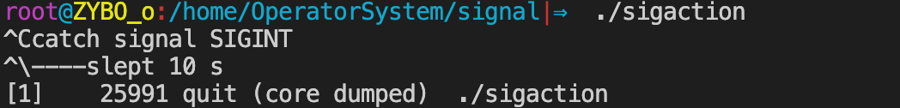

# 信号

## 一.信号基本概念

### 1.信号的概念与机制

+ **信号的共性：**
  1. 简单 
  2. 不能携带大量信息 
  3. 满足某个特设条件才发送。
+ **信号的机制：**
  + A给B发送信号，B收到信号之前执行自己的代码，收到信号后，不管执行到程序的什么位置，都要暂停运行，去处理信号，处理完毕再继续执行。
  + 与硬件中断类似——异步模式。但信号是软件层面上实现的中断，早期常被称为“软中断”。
+ **信号的特质：**
  + 由于信号是通过软件方法实现，其实现手段导致信号有很强的延时性。但对于用户来说，这个延迟时间非常短，不易察觉。

> **每个进程收到的所有信号，都是由内核负责发送的，内核处理。**

### 2.与信号相关的事件与状态

+ **产生信号：**

  + 按键产生，如：Ctrl+c、Ctrl+z、Ctrl+\
  + 系统调用产生，如：kill、raise、abort
  + 软件条件产生，如：定时器alarm
  + 硬件异常产生，如：非法访问内存(段错误)、除0(浮点数例外)、内存对齐出错(总线错误)
  + 命令产生，如：kill命令

+ **递达：** 

  + 信号从发送方递送并且到达进程。

+ **未决：** 

  + 产生和递达之间的状态。主要由于阻塞(屏蔽) ，并没有递达目的地，导致该状态。

+ **阻塞信号集(信号屏蔽字)**： 

  + 将某些信号加入集合，对他们设置屏蔽，当屏蔽x信号后，再收到该信号，该信号的处理将推后(解除屏蔽后)。

+ **未决信号集**: 

  +  信号产生，未决信号集中描述该信号的位立刻翻转为1，表信号处于未决状态。当信号被处理对应位翻转回为0。这一时刻往往非常短暂。
  +  信号产生后由于某些原因(主要是阻塞)不能抵达。这类信号的集合称之为未决信号集。在屏蔽解除前，信号一直处于未决状态。 

  > 阻塞信号集会影响未决信号集

  <div align = center></div>

+ **信号的处理方式:** 

  + **执行默认处理动作（有五种）** 

    > + Term：终止进程
    > + Ign： 忽略信号 (默认即时对该种信号忽略操作)
    > + Core：终止进程，生成Core文件。(查验进程死亡原因， 用于gdb调试)
    > + Stop：停止（暂停）进程
    > + Cont：继续运行进程

  + **忽略(丢弃)** 

    > 对信号的处理方式是丢弃

  + **捕捉(调用户处理函数)**

    > 抓住对应的信号，不去执行它的默认动作，去执行自己定义的行为

+ Linux内核的进程控制块PCB是一个结构体，task_struct, 除了包含进程id，状态，工作目录，用户id，组id，文件描述符表，还包含了信号相关的信息，主要指阻塞信号集和未决信号集。

### 3.信号编号

+ 可以使用`kill –l`命令查看当前系统可使用的信号有哪些。
+ 不存在编号为0的信号。其中1-31号信号称之为常规信号（也叫普通信号或标准信号），34-64称之为实时信号，驱动编程与硬件相关。名字上区别不大。而前32个名字各不相同。

### 4.信号4要素

+ 与变量三要素类似的，每个信号也有其必备4要素，分别是：
  + **编号** 
  + **名称** 
  + **事件** 
  + **默认处理动作** 

+ 可通过`man 7 signal`查看帮助文档获取。也可查看`/usr/src/linux-headers-3.16.0-30/arch/s390/include/uapi/asm/signal.h`

<div align = center></div>

<div align = center></div>

+ **主要的默认处理动作**

  + Term：终止进程
  + Ign： 忽略信号 (默认即时对该种信号忽略操作)
  + Core：终止进程，生成Core文件。(查验进程死亡原因， 用于gdb调试)
  + Stop：停止（暂停）进程
  + Cont：继续运行进程

+ 注意从man 7 signal帮助文档中可看到 : The signals SIGKILL and SIGSTOP cannot be caught, blocked, or ignored.

  >  <font color = red>特别强调了**9) SIGKILL** **和19) SIGSTOP**信号， **不允许忽略和捕捉，只能执行默认动作。甚至不能将其设置为阻塞。**</font>


## 二.信号的产生

> 信号的产生主要有以下几种方式：
>
> + 按键产生，如：Ctrl+c、Ctrl+z、Ctrl+\
> + 系统调用产生，如：kill、raise、abort
> + 软件条件产生，如：定时器alarm
> + 硬件异常产生，如：非法访问内存(段错误)、除0(浮点数例外)、内存对齐出错(总线错误)
> + 命令产生，如：kill命令

### 1.终端按键产生信号

+  Ctrl + c → 2) SIGINT（终止/中断）  "INT" ----Interrupt
+  Ctrl + z → 20) SIGTSTP（暂停/停止） "T" ----Terminal 终端。停止与终端交互的进程(SIGSTOP与之不同)
+  Ctrl + \ → 3) SIGQUIT（退出） 

### 2.硬件异常产生信号

+  除0操作  → 8) SIGFPE (浮点数例外)   "F" -----float 浮点数。
+  非法访问内存 → 11) SIGSEGV (段错误)
+  总线错误 → 7) SIGBUS  

### 3.kill函数/命令 产生信号

+ kill命令产生信号：kill -SIGKILL pid

+ kill函数：给指定进程发送指定信号(不一定杀死)

  ```c
  #include <signal.h>
  
  int kill(pid_t pid, int sig);
  //成功：0；失败：-1 (ID非法，信号非法，普通用户杀init进程等权级问题)，设置errno
  ```

  + 参数：

    + pid > 0: 发送信号给指定的进程。
    + pid = 0: 发送信号给 **与调用kill函数进程属于同一进程组的所有进程**。
    + pid < 0:  **取|pid|发给对应进程组。**
    + pid = -1：发送给进程有权限发送的系统中所有进程。

    + sig：不推荐直接使用数字，应使用宏名，因为不同操作系统信号编号可能不同，但名称一致。

  + 进程组：每个进程都属于一个进程组，进程组是一个或多个进程集合，他们相互关联，共同完成一个实体任务，每个进程组都有一个进程组长，默认进程组ID与进程组长ID相同。
  + 权限保护：super用户(root)可以发送信号给任意用户，普通用户是不能向系统用户发送信号的。 kill -9 (root用户的pid) 是不可以的。同样，普通用户也不能向其他普通用户发送信号，终止其进程。 只能向自己创建的进程发送信号。普通用户基本规则是：发送者实际或有效用户ID == 接收者实际或有效用户ID

### 4.raise 和 abort 函数

#### raise 函数

```c
#include <signal.h>

int  raise(int sig);
//成功：0，失败非0值
```

给当前进程发送指定信号(自己给自己发)  

`raise(signo) == kill(getpid(), signo);`

#### abort函数

```c
 #include <stdlib.h>

void abort(void);
//该函数无返回
```

给自己发送异常终止信号 **6) SIGABRT** 信号，终止并产生core文件

### 5.软件条件产生信号1——alarm函数

```c
#include <unistd.h>

unsigned alarm(unsigned seconds);
//返回0或剩余的秒数，无失败。
```

+ 设置定时器(闹钟)。在指定seconds后，内核会给当前进程发送 **14）SIGALRM信号** 。进程收到该信号，默认动作终止。
+ **每个进程都有且只有唯一个定时器。**
+ 常用：取消定时器alarm(0)，返回旧闹钟余下秒数。
+ 定时，与进程状态无关(自然定时法)！就绪、运行、挂起(阻塞、暂停)、终止、僵尸...无论进程处于何种状态，alarm都计时。

程序：1s内能计数多少

```c
#include<stdio.h>
#include <unistd.h>

int main() {
    alarm(1);
    for(int i = 0; ;++i)
        printf("%d\n",i);
}
```


### 6.软件条件产生信号2——setitimer函数

```c
#include <sys/time.h>

#define ITIMER_REAL      0
#define ITIMER_VIRTUAL   1
#define ITIMER_PROF      2

int
  setitimer(int which, const struct itimerval *restrict value,
            					 struct itimerval *restrict ovalue);
// 成功：0；失败：-1，设置errno
struct itimerval {
		struct timeval it_interval; /* Interval for periodic timer 下一次定时的值*/
		struct timeval it_value;    /* Time until next expiration 当前定时的值*/
};
struct timeval {
    time_t      tv_sec;         /* seconds */
    suseconds_t tv_usec;        /* microseconds */
};
```

+ 设置定时器(闹钟)。 可代替alarm函数。精度微秒us，可以实现周期定时。
+ 参数：
  + which：指定定时方式
    + 自然定时：                            ITIMER_REAL       →      **14）SIGLARM**                  计算自然时间
    + 虚拟空间计时(用户空间)：  ITIMER_VIRTUAL →       **26）SIGVTALRM**   只计算进程占用cpu的时间
    + 运行时计时(用户+内核)：    ITIMER_PROF      →       **27）SIGPROF**     计算占用cpu及执行系统调用的时间
  + value： 指定需要定义的时间
  + ovalue： 传出参数，返回之前剩余的时间

程序：利用setitimer实现alarm计时功能：

```c
#include <sys/time.h>
#include<stdio.h>
#include <stdlib.h>
#include <unistd.h>

unsigned int my_alarm(unsigned int sec) {
    struct itimerval it, oldit;
    int ret;
    it.it_value.tv_sec = sec;
    it.it_value.tv_usec = 0;
    it.it_interval.tv_sec = 0;
    it.it_interval.tv_usec = 0;
    ret = setitimer(ITIMER_REAL, &it, &oldit);
    if(ret == -1) {
        perror("setitimer error");
        exit(1);
    }
    return oldit.it_value.tv_sec;
}

int main() {
    my_alarm(1);
    for(int i = 0; ;++i)
        printf("%d\n",i);
    return 0;
}
```


## 三.信号集操作

内核通过读取未决信号集来判断信号是否应被处理。信号屏蔽字mask可以影响未决信号集。而我们可以在应用程序中自定义set来改变mask。已达到屏蔽指定信号的目的。

### 1.信号集设定

```c
sigset_t set;    // typedef unsigned long sigset_t; 

int sigemptyset(sigset_t *set);           				//将某个信号集清0           成功：0；失败：-1
int sigfillset(sigset_t *set);              			//将某个信号集置1           成功：0；失败：-1
int sigaddset(sigset_t *set, int signum);     		//将某个信号加入信号集       成功：0；失败：-1
int sigdelset(sigset_t *set, int signum);     		//将某个信号清出信号集       成功：0；失败：-1
int sigismember(const sigset_t *set, int signum);	//判断某个信号是否在信号集中   返回值：在集合：1；不在：0；出错：-1 
```

+ sigset_t类型的本质是位图。但不应该直接使用位操作，而应该使用上述函数，保证跨系统操作有效。

### 2.sigpromask函数 

```c
#include <signal.h>

int sigprocmask(int how, const sigset_t *restrict set, sigset_t *restrict oset);
//返回值:若成功，返回0;若出错，返回−1
```

+ 用来屏蔽信号、解除屏蔽也使用该函数。 **其本质，读取或修改进程的信号屏蔽字(PCB中)**

+ **严格注意，屏蔽信号：只是将信号处理延后执行(延至解除屏蔽)；而忽略表示将信号丢处理。**

+ 参数：

  + how参数取值：  假设当前的信号屏蔽字为mask
    + **SIG_BLOCK:**        当how设置为此，set表示需要屏蔽的信号。相当于 mask = mask|set
    + **SIG_UNBLOCK:**  当how设置为此，set表示需要解除屏蔽的信号。相当于 mask = mask & ~set
    + **SIG_SETMASK:**    当how设置为此，set表示用于替代原始屏蔽及的新屏蔽集。相当于 mask = set若，调用sigprocmask解除了对当前若干个信号的阻塞，则在sigprocmask返回前，至少将其中一个信号递达。

  + set：传入参数，是一个位图，set中哪位置1，就表示当前进程屏蔽哪个信号。
  + oldset：传出参数，保存旧的信号屏蔽集。

### 3.sigpending函数

```c
#include <signal.h>

int sigpending(sigset_t *set);
//返回值:若成功，返回0;若出错，返回−1
```

+ 读取当前进程的**未决**信号集
+ 参数：
  + set： 用传出参数传出信号集。 
+ 返回值：
  + 成功：0；
  + 失败：-1，设置errno

程序：打印当前的未决信号集

```c
#include <stdio.h>
#include <unistd.h>
#include <signal.h>

void printped(sigset_t *ped)
{
    int i;
    for (i = 1; i < 32; i++) {
        if (sigismember(ped, i) == 1) {
            putchar('1');
        } else {
            putchar('0');
        }
    }
    printf("\n");
}
int main(void)
{
    sigset_t myset, oldset, ped;
    //首先将自己定义的信号集设置为空
    sigemptyset(&myset);
    //将3号信号设置为1
    sigaddset(&myset, SIGQUIT);
    //影响屏蔽字，设置屏蔽
    sigprocmask(SIG_BLOCK, &myset, &oldset);
    
    while (1) {
        //读取当前的未决信号集
        sigpending(&ped);
        printped(&ped);
        sleep(1);
    }
    return 0;
}
```

<div align = center></div>

> 按键`ctl + \`之后未决信号集发生了改变


## 四.信号捕捉

### 1.信号捕捉函数signal

```c
#include <signal.h>

typedef void (*sighandler_t)(int);
sighandler_t signal(int signum, sighandler_t handler);
//返回值:若成功，返回以前的信号处理配置;若出错，返回SIG_ERR
```

+ 参数：
  + signum ： 需要捕捉的信号
  + handler ： 函数，确定捕捉函数后的操作
+ 该函数由ANSI定义，由于历史原因在不同版本的Unix和不同版本的Linux中可能有不同的行为。因此应该尽量避免使用它，取而代之使用sigaction函数。

代码实现信号捕捉例子：

```c
#include <sys/time.h>
#include<stdio.h>
#include <stdlib.h>
#include <unistd.h>
#include<signal.h>

typedef void (*sighandler_t)(int);

void catch_signal(int signo) {
    printf("catched SIGQUIT\n");
}

int main() {
    sighandler_t handler;
    //注册SIGALRM信号的捕捉
    handler = signal(SIGQUIT, catch_signal);
    if(handler == SIG_ERR) {
        perror("signale error");
        exit(1);
    }
    while(1);
    return 0;
}
```

<div align = center></div>

> 代码实现了捕捉SIGQUIT信号


### 2.sigaction函数

```c
#include <signal.h>

int sigaction(int signo, const struct sigaction *restrict act,
          struct sigaction *restrict oact);
//返回值:若成功，返回0;若出错，返回−1
```

+ 修改信号处理动作（通常在Linux用其来注册一个信号的捕捉函数）

+ 参数：

  + signo ：需要捕捉的信号

  + act：传入参数，新的处理方式。

  + oldact：传出参数，旧的处理方式。 

+ struct sigaction结构体

  ```c
   struct sigaction {
          void     (*sa_handler)(int);
          void     (*sa_sigaction)(int, siginfo_t *, void *);
          sigset_t   sa_mask; 
          int       sa_flags; 
          void     (*sa_restorer)(void);
   };
  ```

  + sa_restorer：该元素是过时的，不应该使用，POSIX.1标准将不指定该元素。(弃用)

  + sa_sigaction：当sa_flags被指定为SA_SIGINFO标志时，使用该信号处理程序。(很少使用) 

  + **sa_handler：指定信号捕捉后的处理函数名(即注册函数)。也可赋值为SIG_IGN表忽略 或 SIG_DFL表执行默认动作**

  + **sa_mask: 调用信号处理函数时，所要屏蔽的信号集合(信号屏蔽字)。注意：仅在处理函数被调用期间屏蔽生效，是临时性设置。**

    > 在函数执行期间屏蔽指定的信号

  + **sa_flags：通常设置为0，表使用默认属性，函数执行期间自动屏蔽本信号。**

代码实现sigaction捕捉`ctl + c`

```c
#include <stdio.h>
#include <stdlib.h>
#include <unistd.h>
#include <signal.h>

/*自定义的信号捕捉函数*/
void sig_int(int signo)
{
	printf("catch signal SIGINT\n");//单次打印
    sleep(10);
    printf("----slept 10 s\n");
}

int main(void)
{
    struct sigaction act;		
    act.sa_handler = sig_int;
    //首先清空
    sigemptyset(&act.sa_mask);		
    //设置sa_mask屏蔽字 来屏蔽SIGQUIT
    sigaddset(&act.sa_mask, SIGQUIT);
    //运行时自动屏蔽本信号
    act.sa_flags = 0;

		int ret = sigaction(SIGINT, &act, NULL);
    if(ret < 0) {
        perror("sigaction error");
        exit(1);
    }
    while(1);//该循环只是为了保证有足够的时间来测试函数特性
    return 0;
}
```

<div align = center></div>

> 通过sigaction捕捉`ctl + c`
>
> 同时在sig_int运行期间又屏蔽了信号SIGQUIT，执行结束后恢复

### 3.信号捕捉特征

+ 进程正常运行时，默认PCB中有一个信号屏蔽字，假定为☆，它决定了进程自动屏蔽哪些信号。当注册了某个信号捕捉函数，捕捉到该信号以后，要调用该函数。而该函数有可能执行很长时间，在这期间所屏蔽的信号不由☆来指定。而是用sa_mask来指定。调用完信号处理函数，再恢复为☆。
+ XXX信号捕捉函数执行期间，XXX信号自动被屏蔽。
+ 阻塞的常规信号不支持排队，产生多次只记录一次。（后32个实时信号支持排队）

### 4.内核实现信号捕捉过程

<div align = center></div>

## 五.竞态条件

### 1.pause函数

```c
#include <unistd.h>

int pause(void);
//只有当pause函数被捕捉，并且捕捉函数返回时才会有返回；返回-1并设置errno
```

+ 该函数可以造成进程主动挂起，等待信号唤醒，调用该系统调用的进程将处于阻塞状态(自动放弃CPU)直到有信号递达将其唤醒。
+ 返回值：

  + 如果信号的默认处理动作是终止进程，则进程终止，pause函数么有机会返回。

  + 如果信号的默认处理动作是忽略，进程继续处于挂起状态，pause函数不返回。

  + 如果信号的处理动作是捕捉，则【调用完信号处理函数之后，pause返回-1】errno设置为EINTR，表示“被信号中断”。

  + pause收到的信号不能被屏蔽，如果被屏蔽，那么pause就不能被唤醒。

用pause和alarm函数实现sleep函数

```c
#include <stdio.h>
#include <signal.h>
#include <unistd.h>

/*所有信号处理函数的原型，都类此，
 *无返回值(void)，只有一个参数，表示信号编号*/
void sig_alrm(int signo)
{
	/*用来占位，可以不做任何事,但这个函数存在
	 *SIGALRM信号
	 *就不执行默认动作终止进程，而做其它事情*/
}

unsigned int mysleep(unsigned int sec)
{
	struct sigaction act, old;
	unsigned int unslept;			//保存未休眠够的时间

	act.sa_handler = sig_alrm;
	sigemptyset(&act.sa_mask);		//清空
	act.sa_flags = 0;
	sigaction(SIGALRM, &act, &old);	//注册信号处理函数sig_alrm
									//同时要保存旧的处理方式
	alarm(sec);						//设置sec秒闹钟
	pause();			//进程阻塞,收到一个信号后,pause返回-1,解除阻塞

	unslept = alarm(0);	//取消旧的定时器,将剩余时间保存
	/*
	 *正常情况下，闹钟到sec秒后发送SIGALRM信号，
	 *pause函数收到信号，调用信号处理函数sig_alrm
	 *pause函数返回，此时定时器已经到时，
	 *执行unslept=alarm(0)不起作用，unslept为0
	 
	 *如果是异常情况下，定时器还没到sec秒，
	 *pause函数被别的信号唤醒，需要将定时器取消
	 *定时器返回剩余时间，也就是未休眠够的时间
	 */
	sigaction(SIGALRM, &old, NULL);	//恢复SIGALRM信号原来的处理方式
	/*因为是在实现库函数,有可能用户之前设置过SIGALRM信号的处理方式*/
	return unslept;
}

int main(void)
{
	while(1){
		mysleep(5);
		printf("Five seconds passed\n");
	}
	return 0;
}
```

<div align = center></div>

### 2.时序竞态

#### 时序竞态问题分析

回顾，借助pause和alarm实现的mysleep函数。设想如下时序：

1. 注册SIGALRM信号处理函数  （sigaction...)
2. 调用alarm(1) 函数设定闹钟1秒。
3. 函数调用刚结束，开始倒计时1秒。当前进程失去cpu，内核调度优先级高的进程(有多个)取代当前进程。当前进程无法获得cpu，进入就绪态等待cpu。
4. 1秒后，闹钟超时，内核向当前进程发送SIGALRM信号(自然定时法，与进程状态无关)，高优先级进程尚未执行完，当前进程仍处于就绪态，信号无法处理(未决)
5. 优先级高的进程执行完，当前进程获得cpu资源，内核调度回当前进程执行。SIGALRM信号递达，信号设置捕捉，执行处理函数sig_alarm。
6. 信号处理函数执行结束，返回当前进程主控流程，pause()被调用挂起等待。（欲等待alarm函数发送的SIGALRM信号将自己唤醒）
7. SIGALRM信号已经处理完毕，pause不会等到。

```c
alarm(sec);						//设置sec秒闹钟
//=======================CPU被抢走，所花时间大于sec=======================
pause();			//进程阻塞,收到一个信号后,pause返回-1,解除阻塞
//pause再也等不到alarm信号的出现
```

#### 解决时序问题

可以通过设置屏蔽SIGALRM的方法来控制程序执行逻辑，但无论如何设置，程序都有可能在“解除信号屏蔽”与“挂起等待信号”这个两个操作间隙失去cpu资源。除非将这两步骤合并成一个“原子操作”。 **sigsuspend函数具备这个功能。在对时序要求严格的场合下都应该使用sigsuspend替换pause。**     

```c
#include <signal.h>

int sigsuspend(const sigset_t *sigmask);
//返回值:−1，并将errno设置为EINTR
```

+ sigsuspend函数调用期间，进程信号屏蔽字由其 **参数mask** 指定。可将某个信号（如SIGALRM）从临时信号屏蔽字mask中删除，这样在调用sigsuspend时将解除对该信号的屏蔽，然后挂起等待.

+ 当sigsuspend返回时，进程的信号 d屏蔽字恢复为原来的值。如果原来对该信号是屏蔽态，sigsuspend函数返回后仍然屏蔽该信号。

mysleep改进

```c
#include <unistd.h>
#include <signal.h>
#include <stdio.h>

void sig_alrm(int signo)
{
    /* nothing to do */
}

unsigned int mysleep(unsigned int nsecs)
{
    struct sigaction newact, oldact;
    sigset_t newmask, oldmask, suspmask;
    unsigned int unslept;

    //1.为SIGALRM设置捕捉函数，一个空函数
    newact.sa_handler = sig_alrm;
    sigemptyset(&newact.sa_mask);
    newact.sa_flags = 0;
    sigaction(SIGALRM, &newact, &oldact);

    //2.设置阻塞信号集，阻塞SIGALRM信号
    sigemptyset(&newmask);
    sigaddset(&newmask, SIGALRM);
   	sigprocmask(SIG_BLOCK, &newmask, &oldmask);   //信号屏蔽字 mask

    //3.定时n秒，到时后可以产生SIGALRM信号
    alarm(nsecs);

    /*4.构造一个调用sigsuspend临时有效的阻塞信号集，
     *  在临时阻塞信号集里解除SIGALRM的阻塞*/
    suspmask = oldmask;
    sigdelset(&suspmask, SIGALRM);

    /*5.sigsuspend调用期间，采用临时阻塞信号集suspmask替换原有阻塞信号集
     *  这个信号集中不包含SIGALRM信号,同时挂起等待，
     *  当sigsuspend被信号唤醒返回时，恢复原有的阻塞信号集*/
    sigsuspend(&suspmask); 

    unslept = alarm(0);
    //6.恢复SIGALRM原有的处理动作，呼应前面注释1
    sigaction(SIGALRM, &oldact, NULL);

    //7.解除对SIGALRM的阻塞，呼应前面注释2
    sigprocmask(SIG_SETMASK, &oldmask, NULL);

    return(unslept);
}

int main(void)
{
    while(1){
        mysleep(2);
        printf("Two seconds passed\n");
    }
    return 0;
}
```

### 3.全局变量的异步IO

分析如下父子进程交替数数程序。当捕捉函数里面的sleep取消，程序即会出现问题

```c
#include<stdio.h>
#include <stdlib.h>
#include<signal.h>
#include <unistd.h>

int n = 0, flag = 0;

void sys_err(char *str){
    perror(str);
    exit(1);
}

//子进程信号调用函数
void do_sig_child(int num) {
    printf("this is child process  pid = %d, n = %d\n",getpid(), n);
    n += 2;
    flag = 1;
    sleep(1);
}

//父进程信号调用函数
void do_sig_parent(int num) {
    printf("this is parent process  pid = %d, n = %d\n",getpid(), n);
    n += 2;
    flag = 1;
    sleep(1);
}

int main() {
    pid_t pid;
    struct sigaction act;

    if((pid = fork()) < 0) 
        sys_err("fork error");
    //父进程操作
    else if(pid > 0) {
        n = 1;
        sleep(1);

        //注册信号捕捉函数
        act.sa_handler = do_sig_parent;
        sigemptyset(&act.sa_mask);
        act.sa_flags = 0;
        ///注册自己的信号捕捉函数   父使用SIGUSR2信号
        sigaction(SIGUSR2, &act, NULL);

        //修改flag，能够发送信号给子进程
        do_sig_parent(0);

        while(1) {
            if(flag == 1) {
                //父进程数数完成
                kill(pid, SIGUSR1);
                //标志已经给子进程发送完信号
                flag = 0;
            }
        }
    } 
    //子进程操作
    else if(pid == 0) {
        n = 2;
        //注册信号捕捉函数
        act.sa_handler = do_sig_child;
        sigemptyset(&act.sa_mask);
        act.sa_flags = 0;
        ///注册自己的信号捕捉函数   父使用SIGUSR2信号
        sigaction(SIGUSR1, &act, NULL);

        while(1) {
            /* wait for signal */;
            if (flag == 1) {
                //子进程数数完成
                kill(getppid(), SIGUSR2);
                //标志已经给子进程发送完信号
                flag = 0;
            }
        }
    }
    return 0;
}
```

<div align = center></div>

+ 示例中，通过flag变量标记程序实行进度。flag置1表示数数完成。flag置0表示给对方发送信号完成。
+ 问题出现的位置，在父子进程kill函数之后需要紧接着调用 flag，将其置0，标记信号已经发送。但，在这期间很有可能被kernel调度，失去执行权利，而对方获取了执行时间，通过发送信号回调捕捉函数，从而修改了全局的flag。
+ 如何解决该问题呢？可以使用后续课程讲到的“锁”机制。

### 4.可/不可重入调用

+  **一个函数在被调用执行期间(尚未调用结束)，由于某种时序又被重复调用，称之为“重入”。**

+ 根据函数实现的方法可分为“可重入函数”和“不可重入函数”两种。看如下时序。

  <div align = center></div>

+ 显然，insert函数是不可重入函数，重入调用，会导致意外结果呈现。究其原因，是该函数内部实现使用了全局变量。

## 六.SIGCHLD信号

### 1.SIGCHLD信号的产生条件

+ 子进程终止时
+ 子进程接收到SIGSTP信号停止时
+ 子进程处于停止状态，接收到SIGCONT后唤醒时

### 2.利用SIGCHLD信号回收子进程

```c
#include <stdio.h>
#include <stdlib.h>
#include <unistd.h>
#include <sys/wait.h>
#include <signal.h>

void sys_err(char *str)
{
    perror(str);
    exit(1);
}
void do_sig_child(int signo)
{
    int status;    pid_t pid;
  	//这里不能修改为if,如果在处理函数时发送信号时，可能会被屏蔽。但如果是while会循环执行，不会漏掉子进程。
    while ((pid = waitpid(0, &status, WNOHANG)) > 0) {
        if (WIFEXITED(status))
            printf("child %d exit %d\n", pid, WEXITSTATUS(status));
        else if (WIFSIGNALED(status))
            printf("child %d cancel signal %d\n", pid, WTERMSIG(status));
    }
}
int main(void)
{
    pid_t pid;    int i;
    for (i = 0; i < 10; i++) {
        if ((pid = fork()) == 0)
            break;
        else if (pid < 0)
            sys_err("fork");
    }
    if (pid == 0) {    
        int n = 1;
        while (n--) {
            printf("child ID %d\n", getpid());
            sleep(1);
        }
        return i+1;
    } else if (pid > 0) {
        struct sigaction act;
        act.sa_handler = do_sig_child;
        sigemptyset(&act.sa_mask);
        act.sa_flags = 0;
        sigaction(SIGCHLD, &act, NULL);
        
        while (1) {
            printf("Parent ID %d\n", getpid());
            sleep(1);
        }
    }
    return 0;
}
```

<div align = center></div>

## 七.信号传参

#### 发送信号传参

```c
#include <signal.h>

int sigqueue(pid_t pid, int sig, const union sigval value);
//成功：0；失败：-1，设置errno

union sigval {
               int   sival_int;
               void *sival_ptr;
};
```

+ sigqueue函数对应kill函数，但可在向指定进程发送信号的同时携带参数

+ 向指定进程发送指定信号的同时，携带数据。但，如传地址，需注意，不同进程之间虚拟地址空间各自独立，将当前进程地址传递给另一进程没有实际意义。

#### 捕捉函数传参

```c
 #include <signal.h>

int sigaction(int signum, const struct sigaction *act,
                     struct sigaction *oldact);
```

+ 结构体：


```c
struct sigaction {
     void     (*sa_handler)(int);
     void     (*sa_sigaction)(int, siginfo_t *, void *);
     sigset_t   sa_mask;
     int       sa_flags;
     void     (*sa_restorer)(void);
};
```


## 八.中断系统调用

+ 系统调用可分为两类： **慢速系统调用** 和 **其他系统调用** 。
  +  **慢速系统调用** ：可能会使进程永远阻塞的一类。如果在阻塞期间收到一个信号，该系统调用就被中断,不再继续执行(早期)；也可以设定系统调用是否重启。如，read、write、pause、wait...
  +  **其他系统调用** ：getpid、getppid、fork...

+ 结合pause，回顾慢速系统调用：
  +  慢速系统调用被中断的相关行为，实际上就是pause的行为： 如，read
     + 像中断pause，信号不能被屏蔽。
     + 信号的处理方式必须是捕捉 (默认、忽略都不可以)
     + 中断后返回-1， 设置errno为EINTR(表“被信号中断”)

+ 可修改sa_flags参数来设置被信号中断后系统调用是否重启。SA_INTERRURT不重启。 SA_RESTART重启。
