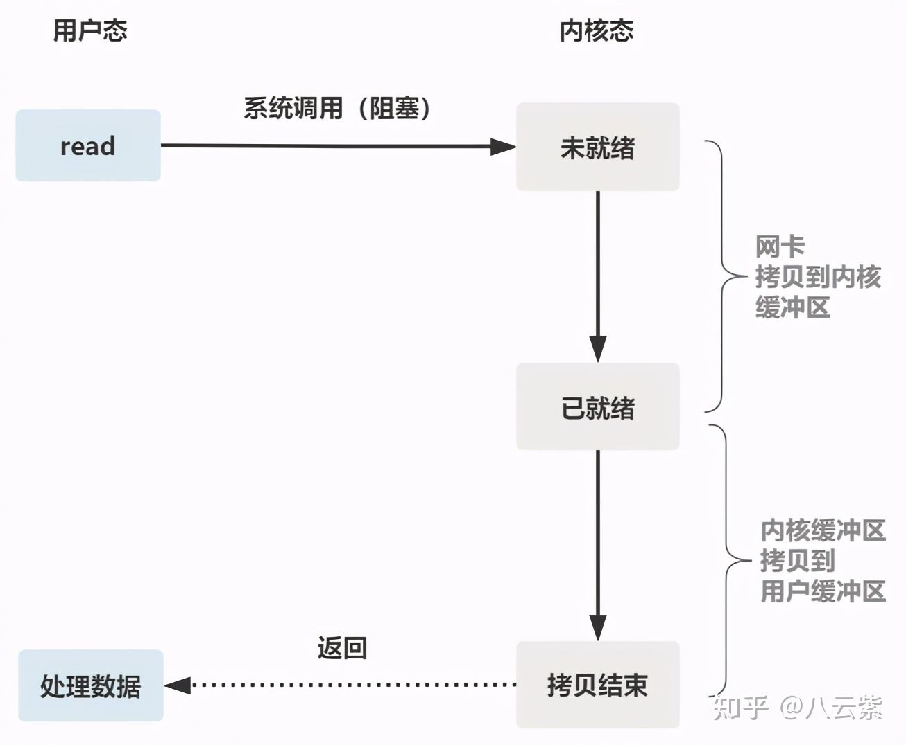
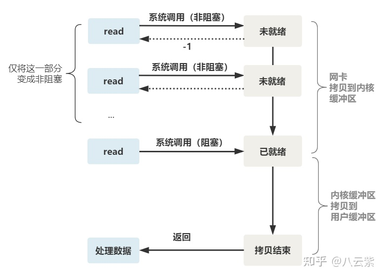
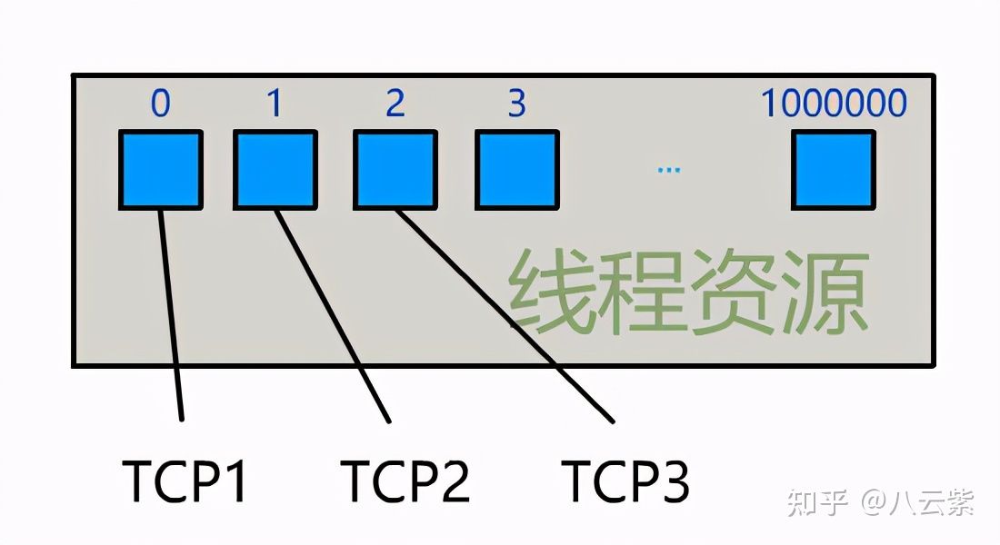
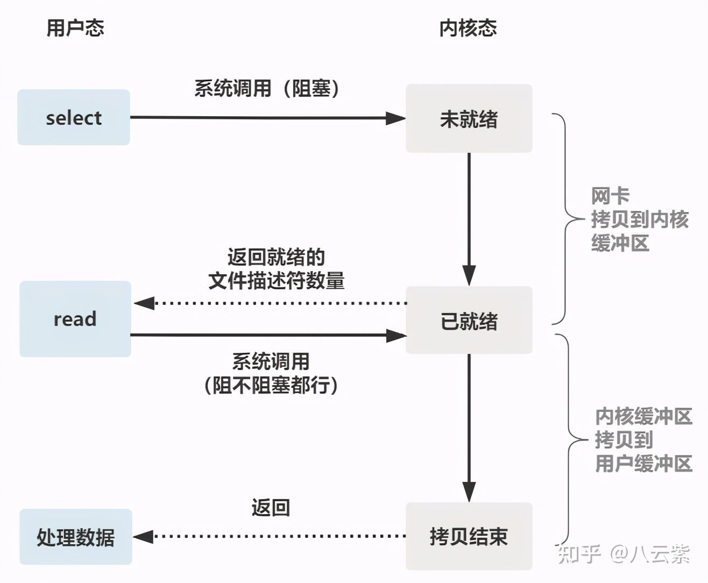
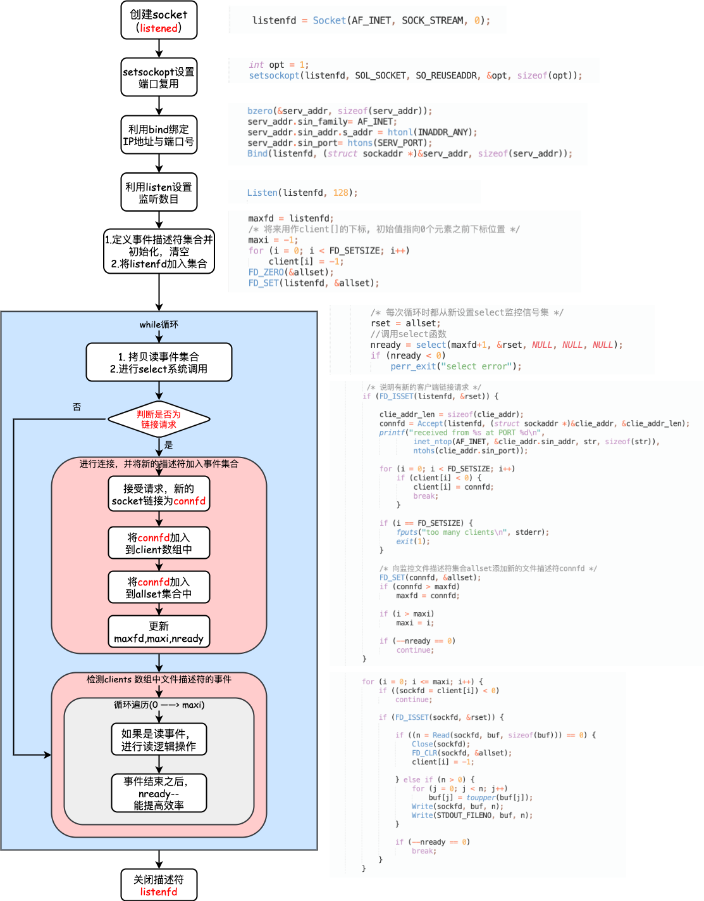
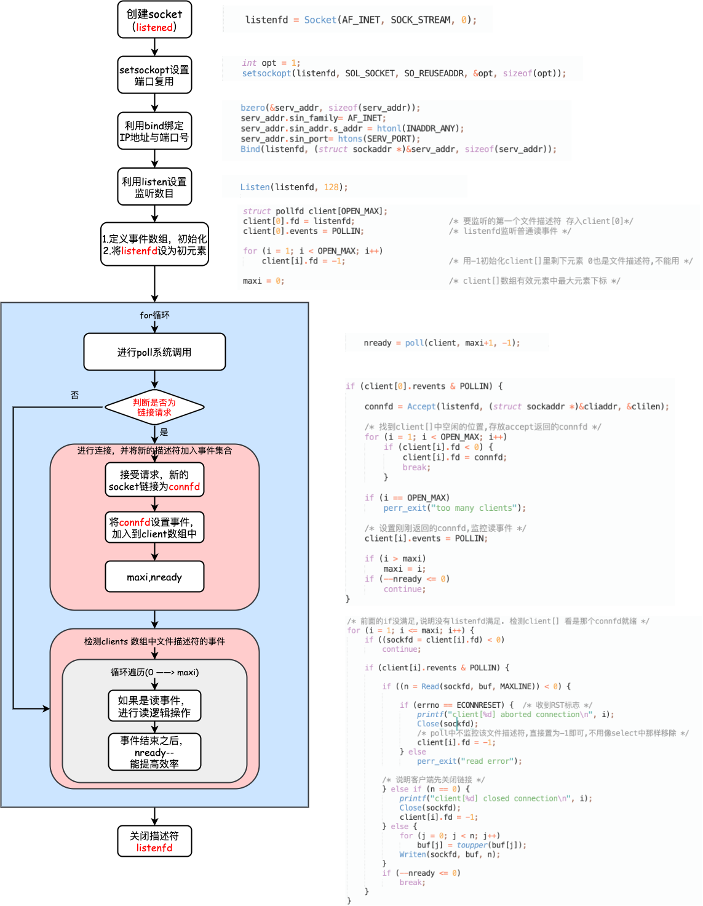
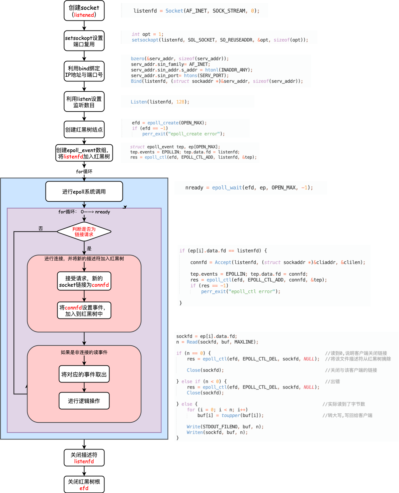

## 一.阻塞IO 

服务端为了处理客户端的连接和请求的数据，写了如下代码。

```c
listenfd = socket();   // 打开一个网络通信端口
bind(listenfd);        // 绑定
listen(listenfd);      // 监听
while(1) {
  connfd = accept(listenfd);  // 阻塞建立连接
  int n = read(connfd, buf);  // 阻塞读数据
  doSomeThing(buf);  // 利用读到的数据做些什么
  close(connfd);     // 关闭连接，循环等待下一个连接
}
```

这段代码会执行得磕磕绊绊，就像这样。


可以看到，服务端的线程阻塞在了两个地方，一个是 accept 函数，一个是 read 函数。

如果再把 read 函数的细节展开，我们会发现其阻塞在了两个阶段。


> + 第一阶段：数据从网卡拷贝到内核缓冲区，之后文件描述符就绪
> + 第二阶段：数据从内核缓冲区拷贝到用户缓冲区

这就是传统的阻塞 IO。

整体流程如下图。



所以，如果这个连接的客户端一直不发数据，那么服务端线程将会一直阻塞在 read 函数上不返回，也无法接受其他客户端连接。

这肯定是不行的。

## 二.非阻塞 IO

为了解决上面的问题，其关键在于改造这个 read 函数。

有一种聪明的办法是，每次都创建一个新的进程或线程，去调用 read 函数，并做业务处理。

```c
while(1) {
  connfd = accept(listenfd);  // 阻塞建立连接
  pthread_create（doWork);  // 创建一个新的线程
}
void doWork() {
  int n = read(connfd, buf);  // 阻塞读数据
  doSomeThing(buf);  // 利用读到的数据做些什么
  close(connfd);     // 关闭连接，循环等待下一个连接
}
```

这样，当给一个客户端建立好连接后，就可以立刻等待新的客户端连接，而不用阻塞在原客户端的 read 请求上。


不过，这不叫非阻塞 IO，只不过用了多线程的手段使得主线程没有卡在 read 函数上不往下走罢了。 ==操作系统为我们提供的 read 函数仍然是阻塞的。==

<font color= red>所以真正的非阻塞 IO，不能是通过我们用户层的小把戏，**而是要恳请操作系统为我们提供一个非阻塞的 read 函数**。 </font>

这个 read 函数的效果是，如果没有数据到达时（到达网卡并拷贝到了内核缓冲区），立刻返回一个错误值（-1），而不是阻塞地等待。

操作系统提供了这样的功能， ==只需要在调用 read 前，将文件描述符设置为非阻塞即可。==

```c
fcntl(connfd, F_SETFL, O_NONBLOCK);
int n = read(connfd, buffer) != SUCCESS);
```

这样，就需要用户线程循环调用 read，直到返回值不为 -1，再开始处理业务。


这里我们注意到一个细节。

非阻塞的 read，指的是在数据到达前，即数据还未到达网卡，或者到达网卡但还没有拷贝到内核缓冲区之前，这个阶段是非阻塞的。

==当数据已到达内核缓冲区， **此时调用 read 函数仍然是阻塞的，需要等待数据从内核缓冲区拷贝到用户缓冲区，才能返回** 。==

整体流程如下图

 

### 三.IO 多路复用

为每个客户端创建一个线程，服务器端的线程资源很容易被耗光。



当然还有个聪明的办法，我们可以每 accept 一个客户端连接后，将这个文件描述符（connfd）放到一个数组里。

```c
fdlist.add(connfd);
```

然后弄一个新的线程去不断遍历这个数组，调用每一个元素的非阻塞 read 方法。

```c
while(1) {
  for(fd <-- fdlist) {
    if(read(fd) != -1) {
      doSomeThing();
    }
  }
}
```

这样，我们就成功用一个线程处理了多个客户端连接。


你是不是觉得这有些多路复用的意思？

但这和我们用多线程去将阻塞 IO 改造成看起来是非阻塞 IO 一样，这种遍历方式也只是我们用户自己想出的小把戏，每次遍历遇到 read 返回 -1 时仍然是一次浪费资源的系统调用。

在 while 循环里做系统调用，就好比你做分布式项目时在 while 里做 rpc 请求一样，是不划算的。

所以，还是得恳请操作系统老大，提供给我们一个有这样效果的函数，我们将一批文件描述符通过一次系统调用传给内核，由内核层去遍历，才能真正解决这个问题。


##三. select

### 1.select 调用方法

select 是操作系统提供的系统调用函数，通过它，我们可以把一个文件描述符的数组发给操作系统， 让操作系统去遍历，确定哪个文件描述符可以读写， 然后告诉我们去处理：


select系统调用的函数定义如下。

```c
int select(
    int nfds,
    fd_set *readfds,
    fd_set *writefds,
    fd_set *exceptfds,
    struct timeval *timeout);
// nfds:监控的文件描述符集里最大文件描述符加1
// readfds：监控有读数据到达文件描述符集合，传入传出参数
// writefds：监控写数据到达文件描述符集合，传入传出参数
// exceptfds：监控异常发生达文件描述符集合, 传入传出参数
// timeout：定时阻塞监控时间，3种情况
//  1.NULL，永远等下去
//  2.设置timeval，等待固定时间
//  3.设置timeval里时间均为0，检查描述字后立即返回，轮询
```

服务端代码，这样来写。

首先一个线程不断接受客户端连接，并把 socket 文件描述符放到一个 list 里。

```c
while(1) {
  connfd = accept(listenfd);
  fcntl(connfd, F_SETFL, O_NONBLOCK);
  fdlist.add(connfd);
}
```

然后，另一个线程不再自己遍历，而是调用 select，将这批文件描述符 list 交给操作系统去遍历。

```c
while(1) {
  // 把一堆文件描述符 list 传给 select 函数
  // 有已就绪的文件描述符就返回，nready 表示有多少个就绪的
  nready = select(list);
  ...
}
```

不过，当 select 函数返回后，用户依然需要遍历刚刚提交给操作系统的 list。

只不过，操作系统会将准备就绪的文件描述符做上标识，用户层将不会再有无意义的系统调用开销。

```c
while(1) {
  nready = select(list);
  // 用户层依然要遍历，只不过少了很多无效的系统调用
  for(fd <-- fdlist) {
    if(fd != -1) {
      // 只读已就绪的文件描述符
      read(fd, buf);
      // 总共只有 nready 个已就绪描述符，不用过多遍历
      if(--nready == 0) break;
    }
  }
}
```

正如刚刚的动图中所描述的，其直观效果如下。（同一个动图消耗了你两次流量，气不气？）


可以看出几个细节：

1. select 调用需要传入 fd 数组，需要拷贝一份到内核，高并发场景下这样的拷贝消耗的资源是惊人的。（可优化为不复制）

2. select 在内核层仍然是通过遍历的方式检查文件描述符的就绪状态，是个同步过程，只不过无系统调用切换上下文的开销。（内核层可优化为异步事件通知）

3. select 仅仅返回可读文件描述符的个数，具体哪个可读还是要用户自己遍历。（可优化为只返回给用户就绪的文件描述符，无需用户做无效的遍历）

整个 select 的流程图如下。



可以看到，这种方式，既做到了一个线程处理多个客户端连接（文件描述符），又减少了系统调用的开销（多个文件描述符只有一次 select 的系统调用 + n 次就绪状态的文件描述符的 read 系统调用）。

### 2.select流程

```c++

char buf[BUFSIZE];
int client[FD_SETSIZE];
fd_set allset, rset;
int nready;
int i;

int main() {

	maxfd = listenfd;
	maxi = -1;

	for (int i = 0; i < FD_SETSIZE; ++i){
		client[i] = -1;
	}
	FD_ZERO(&allset);
	FD_SET(listenfd, &allset);

	for(; ;) {
		rset = allset;
		//系统调用select
		nready = select(maxfd + 1,&rset,NULL,NULL,NULL);
		if(nready < 0) 
			perror("select error");

		//如果是连接请求
		if(FD_ISSET(listenfd, &rset)) {
			connfd = Accept(listenfd, (struct sockaddr *)&clie_addr, &clie_addr_len);
			
			//找到client中的空位,导入connfd
			for (i = 0; i < FD_SETSIZE; ++i) {
				if(client[i] < 0) {
					client[i] = connfd;
					breakl
				}
			}
			//检查是否到达上限
			if (i == FD_SETSIZE){
				fputs("too many clients\n", stderr);
                exit(1)
			}
			//将connfd添加到allset中，下一轮进行监听
			FD_SET(connfd, &allset);

			//更新参数
			if(maxfd < connfd) maxfd = connfd;
			if(i > maxi) maxi = i;
			if(nready --) continue;
		}

		//检查哪个client中的文件操作符就绪
		for (i = 0; i < maxi; ++i)
		{
			//找到就绪事件
			if((sockfd = client[i]) < 0)
				continue;
			if(FD_ISSET(sockfd, &rset)) {
				if(n = Read(sockfd, buf, sizeof(buf)) == 0) {
					//关闭socket，并从集合中解除
					Close(sockfd);
					FD_CLR(sockfd, &allset);
					client[i] = -1;
				} else if(n > 0) {
					for (j = 0; j < n; j++)
                        buf[j] = toupper(buf[j]);
                    Write(sockfd, buf, n);
                    Write(STDOUT_FILENO, buf, n);
				}
				//就绪事件全部变量完成，则跳出循环
				if(--nready == 0) {
					break;
				}
			}
		}
	}
	Close(listenfd);
	return 0;

}
```


<div align = center></div>


## 四 .poll

### 1.poll调用方法

poll 也是操作系统提供的系统调用函数。

```c
int poll(struct pollfd *fds, nfds_tnfds, int timeout);

struct pollfd {
  intfd; /*文件描述符*/
  shortevents; /*监控的事件*/
  shortrevents; /*监控事件中满足条件返回的事件*/
};
```

它和 select 的主要区别就是，去掉了 select 只能监听 1024 个文件描述符的限制。

### 2.poll流程

```c++
#define OPEN_MAX 6544
#define MAXLINE 80

int i,maxi, nready;
char buf[MAXLINE];

int main()
{
	//定义poll事件数组
	struct pollfd client[OPEN_MAX];
	client[0].fd = listenfd;
	client[0].event = POLLIN;

	//初始化剩余事件数组
	for (i = 1; i < count; ++i){
		client[i].fd = -1;
	}
	//client[]数组有效元素中最大元素下标
	maxi = 0;
  
	for(; ;) {

		nready = poll(client, maxi + 1, -1);

		//判断连接是否就绪
		if(client[0].revents & POLLIN) {
			connfd = Accept(listenfd, (struct sockaddr *)&cliaddr, &clilen);

			//将connfd导入client数组中
			for(i = 1; i < OPEN_MAX; ++i) {
				if(client[i] < 0) {
					client[i] = connfd;
					break;
				}
			}

			//检查是否到达上限
			if(i == OPEN_MAX)
				perr_exit("too many clients");

			//设置刚刚返回的connfd
			client[i].event = POLLIN;

			//更新参数
			if(maxi < i) maxi = i;
			if(--nready <= 0) continue;
		}
		//前面的if没满足,说明没有listenfd满足. 检测client[] 看是哪个connfd就绪
		for(i = 1; i <= maxi; ++i) {
			if((sockfd = client[i]) < 0)
				continue;

			if(client[i].revents & POLLIN) {

				if((n = Read(sockfd, buf, MAXLINE)) < 0) {
					 //poll中不监控该文件描述符,直接置为-1即可,不用像select中那样移除 */
					if (errno == ECONNRESET) {  /* 收到RST标志 */
                        Close(sockfd);
                        client[i].fd = -1;     
                    } else
                        perr_exit("read error");
				} else if(n == 0) {
					Close(sockfd);
					client[i].fd = -1;
				} else {
					for (j = 0; j < n; j++)
                        buf[j] = toupper(buf[j]);
                    Writen(sockfd, buf, n);
				}

				if(-- nready <= 0)
					break;
			}
		}  
	}	
	Close(listenfd)
	return 0;
}
```


<div align = center></div>

---

### 3.poll与select的对比

:diamond_shape_with_a_dot_inside: **优势：**

:one: 没有了只能监听 1024 个文件描述符的限制。

:two: 提供了pollfd 结构体，不需要自己设置fd数组 和 文件描述符事件集合(读，写，异常都要自己设置，poll直接在pollfd的event中设置)，在一定程度上有了简化。

:disappointed_relieved: **一样的缺陷：**

:one: 都是要传入数组，这就涉及到了资源拷贝，效率不高

:two: 在内核层仍然是通过遍历的方式检查文件描述符的就绪状态，是个同步过程，只不过无系统调用切换上下文的开销。

:three: 对于所传出的结构体数组，还是需要通过遍历maxi(往往设置为最大文件描述符 + 1)次来筛查哪些文件描述符满足就绪事件。

---

## 五 .epoll

### 1.调用流程

epoll 是最终的大 boss，它解决了 select 和 poll 的一些问题。

还记得上面说的 select 的三个细节么？

1. select 调用需要传入 fd 数组，需要拷贝一份到内核，高并发场景下这样的拷贝消耗的资源是惊人的。（可优化为不复制）

2. select 在内核层仍然是通过遍历的方式检查文件描述符的就绪状态，是个同步过程，只不过无系统调用切换上下文的开销。（内核层可优化为异步事件通知）

3. select 仅仅返回可读文件描述符的个数，具体哪个可读还是要用户自己遍历。（可优化为只返回给用户就绪的文件描述符，无需用户做无效的遍历）

所以 epoll 主要就是针对这三点进行了改进。

1. 内核中保存一份文件描述符集合，无需用户每次都重新传入，只需告诉内核修改的部分即可。

2. 内核不再通过轮询的方式找到就绪的文件描述符，而是通过异步 IO 事件唤醒。

3. 内核仅会将有 IO 事件的文件描述符返回给用户，用户也无需遍历整个文件描述符集合。

具体，操作系统提供了这三个函数。

```c
第一步，创建一个 epoll 句柄
int epoll_create(int size);
第二步，向内核添加、修改或删除要监控的文件描述符。
int epoll_ctl(
  int epfd, int op, int fd, struct epoll_event *event);
第三步，类似发起了 select() 调用
int epoll_wait(
  int epfd, struct epoll_event *events, int max events, int timeout);
```

使用起来，其内部原理就像如下一般丝滑。


### 2.epoll流程

```c++
#define MAXLINE 8192
#define OPEN_MAX 5000

int main() {
	ssize_t nready, efd, res;
	int listenfd, connfd, sockfd, n;
	char buf[MAXLINE];

	//创建红黑树根
	efd = epoll_create(OPEN_MAX);
	if (efd == -1)
        perr_exit("epoll_create error");


    struct epoll_event tep, ep[OPEN_MAX];
    //将listenfd注册至红黑树中
    tep.events = EPOLLIN;
    tep.data.fd = listenfd;
    res = epoll_ctl(efd, EPOLL_CTL_ADD, listenfd, &tep);

    for(; ;) {
    	//epoll调用
    	nready = epoll_wait(efd, ep, OPEN_MAX, -1);
    	if(nready < 0) 
    		perr_exit("epoll_wait error");

    	//遍历内核传出的事件数组
    	for(int i = 0; i < nready; ++i) {
    		//如果是连接事件
    		if(ep[i].data.fd == listenfd) {
    			connfd = Accept(listenfd, (struct sockaddr *)&cliaddr, &clilen);  
    			//将新的socket加入红黑树
    			tep.data.fd = connfd;
    			tep.events = EPOLLIN;
    			res = epoll_ctl(efd, EPOLL_CTL_ADD, connfd, &tep);
    			if (res == -1)
                    perr_exit("epoll_ctl error");
    		}
    		//否则就是读事件
    		else{
    			sockfd = ep[i].data.fd;
    			//读取数据
    			n = Read(sockfd, buf, MAXLINE);
    			//如果对方关闭链接
    			if(n == 0) {
    				//将对应的socket从红黑树中删除
    				res = epoll_ctl(efd, EPOLL_CTL_DEL, sockfd, NULL);
    				Close(sockfd);
    			}
    			//如果出错
    			else if(n < 0) {
    				//将对应的socket从红黑树中删除
    				res = epoll_ctl(efd, EPOLL_CTL_DEL, sockfd, NULL);
    				Close(sockfd);
    			}
    			//进行逻辑操作
    			else {
    				for (i = 0; i < n; i++)
                        buf[i] = toupper(buf[i]);   //转大写,写回给客户端

                    Write(STDOUT_FILENO, buf, n);
                    Writen(sockfd, buf, n);
    			}
    		}
    	}
    }
close(listenfd);
close(efd);
	return 0;
}
```


<div align = center></div>


---

大白话总结一下。

一切的开始，都起源于这个 read 函数是操作系统提供的，而且是阻塞的，我们叫它 **阻塞 IO**。

为了破这个局，程序员在用户态通过多线程来防止主线程卡死。

后来操作系统发现这个需求比较大，于是在操作系统层面提供了非阻塞的 read 函数，这样程序员就可以在一个线程内完成多个文件描述符的读取，这就是 **非阻塞 IO**。

但多个文件描述符的读取就需要遍历，当高并发场景越来越多时，用户态遍历的文件描述符也越来越多，相当于在 while 循环里进行了越来越多的系统调用。

后来操作系统又发现这个场景需求量较大，于是又在操作系统层面提供了这样的遍历文件描述符的机制，这就是 **IO 多路复用**。

多路复用有三个函数，最开始是 select，然后又发明了 poll 解决了 select 文件描述符的限制，然后又发明了 epoll 解决 select 的三个不足。