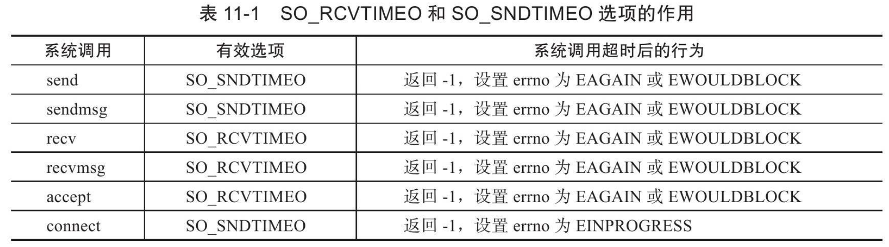
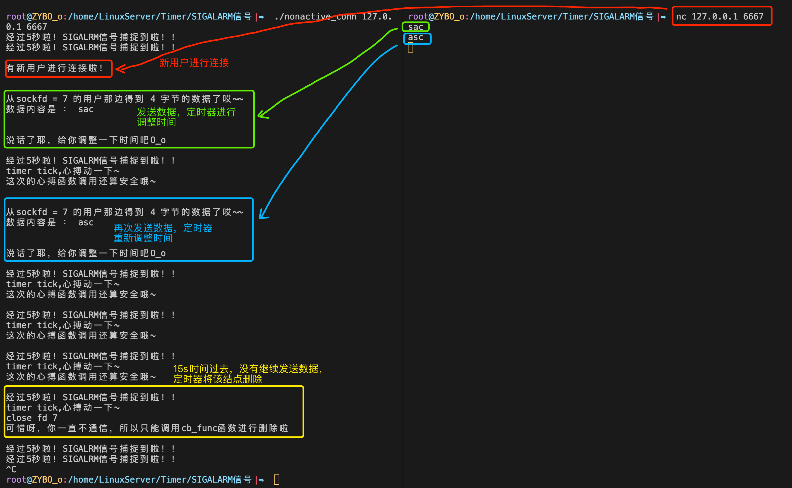
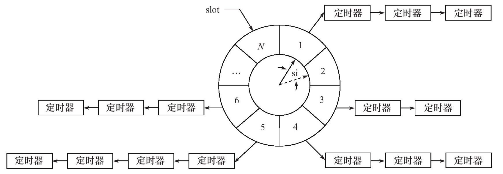

网络程序需要处理的第三类事件是定时事件，比如定期检测一个客户连接的活动状态。服务器程序通常管理着众多定时事件，因此有效地组织这些定时事件，使之能在预期的时间点被触发且不影响服务器的主要逻辑，对于服务器的性能有着至关重要的影响。

为此，我们要 **将每个定时事件分别封装成定时器，并使用某种容器类数据结构，比如链表、排序链表和时间轮，将所有定时器串联起来，以实现对定时事件的统一管理。**

本章主要讨论的就是两种高效的管理定时器的容器： **时间轮** 和 **时间堆** 。 不过，在讨论如何组织定时器之前，我们先要介绍定时的方法。定时是指在一段时间之后触发某段代码的机制，我们可以在这段代码中依次处理所有到期的定时器。换言之，定时机制是定时器得以被处理的原动力。Linux提供了三种定时方法，它们是：

❑ socket选项SO_RCVTIMEO和SO_SNDTIMEO。

❑ SIGALRM信号。

❑ I/O复用系统调用的超时参数。

## 一.socket选项SO_RCVTIMEO和SO_SNDTIMEO

socket选项SO_RCVTIMEO和SO_SNDTIMEO，它们分别用来设置socket接收数据超时时间和发送数据超时时间。因此，这两个选项仅对与数据接收和发送相关的socket专用系统调用有效。

SO_RCVTIMEO和SO_SNDTIMEO选项的作用：

<div align = center></div>

由表11-1可见，在程序中，我们可以根据系统调用的返回值以及errno来判断超时时间是否已到，进而决定是否开始处理定时任务。

### 例子实现

:large_blue_diamond: 定义timeout_connect函数，根据IP地址，端口号和超时时间创建socket文件

```c++ 
const char* ip = argv[1];
int port = atoi( argv[2] );

int sockfd = timeout_connect( ip, port, 10 );
```

:diamond_shape_with_a_dot_inside: **timeout_connect定义**

```c++
int sockfd = socket( PF_INET, SOCK_STREAM, 0 );
assert( sockfd >= 0 );

//通过选项SO_RCVTIMEO和SO_SNDTIMEO所设置的超时时间的类型是timeval，这和select系统调用的超时参数类型相同
struct timeval timeout;
timeout.tv_sec = time;
timeout.tv_usec = 0;
socklen_t len = sizeof( timeout );
ret = setsockopt( sockfd, SOL_SOCKET, SO_SNDTIMEO, &timeout, len );
assert( ret != -1 );

ret = connect( sockfd, ( struct sockaddr* )&address, sizeof( address ) );
```

:one: 创建timeval对象timeout，设定时间。

:two: 利用setsockopt函数设置sockfd文件描述符，设置为具有定时功能的对象

:three: 利用新功能的sockfd创建连接socket文件描述符

```c++
if ( ret == -1 )
{
    //超时对应的错误号是EINPROGRESS。下面这个条件如果成立，我们就可以处理定时任务了
    if( errno == EINPROGRESS ){
        printf( "connecting timeout\n" );
        return -1;
    }
    printf( "error occur when connecting to server\n" );
    return -1;
}
```

:one: 如果返回值的错误类型是EINPROGRESS，则处理定时任务。

---


## 二.SIGALRM信号

alarm和setitimer函数设置的实时闹钟一旦超时，将触发SIGALRM信号。因此，我们可以利用该信号的信号处理函数来处理定时任务。

但是，如果要处理多个定时任务，就需要不断地触发SIGALRM信号，并在其信号处理函数中执行到期的任务。一般而言，SIGALRM信号按照固定的频率生成， **即由alarm或setitimer函数设置的定时周期T保持不变。如果某个定时任务的超时时间不是T的整数倍，那么它实际被执行的时间和预期的时间将略有偏差。因此定时周期T反映了定时的精度。**

### 1. 基于升序链表的定时器

定时器通常至少要包含两个成员：

+ 超时时间（相对时间或者绝对时间）
+ 任务回调函数

>  有的时候还可能包含回调函数被执行时需要传入的参数，以及是否重启定时器等信息。

如果使用链表作为容器来串联所有的定时器，则每个定时器还要包含指向下一个定时器的指针成员。进一步，如果链表是双向的，则每个定时器还需要包含指向前一个定时器的指针成员。

#### 代码分析

:large_blue_diamond: 用户数据类

```c++
struct client_data{
    sockaddr_in address;				//客户端socket地址
    int sockfd;									//socket文件描述符
    char buf[ BUFFER_SIZE ];		//读缓存
    util_timer* timer;					//定时器
};
```

:large_blue_diamond: 定时器类

```c++
class util_timer{
public:
   time_t expire;												 //任务的超时时间，这里使用绝对时间	
   void (*cb_func)( client_data* );				//任务回调函数
   client_data* user_data;	//回调函数处理的客户数据，由定时器的执行者传递给回调函数
   util_timer* prev;				//前指针
   util_timer* next;				//后指针
   util_timer() : prev( NULL ), next( NULL ){}
};
```

:diamond_shape_with_a_dot_inside: **定时器链表 sort_timer_lst** 

:one: 定时器链表的数据成员

```c++
private:
    util_timer* head;	//链表头指针
    util_timer* tail;	//链表尾指针
```

:two: 构造函数与析构函数

```c++
sort_timer_lst() : head( NULL ), tail( NULL ) {}
~sort_timer_lst(){
    util_timer* tmp = head;
    while( tmp ){
        head = tmp->next;
        delete tmp;
        tmp = head;
    }
}
```

+ 构造函数将头和为指针初始化为空
+ 析构函数删除所有的定时器

:three: **将目标定时器timer添加到链表中**

```c++
void add_timer( util_timer* timer )
{
    if( !timer )
      return;
    //头结点为空，则让收尾都是这个结点
    if( !head ){
        head = tail = timer;
        return; 
    }
    //如果目标定时器的超时时间小于当前链表中所有定时器的超时时间，
    //则把该定时器插入链表头部，作为链表新的头节点。
    if( timer->expire < head->expire )
    {
        timer->next = head;
        head->prev = timer;
        head = timer;
        return;
    }
    //否则就需要调用重载函数add_timer函数
    //把它插入链表中合适的位置，以保证链表的升序特性
    add_timer( timer, head );
}
```

:four: **定时器调整函数**

```c++
/* 
		当某个定时任务发生变化时，调整对应的定时器在链表中的位置。
    这个函数只考虑被调整的定时器的超时时间延长的情况，
    即该定时器需要往链表的尾部移动
*/
void adjust_timer( util_timer* timer )
{
    if( !timer ){
        return;
    }
    util_timer* tmp = timer->next;
    //如果被调整的目标定时器处在链表尾部，
    //或者该定时器新的超时值仍然小于其下一个定时器的超时值，则不用调整
    if( !tmp || ( timer->expire < tmp->expire ) ){
        return;
    }
    //如果目标定时器是链表的头节点，
    //则将该定时器从链表中取出并重新插入链表
    if( timer == head ) {
        head = head->next;
        head->prev = NULL;
        timer->next = NULL;
        add_timer( timer, head );
    }
    //如果目标定时器不是链表的头节点，
    //则将该定时器从链表中取出，然后插入其原来所在位置之后的部分链表中
    else {
        timer->prev->next = timer->next;
        timer->next->prev = timer->prev;
        add_timer( timer, timer->next );
    }
}
```

:five: **定时器删除函数**

```c++
void del_timer( util_timer* timer )
{
    if( !timer ){
        return;
    }
    //下面这个条件成立表示链表中只有一个定时器，即目标定时器
    if( ( timer == head ) && ( timer == tail ) ){
        delete timer;
        head = NULL;
        tail = NULL;
        return;
    }
    //如果链表中至少有两个定时器，且目标定时器是链表的头结点，
    //则将链表的头结点重置为原头节点的下一个节点，然后删除目标定时器
    if( timer == head ){
        head = head->next;
        head->prev = NULL;
        delete timer;
        return;
    }
    //如果链表中至少有两个定时器，且目标定时器是链表的尾结点，
    //则将链表的尾结点重置为原尾节点的前一个节点，然后删除目标定时器
    if( timer == tail ){
        tail = tail->prev;
        tail->next = NULL;
        delete timer;
        return;
    }
    //如果目标定时器位于链表的中间，则把它前后的定时器串联起来，然后删除目标定时器
    timer->prev->next = timer->next;
    timer->next->prev = timer->prev;
    delete timer;
}
```

:six: **心搏函数—tick函数**

```c++
/*
	SIGALRM信号每次被触发就在其信号处理函数（如果使用统一事件源，则是主函数）
	中执行一次tick函数，以处理链表上到期的任务
*/
void tick(){
    if( !head ){
        return;
    }
    printf( "timer tick\n" );
    //获得系统当前的时间
    time_t cur = time( NULL );
    util_timer* tmp = head;
    //从头结点开始依次处理每个定时器，直到遇到一个尚未到期的定时器，这就是定时器的核心逻辑
    while( tmp ){
        /*
        		因为每个定时器都使用绝对时间作为超时值，
        		所以我们可以把定时器的超时值和系统当前时间比较, 以判断定时器是否到期
        */
      	//如果还没到时间，直接跳出循环
        if( cur < tmp->expire ){
            break;
        }
        //到期了，就调用定时器的回调函数，以执行定时任务
        tmp->cb_func( tmp->user_data );
        //执行完定时器中的定时任务之后，就将它从链表中删除，并重置链表头结点
      	//因为是升序链表，所有肯定从头挨个删除
        head = tmp->next;
        if( head ){
            head->prev = NULL;
        }
        delete tmp;
        tmp = head;
    }
}
```

:large_orange_diamond: **私有功能函数：定时器添加函数**

```c++
//一个重载的辅助函数，它被公有的add_timer函数和adjust_timer函数调用。
//该函数表示将目标定时器timer添加到节点lst_head之后的部分链表中
void add_timer( util_timer* timer, util_timer* lst_head )
{
    util_timer* prev = lst_head;
    util_timer* tmp = prev->next;
    //遍历lst_head节点之后的部分链表，
    //直到找到一个超时时间大于目标定时器的超时时间的节点，
    //并将目标定时器插入该节点之前
    while( tmp ){
        //直到找到一个超时时间大于目标定时器的超时时间的节点，
        if( timer->expire < tmp->expire ){
            prev->next = timer;
            timer->next = tmp;
            tmp->prev = timer;
            timer->prev = prev;
            break;
        }
        prev = tmp;
        tmp = tmp->next;
    }
    //如果遍历完lst_head节点之后的部分链表，仍未找到超时时间大于目标定时器的超时时间的节点，
    //则将目标定时器插入链表尾部，并把它设置为链表新的尾节点
    if( !tmp ){
        prev->next = timer;
        timer->prev = prev;
        timer->next = NULL;
        tail = timer;
    }
    
}
```

+ 其核心函数tick相当于一个心搏函数，它每隔一段固定的时间就执行一次，以检测并处理到期的任务。判断定时任务到期的依据是定时器的expire值小于当前的系统时间。

+ 从执行效率来看，添加定时器的时间复杂度是O(n)，删除定时器的时间复杂度是O(1)，执行定时任务的时间复杂度是O(1)。

### 2.处理非活动连接

服务器程序通常要定期处理非活动连接：给客户端发一个重连请求，或者关闭该连接，或者其他。

Linux在内核中提供了对连接是否处于活动状态的定期检查机制，我们可以 **通过socket选项KEEPALIVE来激活它** 。不过使用这种方式将使得应用程序对连接的管理变得复杂。

因此，我们可以考虑在应用层实现类似于KEEPALIVE的机制，以管理所有长时间处于非活动状态的连接。

下面应用利用alarm函数周期性地触发SIGALRM信号，该信号的信号处理函数利用管道通知主循环执行定时器链表上的定时任务——关闭非活动的连接。

#### 代码分析

:large_blue_diamond: **全局变量定义**

```c++
//管道进行传输信号
static int pipefd[2];
//利用升序链表来管理定时器
static sort_timer_lst timer_lst;
static int epollfd = 0;
```

:large_blue_diamond: **信号处理函数**

```c++
void sig_handler( int sig ){
    int save_errno = errno;
    int msg = sig;
  	//将信号写入管道，进行通知
    send( pipefd[1], ( char* )&msg, 1, 0 );
    errno = save_errno;
}
```

:large_blue_diamond: **信号添加函数**

```c++
void addsig( int sig ){
    struct sigaction sa;
    memset( &sa, '\0', sizeof( sa ) );
  	//加入信号处理函数
    sa.sa_handler = sig_handler;
    sa.sa_flags |= SA_RESTART;
    sigfillset( &sa.sa_mask );
  	//调用信号注册函数
    assert( sigaction( sig, &sa, NULL ) != -1 );
}
```

:large_blue_diamond: **时间处理函数**

```c++
void timer_handler(){
    //定时处理任务，实际上就是调用tick函数
    timer_lst.tick();
    //一个alarm调用只会引起一次SIGALRM信号，所以我们要重新定时，不断触发信号
    alarm( TIMESLOT );
}
```

:large_blue_diamond: 定时器回调函数

```c++
void cb_func( client_data* user_data ){
  	//删除非活动链接socket上的注册事件，并关闭
    epoll_ctl( epollfd, EPOLL_CTL_DEL, user_data->sockfd, 0 );
    assert( user_data );
    close( user_data->sockfd );
    printf( "close fd %d\n", user_data->sockfd );
}
```

:diamond_shape_with_a_dot_inside: **逻辑分析**

:one: 创建epoll事件

```c++
epoll_event events[ MAX_EVENT_NUMBER ];
//创建红黑树根结点
int epollfd = epoll_create( 5 );
assert( epollfd != -1 );
//listenfd添加到红黑树根
addfd( epollfd, listenfd );
```

:two: 创建管道，注册pipefd[0]上的可读事件，并将其注册至红黑树中

```c++
//使用socketpair创建管道，注册pipefd[0]上的可读事件
ret = socketpair( PF_UNIX, SOCK_STREAM, 0, pipefd );
assert( ret != -1 );
//设置写事件为非阻塞
setnonblocking( pipefd[1] );
//将读事件 注册至红黑树
addfd( epollfd, pipefd[0] );
```

:three: 添加信号处理函数，创建用户数据数组，并定时5s

```c++
// 添加信号处理函数
addsig( SIGALRM );
addsig( SIGTERM );
bool stop_server = false;
client_data* users = new client_data[FD_LIMIT]; 
bool timeout = false;
alarm( TIMESLOT );
```

:four: 逻辑开始，进行epoll监听，如果事件出现，则进行处理

```c++
while( !stop_server ){
    //进行epoll_wait，等待事件发生
    int number = epoll_wait( epollfd, events, MAX_EVENT_NUMBER, -1 );
  	...
    for ( int i = 0; i < number; i++ ){
        int sockfd = events[i].data.fd;
```

:diamonds: :five: 如果是新用户链接

```c++
if( sockfd == listenfd )
{
    int connfd = accept(...);
  	//将新的socket注册至红黑树进行监听
    addfd( epollfd, connfd );
		//socket对应的用户数据进行注册
    users[connfd].address = client_address;
    users[connfd].sockfd = connfd;
    //创建定时器，设置其回调函数与超时时间，然后绑定定时器与用户数据
    util_timer* timer = new util_timer;
    timer->user_data = &users[connfd];
    timer->cb_func = cb_func;
  	//当前时间
    time_t cur = time( NULL );
    timer->expire = cur + 3 * TIMESLOT;
    users[connfd].timer = timer;
    //将定时器添加到升序链表中
    timer_lst.add_timer( timer );
}
```

:diamonds: :six: 如果是管道写回数据，说明信号到来

```c++
else if( ( sockfd == pipefd[0] ) && ( events[i].events & EPOLLIN ) )
{
    int sig;
    char signals[1024];
    //如果是管道的读事件，则从管道中把数据读出
    ret = recv( pipefd[0], signals, sizeof( signals ), 0 );
    if( ret == -1 )
        continue;
    else if( ret == 0 )
        continue;
    else{   // 遍历数据中的信号，通过switch处理每个信号对应的事件
        for( int i = 0; i < ret; ++i ){
            switch( signals[i] ){
                case SIGALRM:{   
                  	//用timeout变量标记有定时任务需要处理，但不立即处理定时任务。
                    //这是因为定时任务的优先级不是很高，我们优先处理其他更重要的任务
                  	//修改超时标记
                    timeout = true;
                    std::cout << "SIGALRM Catched" <<std::endl;
                    break;
                }
                case SIGTERM:{
                    std::cout << "SIGTERM Catched" <<std::endl;
                    stop_server = true;
                }
            }
        }
    }
}
```

:diamonds: :seven: 处理客户连接上收到的数据

```c++
else if(  events[i].events & EPOLLIN ){
  	//接收用户发送的数据
    memset( users[sockfd].buf, '\0', BUFFER_SIZE );
    ret = recv( sockfd, users[sockfd].buf, BUFFER_SIZE-1, 0 );
    printf( "get %d bytes of client data %s from %d\n", ret, users[sockfd].buf, sockfd );
  	//取出用户对应的定时器
    util_timer* timer = users[sockfd].timer;
    if( ret < 0 ){
        //如果发生读错误，则关闭连接，并移除其对应的定时器
        if( errno != EAGAIN ){
            cb_func( &users[sockfd] );
            if( timer ){
                timer_lst.del_timer( timer );
            }
        }
    }
    //如果对方已经关闭连接，则我们也关闭连接，并移除对应的定时器
    else if( ret == 0 ){
        cb_func( &users[sockfd] );
        if( timer ){
            timer_lst.del_timer( timer );
        }
    }
    else{
   //如果某个客户连接上有数据可读，则我们要调整该连接对应的定时器，以延迟该连接被关闭的时间
        if( timer ){
            time_t cur = time( NULL );
            timer->expire = cur + 3 * TIMESLOT;
            printf( "adjust timer once\n" );
          	//调整该连接对应的定时器
            timer_lst.adjust_timer( timer );
        }
    }
}
```

:diamonds: :eight: 处理最后的定时事件

```c++
//最后处理定时事件，因为I/O事件有更高的优先级。当然，这样做将导致定时任务不能精确地按照预期的时间执行
if( timeout ){
    timer_handler();
    timeout = false;
}
```

:large_orange_diamond: 运行结果

<div align = center></div>

## 三.I/O复用系统调用的超时参数

Linux下的3组I/O复用系统调用都带有超时参数，因此它们不仅能统一处理信号和I/O事件，也能统一处理定时事件。

但是由于I/O复用系统调用可能在超时时间到期之前就返回（有I/O事件发生）， 所以如果我们要 **利用它们来定时，就需要不断更新定时参数以反映剩余的时间。**

```c++
#define TIMEOUT 5000

int timeout = TIMEOUT;
time_t start = time( NULL );
time_t end = time( NULL );
while( 1 )
{
    printf( "the timeout is now %d mill-seconds\n", timeout );
    start = time( NULL );
    int number = epoll_wait( epollfd, events, MAX_EVENT_NUMBER, timeout );
    if( ( number < 0 ) && ( errno != EINTR ) )
    {
        printf( "epoll failure\n" );
        break;
    }

    //如果epoll_wait成功返回0，则说明超时时间到，此时便可处理定时任务，并重置定时时间
    if( number == 0 )
    {
        // timeout
        timeout = TIMEOUT;
        continue;
    }

    //如果epoll_wait的返回值大于0，则本次epoll_wait调用持续的时间是(end-start)*1000 ms，
    //我们需要将定时时间timeout减去这段时间，以获得下次epoll_wait调用的超时参数
    end = time( NULL );
    timeout -= ( end - start ) * 1000;
  
    //重新计算之后的timeout值有可能等于0，说明本次epoll_wait调用返回时，不仅有文件描述符就绪，而且其超时时间也刚好到达，
    //此时我们也要处理定时任务，并重置定时时间
    if( timeout <= 0 )
    {
        // timeout
        timeout = TIMEOUT;
    }

    // handle connections
}
```

---


## 四.高性能定时器—时间轮

### 1.基本概念

基于排序链表的定时器存在一个问题：添加定时器的效率偏低。而时间轮可以解决这个问题。一种简单的时间轮如图11-1所示：

<div align = center></div>

上图所示的时间轮内：

+ （实线）指针指向轮子上的一个槽（slot）。它以恒定的速度顺时针转动，每转动一步就指向下一个槽（虚线指针指向的槽）；
+ 每次转动称为一个滴答（tick），一个滴答的时间称为时间轮的槽间隔si（slot interval），它实际上就是心搏时间。
+ 该时间轮共有N个槽，因此它运转一周的时间是N * si。
+ 每个槽指向一条定时器链表，每条链表上的定时器具有相同的特征：它们的定时时间相差N*si的整数倍。时间轮正是利用这个关系将定时器散列到不同的链表中。

假如现在指针指向槽cs，我们要添加一个定时时间为ti的定时器，则该定时器将被插入槽ts（timer slot）对应的链表中：

<div align = center> ts = (cs + (ti / si)) % N </div>

基于排序链表的定时器使用唯一的一条链表来管理所有定时器，所以插入操作的效率随着定时器数目的增多而降低。

**而时间轮使用哈希表的思想，将定时器散列到不同的链表上。这样每条链表上的定时器数目都将明显少于原来的排序链表上的定时器数目，插入操作的效率基本不受定时器数目的影响。**

很显然，对时间轮而言，要提高定时精度，就要使si值足够小；要提高执行效率，则要求N值足够大。

### 2.代码分析


### 3.性能分析

对时间轮而言：

+ 添加一个定时器的时间复杂度是O(1)

+ 删除一个定时器的时间复杂度也是O(1)

+ 执行一个定时器的时间复杂度是O(n)

  > 但实际上执行一个定时器任务的效率要比O（n）好得多，因为时间轮将所有的定时器散列到了不同的链表上。
  >
  > 时间轮的槽越多，等价于散列表的入口（entry）越多，从而每条链表上的定时器数量越少。
  >
  > 此外，我们的代码仅使用了一个时间轮。当使用多个轮子来实现时间轮时，执行一个定时器任务的时间复杂度将接近O(1)

---


## 五.高性能定时器—时间堆

### 1.基本概念

前面讨论的定时方案都是以固定的频率调用心搏函数tick，并在其中依次检测到期的定时器，然后执行到期定时器上的回调函数。

设计定时器的另外一种思路是：

+  **将所有定时器中超时时间最小的一个定时器的超时值作为心搏间隔。**

这样，一旦心搏函数tick被调用，超时时间最小的定时器必然到期，我们就可以在tick函数中处理该定时器。然后，再次从剩余的定时器中找出超时时间最小的一个，并将这段最小时间设置为下一次心搏间隔。如此反复，就实现了较为精确的定时。最小堆很适合处理这种定时方案。

### 2.最小堆操作

堆的操作见 [堆排序]()

### 3.代码分析


### 4.性能分析

对时间堆而言：

+ 添加一个定时器的时间复杂度是O(lgn)
+ 删除一个定时器的时间复杂度是O(1)
+ 执行一个定时器的时间复杂度是O(1)

因此，时间堆的效率是很高的。