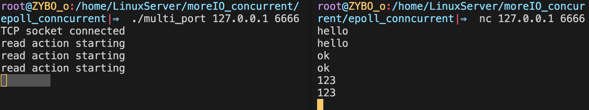

## 一.I/O复用应用——同时处理TCP和UDP服务

我们讨论过的服务器程序都只监听一个端口。而在实际应用中，有不少服务器程序能同时监听多个端口，比如超级服务inetd和android的调试服务adbd。

:diamonds: 从bind系统调用的参数来看，一个socket只能与一个socket地址绑定，即一个socket只能用来监听一个端口。 **因此，服务器如果要同时监听多个端口，就必须创建多个socket，并将它们分别绑定到各个端口上。** 这样一来，服务器程序就需要同时管理多个监听socket，I/O复用技术就有了用武之地。

:diamonds: 另外，即使是同一个端口，如果服务器要同时处理该端口上的TCP和UDP请求，则也需要创建两个不同的socket：一个是流socket，另一个是数据报socket，并将它们都绑定到该端口上。

:diamond_shape_with_a_dot_inside: 下面的回射服务器应用就能同时处理一个端口上的TCP和UDP请求。

:one: **创建TCP socket，并将其绑定到端口上 ​**

```c++
struct sockaddr_in address;
bzero( &address, sizeof( address ) );
address.sin_family = AF_INET;
inet_pton( AF_INET, ip, &address.sin_addr );
address.sin_port = htons( port );

//创建TCP socket，并将其绑定在端口号port上
int listenfd = socket( PF_INET, SOCK_STREAM, 0 );
assert( listenfd >= 0 );

ret = bind( listenfd, ( struct sockaddr* )&address, sizeof( address ) );
assert( ret != -1 );

ret = listen( listenfd, 5 );
assert( ret != -1 );
```

:two: **创建UDP socket，并将其绑定到端口上** 

```c++
bzero( &address, sizeof( address ) );
address.sin_family = AF_INET;
inet_pton( AF_INET, ip, &address.sin_addr );
address.sin_port = htons( port );

//创建UDP socket，并将其绑定在端口号port上
int udpfd = socket( PF_INET, SOCK_DGRAM, 0 );
assert( udpfd >= 0 );

ret = bind( udpfd, ( struct sockaddr* )&address, sizeof( address ) );
assert( ret != -1 );
```

:three: **将socket注册到epoll红黑树中**

```c++
int epollfd = epoll_create( 5 );
assert( epollfd != -1 );

//注册TCP socket 和 UDP socket上的可读事件
addfd( epollfd, listenfd );
addfd( epollfd, udpfd );
```

:four: **处理逻辑**

```c++
while( 1 ){
    int number = epoll_wait( epollfd, events, MAX_EVENT_NUMBER, -1 );
    for ( int i = 0; i < number; i++ )
    {
        int sockfd = events[i].data.fd;
        //如果是TCP socket
        if ( sockfd == listenfd ){
            printf( "TCP socket connected\n" );
       			...
            //建立链接
            int connfd = accept( ...);
            //注册到红黑树中
            addfd( epollfd, connfd );
        }
        //如果是UDP socket，直接读和发
        else if ( sockfd == udpfd ){
            printf( "UDP socket connected\n" );
         		...
            //读缓冲区数据并写回
            ...  
        }
        //如果是读事件
        else if ( events[i].events & EPOLLIN )
        {
            printf( "read action starting\n" );
          	...
            //读缓冲区数据并写回
            ...                
        }
    }
}
```

:arrow_forward:   **运行结果：**​

<div align = center></div>

:arrow_right: [源码](https://github.com/ZYBO-o/Linux-Server-programming/tree/main/ProjectCodes/multi_port)


## 二.I/O复用应用——非阻塞connect

